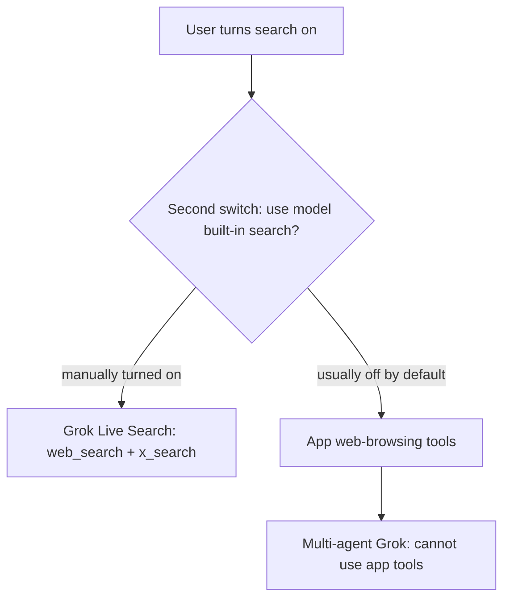

# Live search: what’s broken (plain language)

**What “Live Search” is here:** Grok’s own built-in ability to look things up on the web and on X (Twitter), then show source links. It is not a separate feature named “live search” in the UI — it is the **model’s built-in search** path for xAI/Grok.

Think of two different search helpers:

1. **Grok’s own search** (Live Search) — Grok looks things up itself.
2. **The app’s search helper** — the product sends search tools that Grok is supposed to call.

Today, when someone turns search **on**, the product usually picks helper #2. Grok’s own Live Search (#1) only runs if the user also flips a second switch: **“use model built-in search.”** Most people never find that switch, so Live Search looks broken even when search is “on.”

---

## Problems (no programming jargon)

### 1. Search is “on,” but Live Search is usually off

- The product turns search mode on by default (`auto`), but **does not** turn on “use the model’s own search.”
- Result: users believe web search is enabled; the app quietly uses its own helper instead of Grok’s Live Search.
- Where this is decided: `[packages/const/src/settings/agent.ts](packages/const/src/settings/agent.ts)` (defaults) + `[packages/model-bank/src/utils.ts](packages/model-bank/src/utils.ts)` (`resolveSearchDecision`).

### 2. Some Grok models cannot use the app’s helper at all

- **Grok Multi-Agent** is documented as supporting only xAI’s own server tools (web/X search), not the app’s client tools.
- With today’s defaults, search is routed to the app helper → that model gets tools it cannot use → research/search fails or appears useless.
- Model note lives in `[packages/model-bank/src/aiModels/xai.ts](packages/model-bank/src/aiModels/xai.ts)` (`grok-4.20-multi-agent-0309`).

### 3. Source links can be incomplete or messy

- When search works, answers should show clickable sources.
- An older path already drops empty/invalid links so the UI does not break.
- Grok now uses the newer **Responses** stream path, which **does not** apply that same cleanup — empty or bad links can still slip through.
- Files: filter exists in `[packages/model-runtime/src/core/streams/openai/openai.ts](packages/model-runtime/src/core/streams/openai/openai.ts)`; missing equivalent in `[packages/model-runtime/src/core/streams/openai/responsesStream.ts](packages/model-runtime/src/core/streams/openai/responsesStream.ts)`. The message UI already tries to be defensive (`[SearchGrounding.tsx](src/features/Conversation/Messages/components/SearchGrounding.tsx)`), but bad data should be filtered at the stream.

### 4. Labels still describe an outdated system

- Live Search used to be configured with old-style “search parameters.” That API is gone; the code now injects `web_search` / `x_search` tools (`[packages/model-runtime/src/providers/xai/index.ts](packages/model-runtime/src/providers/xai/index.ts)`).
- Model cards still say `searchImpl: 'params'`, which matches the old mental model and makes routing easy to misconfigure.

---

## What needs to be fixed (engineering)

Committed approach (no open options):

1. **Route xAI search to model-native Live Search when search is on**
  Prefer Grok’s `web_search` / `x_search` whenever search mode is not `off` for xAI models that advertise search — especially force this for multi-agent Grok (no client tools). Keep the existing “use model built-in search” toggle for other providers (Google, etc.) where choosing app vs model search is intentional.
2. **Filter empty/invalid citations on the Responses stream**
  Reuse the same `filterValidCitations` idea from the Chat Completions path inside `responsesStream.ts` before emitting `grounding` events; add a regression test with an empty `url_citation`.
3. **Align model metadata with real behavior**
  Update xAI model search settings / comments so they reflect tool injection (not the deprecated Live Search params API), so future routing does not reintroduce the wrong path.
4. **Regression coverage**
  - Decision tests: xAI + search on → `useModelSearch` / `enabledSearch` without requiring a manual second switch (and multi-agent specifically).
  - Provider tests already cover tool injection when `enabledSearch` is true — keep those green.
  - Stream test for empty citation filtering.

Out of scope for this fix: redesigning the whole search UI, or changing non-xAI providers’ default between app search and model search.
