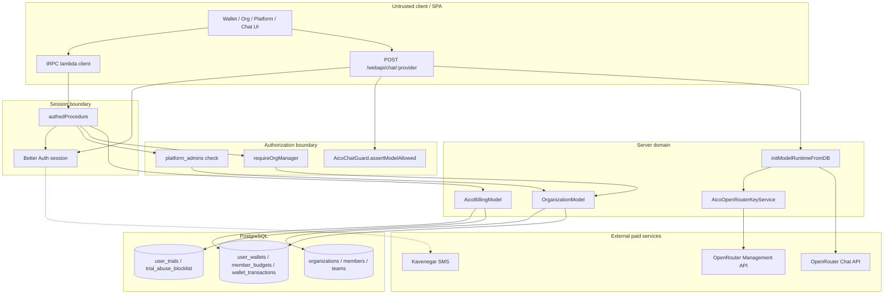
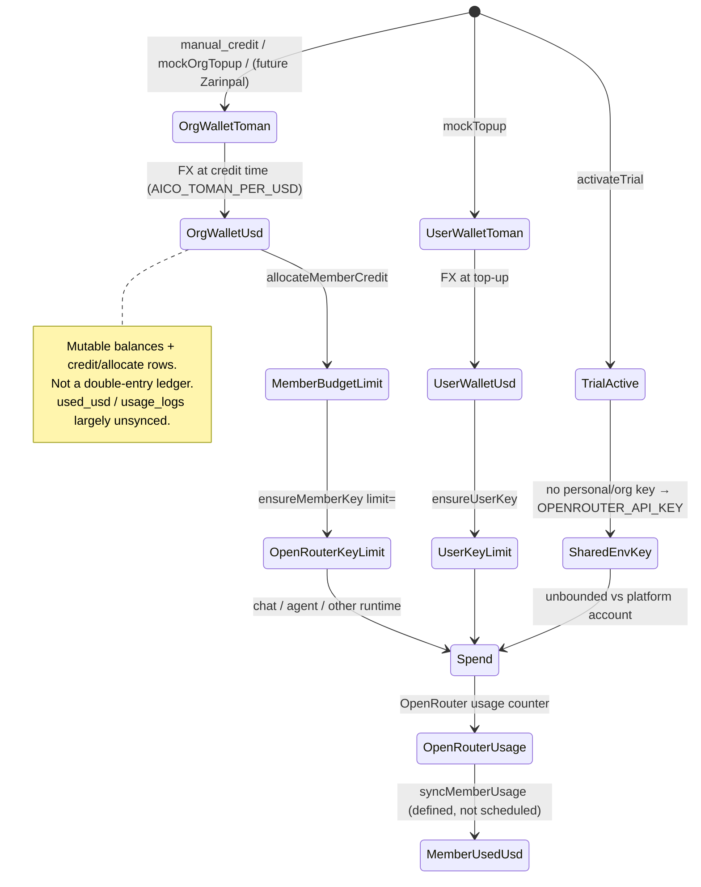
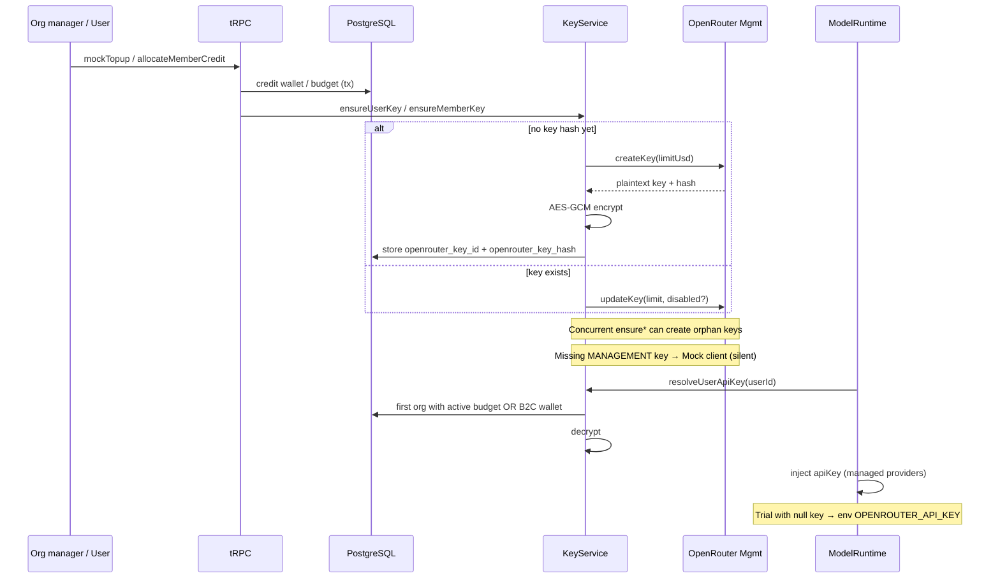

# Aico Phase 1 Adversarial Audit

**Auditor roles:** Principal software architect · Application-security engineer · Database reviewer · Fintech systems auditor  
**Audit date:** 2026-07-30  
**Scope:** Static code + schema + contract verification (no application fixes, no live paid API calls)  
**Baseline commit:** `b357039491` (`Phase 1 better auth phone (#10)`) on branch `canary`

---

## 1. Executive verdict

**NO-GO for production / soft-launch.**

The Aico surface on `canary` is a real, partially integrated B2B/B2C billing and org stack (custom org tables, wallets, trials, OpenRouter key provisioning, chat guard hooks). It is **not** release-safe:

1. **Any authenticated user can mint arbitrary USD wallet credit** via unguarded `mockTopup` / `mockOrgTopup` (UI + tRPC).
2. **Trial users without a personal key fall through to the shared env `OPENROUTER_API_KEY`**, with no OpenRouter hard limit and incomplete request accounting.
3. **Production fails open** into OpenRouter Management mock mode and Debug SMS when secrets are missing.
4. **Organization suspension, member removal, multi-org billing context, and concurrency on allocation/key creation** are incomplete or racy.
5. **Model/trial policy is only enforced on `webapi/chat/[provider]`**, while agents/images/embeddings share managed-key injection.

Phase 2 adversarial testing **should proceed** to reproduce and harden evidence for the findings below. Do **not** treat Phase 2 as a substitute for fixing P0/P1 before any pilot that spends real OpenRouter credit.

---

## 2. Baseline (verified, read-only)

| Item | Value |
|---|---|
| Branch | `canary` (tracks `origin/canary`) |
| HEAD | `b357039491bc5d8c4f027ec8a64139e2a1c5abc3` — *Phase 1 better auth phone (#10)* |
| `git status` | Clean working tree |
| Diff vs HEAD | Empty |
| Relevant commits on line | Branding rebrand (#8); Aico org/wallet/managed keys landed via #10 squash; earlier LobeHub workspace-billing commits are unrelated |
| Package manager | `pnpm` 10.33.0 |
| Runtime | `bun` 1.3.14; app `package.json` version `2.2.11` |
| Migrations | `0131_fixed_mathemanic`, `0132_shocking_blizzard` present and journaled (`meta/_journal.json` idx 131–132) |
| DBML | `docs/development/database-schema.dbml` includes `organizations`, `member_budgets`, `user_wallets` |
| `AICO_IMPLEMENTATION_REVIEW.md` | **Missing** (documentation mismatch) |
| Docs read | `PRD_Aico.md`, technical contract (`-aico-v1-0.md`), roadmaps (ساخت / علی / آرش / مهدیار), `مراحل انجام تسک.md`, `setup-guide-using-docker-.md`, `torobche_phas1/-aico-v1-0.md`, `AGENTS.md` |

Document contradictions (high level):

- PRD / مهدیار roadmap: MVP wallet top-up is **manual platform credit**; Zarinpal deferred. Implementation exposes **self-serve mock top-up** for every user and org manager.
- Technical contract: money on the wire as **strings**. Implementation returns **JS numbers**.
- Roadmap / علی: Better Auth Organization plugin decision Path A/B. Implementation chose **custom tables** (Path A) — consistent with code, but no written `AICO_IMPLEMENTATION_REVIEW.md` decision record in-repo.
- PRD: phone verify required for org managers / independent buyers. `organization.create` does **not** enforce phone verification.

---

## 3. Verified architecture map

### Entry → persistence → external

| Flow | Entry | Authz boundary | Persistence | External side effect | Failure / retry notes |
|---|---|---|---|---|---|
| Auth / session | Better Auth (`src/libs/better-auth/define-config.ts`) | Session cookie | `users`, sessions | Email OTP; SMS OTP (Kavenegar or Debug) | Debug SMS if no Kavenegar key |
| Phone verify | Better Auth `phoneNumber` plugin | Authed / OTP | `users.phone`, `phoneNumberVerified` | SMS | Iranian E.164 normalize; no Persian digits |
| Org create | `organization.create` | Authed only | `organizations`, owner member, default team | None | No phone-verify gate |
| Invite | `organization.inviteMember` | Org manager / platform admin | `organization_invites` | Email / SMS invite URL | Delivery failure leaves invite row |
| Accept invite | `organization.acceptInvite` | Authed + identifier match | Member active + default team | None | Status check partly outside CAS |
| Platform admin | `platformAdmin.*` | `platform_admins` row | Orgs, credits, trial config | None (master status stubbed) | |
| Teams | `createTeam` / `assignMemberToTeam` / `setTeamModels` | Org manager | `organization_teams*`, `model_access_rules` | None | One team membership per member (unique) |
| Org top-up | `platformAdmin.addManualCredit` **or** `organization.mockOrgTopup` | Platform admin **or** org manager | Wallet + `wallet_transactions` | OpenRouter key update only on allocate path | Mock ungated |
| B2C top-up | `aicoBilling.mockTopup` | Authed user | `user_wallets` + txs | `ensureUserKey` → OpenRouter | Mock ungated |
| Allocate credit | `organization.allocateMemberCredit` | Org manager | Org USD −, budget +, allocate tx | `ensureMemberKey` | No row lock |
| Trial | `aicoBilling.activateTrial` | Authed + verified phone | `user_trials` | None at activation | App-level phone uniqueness only |
| Account delete | `accountDeletion.requestDeletion` | Authed | Blocklist then delete user | Should disable keys — **does not** | Not one transaction |
| Managed keys | `AicoOpenRouterKeyService` | Called from top-up/allocate | Encrypted key in wallet/budget | OpenRouter Management API | Mock if key missing |
| Chat authz | `webapi/chat/[provider]` + `initModelRuntimeFromDB` | Session + partial guard | (usage_logs **unused**) | OpenRouter chat | Agents skip assert |
| Model allow-list | `AicoChatGuard.assertModelAllowed` | Only chat route | Team rules | None | Empty list = all allowed |
| Trial quota | `assertModelAllowed` + post-chat increment | Chat route only | `user_trials.request_count` | Shared env key possible | TOCTOU |
| Org suspend | `platformAdmin.suspendOrganization` | Platform admin | `organizations.status` | **Keys not disabled** | Chat ignores status |

### Trusted vs untrusted input (summary)

- **Trusted:** `ctx.userId` from session; FX rate from server env; platform-admin flag from DB.
- **Untrusted:** `orgId`, `memberId`, `teamId`, `amountToman`, `amountUsd` (allocation), invite `token`, model id in chat body, provider path segment.
- **Authorization must re-check ownership** for org/member/team IDs — generally done via `requireOrgManager` + member `orgId` match on allocate; **not** done for suspended/disabled spend paths.

---

## 4. Trust-boundary diagram

---

## 5. Money-flow / state diagram

---

## 6. Key-lifecycle diagram

---

## 7. Requirements-to-code traceability matrix

| Requirement (PRD / contract / roadmap) | Code locus | Status |
|---|---|---|
| Better Auth email/GitHub + phone plugin | `define-config.ts` phoneNumber plugin | Present |
| Phone verify for managers / independent buyers | `activateTrial` checks phone; **org.create does not** | Partial |
| Custom org schema (Path A) | `aicoOrganization.ts`, migrations 0131/0132 | Present |
| Org invite / roles / members | `organization` router + model | Present |
| Teams + one membership + default Unspecified | schema unique + createOrganization | Present |
| Per-member OpenRouter key + limit | `AicoOpenRouterKeyService` | Present (fragile) |
| Model allow-list | team-scoped rules + chatGuard | Partial (chat-only) |
| Manual credit by platform admin | `platformAdmin.addManualCredit` | Present |
| No self-serve production top-up in MVP | `mockTopup` / `mockOrgTopup` | **Violated** |
| Money as string on wire | routers return `Number(...)` | **Violated** |
| Canonical money error codes | Mostly English / raw Error messages | Partial |
| Super-admin panel | `platformAdmin` + `PlatformAdminPanel` | Partial (financial stubs) |
| Master OpenRouter balance monitor | `getMasterAccountStatus` hard-coded zeros | **Missing** |
| Trial anti-abuse + blocklist on delete | `user_trials` + `accountDeletion` | Partial (races / non-atomic) |
| Suspended org cannot spend | status field only; chat ignores | **Missing** |
| Usage logging / reports | `usage_logs` + `recordUsage` unused from chat | **Missing wiring** |
| Zarinpal | Not implemented | Acceptable deferred |
| RTL / Persian UI | `aico` locales + fa branding work | Partial (out of deep UI scope) |

---

## 8. Complete findings table

| ID | Severity | Title | Blocking |
|---|---|---|---|
| AICO-P1-001 | P0 | Ungated mock B2C top-up mints real spendable credit | Yes |
| AICO-P1-002 | P0 | Ungated mock org top-up for any org manager | Yes |
| AICO-P1-003 | P0 | Trial falls through to shared env OpenRouter key | Yes |
| AICO-P1-004 | P0 | OpenRouter Management silently mocks when key missing | Yes |
| AICO-P1-005 | P1 | Concurrent `allocateMemberCredit` can overspend org USD | Yes |
| AICO-P1-006 | P1 | Suspended orgs still resolve keys / can allocate / chat | Yes |
| AICO-P1-007 | P1 | `removeMember` soft-disables only; OpenRouter key stays live | Yes |
| AICO-P1-008 | P1 | Multi-org billing context is nondeterministic | Yes |
| AICO-P1-009 | P1 | Model/trial guards only on `webapi/chat`; agents bypass | Yes |
| AICO-P1-010 | P1 | Trial maxRequests TOCTOU + post-success increment | Yes |
| AICO-P1-011 | P1 | Concurrent `ensure*Key` creates orphan OpenRouter keys | Yes |
| AICO-P1-012 | P1 | Migration 0132 `usage_logs.user_id NOT NULL` unsafe on non-empty DB | Yes |
| AICO-P1-013 | P1 | No unique DB constraint on trial phone fingerprint | Yes |
| AICO-P1-014 | P1 | SMS Debug provider / OTP debug usable without production hard-fail | Yes |
| AICO-P1-015 | P1 | `usage_logs` / `syncMemberUsage` never wired from chat | Yes |
| AICO-P1-016 | P1 | `ensureMemberKey` floors new keys at $0.01 | Yes |
| AICO-P1-017 | P2 | USD stored/calculated as JS float (`numeric` mode number) | No* |
| AICO-P1-018 | P2 | Money returned as numbers, not strings | No |
| AICO-P1-019 | P2 | Account deletion + blocklist not atomic; keys not revoked | No* |
| AICO-P1-020 | P2 | Phone normalize ignores Persian/Arabic digits | No |
| AICO-P1-021 | P2 | Trial fingerprint does not canonicalize phone | No |
| AICO-P1-022 | P2 | Invite accept compares phone without normalize | No |
| AICO-P1-023 | P2 | Org create does not require phone verification | No |
| AICO-P1-024 | P2 | Master account / margin financials stubbed | No |
| AICO-P1-025 | P2 | Mutable balances ≠ true ledger; used_usd can diverge | No |
| AICO-P1-026 | P2 | Invite tokens returned in tRPC payloads | No |
| AICO-P1-027 | P2 | SPA routes lack RBAC loaders (API-only) | No |
| AICO-P1-028 | P2 | Budget `period` daily/weekly/monthly unused (always total) | No |
| AICO-P1-029 | P2 | Unit tests do not prove concurrency or policy safety | No |
| AICO-P1-030 | P3 | `openrouter_key_hash` is ciphertext, not a hash | No |
| AICO-P1-031 | P3 | Missing `AICO_IMPLEMENTATION_REVIEW.md`; passkey rpName still LobeHub | No |
| AICO-P1-032 | Info | Zarinpal / auto-FX deferred per PRD | No |

\*P2 marked No for “immediate pilot on empty internal DB with mocks disabled” may still block a broader release; treat P1-019 as release-blocking if accounts can be deleted in pilot.

---

## 9. Detailed evidence (P0 / P1 / P2)

### [AICO-P1-001] Ungated mock B2C top-up mints real spendable credit

* Severity: P0 Critical
* Confidence: Confirmed
* Category: Financial correctness / Production fail-open
* Requirement: MVP top-up is manual platform credit only; top-up endpoints must not work in production
* Affected files: `apps/server/src/routers/lambda/aicoBilling.ts` (L49–72); `src/features/AicoWallet/index.tsx` (L72–109); `packages/env/src/aico.ts`
* Affected symbols: `aicoBillingRouter.mockTopup`, `AicoBillingModel.mockTopupUser`, `AicoOpenRouterKeyService.ensureUserKey`
* Evidence: Mutation accepts any authed user `amountToman`, credits USD via `tomanToUsd`, then `ensureUserKey` provisions/updates OpenRouter limit. No `NODE_ENV` / feature-flag guard. UI always renders mock top-up form.
* Execution path: SPA `/wallet` → `aicoBilling.mockTopup` → DB wallet credit → OpenRouter `createKey`/`updateKey`
* Reproduction scenario: Authenticate as normal user in a deployment with real `OPENROUTER_MANAGEMENT_API_KEY`; POST mockTopup `{ amountToman: 50_000_000 }`; observe wallet USD and a new OpenRouter key with matching limit.
* Expected behavior: Endpoint absent or hard-forbidden in production; only platform-admin manual credit.
* Actual behavior: Self-serve unlimited credit (capped only by zod max 1e8 toman).
* Financial/security impact: Arbitrary balance creation → real OpenRouter spend against master account.
* Why existing tests do not prove safety: `aicoBilling.test.ts` / org tests only assert happy-path credit math; no production-gate test.
* Recommended Phase 2 test: Deploy-like env (`NODE_ENV=production`, mock flag unset) — assert `mockTopup` returns FORBIDDEN and does not mutate balances.
* Suggested remediation direction: Remove or gate behind `AICO_ALLOW_MOCK_TOPUP===1` **and** non-production; prefer platform-admin-only credit.
* Blocking release: Yes

### [AICO-P1-002] Ungated mock org top-up for any org manager

* Severity: P0 Critical
* Confidence: Confirmed
* Category: Financial correctness
* Requirement: Org wallet credit only via platform admin manual credit in MVP
* Affected files: `apps/server/src/routers/lambda/organization.ts` (L248–274); `src/features/OrgAdmin/OrgAdminMembers.tsx` (mock org top-up UI)
* Affected symbols: `organizationRouter.mockOrgTopup`, `OrganizationModel.addManualCredit`
* Evidence: Any owner/admin (or platform admin via `requireOrgManager`) can credit org wallet; type `'topup'`. No env gate. Does not even require platform role.
* Execution path: Org admin UI → `mockOrgTopup` → `addManualCredit` → balances increase
* Reproduction scenario: Org owner calls `mockOrgTopup` with large toman; allocate to members; members chat on managed keys.
* Expected behavior: Only `platformAdmin.addManualCredit`.
* Actual behavior: Org managers mint org USD.
* Financial/security impact: Same as P0-001 at org scale.
* Why existing tests do not prove safety: Model tests credit via `addManualCredit` directly; no router production gate.
* Recommended Phase 2 test: As org owner in production-like env, `mockOrgTopup` must fail; `platformAdmin.addManualCredit` still works for platform admin.
* Suggested remediation direction: Delete `mockOrgTopup` or restrict identically to mock B2C gate.
* Blocking release: Yes

### [AICO-P1-003] Trial falls through to shared env OpenRouter key

* Severity: P0 Critical
* Confidence: Confirmed
* Category: Trial abuse / External-service consistency
* Requirement: Trial must be quota-bounded; shared trial keys need hard-spend protection
* Affected files: `apps/server/src/services/aico/chatGuard.ts` (L77–86); `apps/server/src/modules/ModelRuntime/index.ts` (L497–504); `src/app/(backend)/webapi/chat/[provider]/route.ts`
* Affected symbols: `AicoChatGuard.resolveManagedApiKey`, `initModelRuntimeFromDB`
* Evidence: If no decrypted managed key, trial path returns `null`. Runtime then uses provider/env key (`OPENROUTER_API_KEY`). No OpenRouter limit attachment for trial. `maxRequests` only checked on chat route and is racy (P1-010).
* Execution path: Activate trial → chat with provider `openrouter`/`aico` without personal wallet key → env key billed
* Reproduction scenario: User verifies phone, activates trial, never tops up; send chat; observe traffic on platform OpenRouter key with no per-user Management limit.
* Expected behavior: Dedicated limited trial key or hard deny without provisioned key; platform-level spend cap.
* Actual behavior: Unbounded spend on shared key until OpenRouter account empty (request count soft-limit only).
* Financial/security impact: Direct unauthorized / unbounded platform spend.
* Why existing tests do not prove safety: `chatGuard.test.ts` only checks provider name mapping.
* Recommended Phase 2 test: Trial user without wallet key must not call OpenRouter with env key; expect explicit error or limited trial key.
* Suggested remediation direction: Fail closed without managed key; or provision a shared trial key with hard USD limit + atomic quota.
* Blocking release: Yes

### [AICO-P1-004] OpenRouter Management silently mocks when key missing

* Severity: P0 Critical
* Confidence: Confirmed
* Category: Production fail-open / External-service consistency
* Requirement: Production fails closed when management key missing; mock impossible accidentally
* Affected files: `apps/server/src/services/openrouter/management.ts` (L154–167); `packages/env/src/aico.ts` (L26–37)
* Affected symbols: `createOpenRouterManagementClient`
* Evidence: `if (aicoEnv.AICO_OPENROUTER_MOCK || !aicoEnv.OPENROUTER_MANAGEMENT_API_KEY) return new MockOpenRouterManagementClient()`. No `NODE_ENV` check. Combined with mock top-up, DB believes keys exist (`sk-or-v1-mock-…`) while chat may fall through to env key or fail confusingly.
* Execution path: Top-up → `ensureUserKey` → Mock `createKey` → ciphertext stored → chat may not use real limited key
* Reproduction scenario: Production deploy without `OPENROUTER_MANAGEMENT_API_KEY`; top up; inspect DB key ids prefixed `mock_`.
* Expected behavior: Boot or first provision throws; health check fails.
* Actual behavior: Silent mock.
* Financial/security impact: False sense of isolation; operators may compensate by setting env chat key → shared spend (amplifies P0-003).
* Why existing tests do not prove safety: Management tests exercise mock deliberately; no production fail-closed test.
* Recommended Phase 2 test: `NODE_ENV=production`, unset management key → createKey path throws; process readiness fails.
* Suggested remediation direction: Fail closed unless `AICO_OPENROUTER_MOCK=1` **and** non-production.
* Blocking release: Yes

### [AICO-P1-005] Concurrent allocateMemberCredit can overspend org USD

* Severity: P1 High
* Confidence: Confirmed
* Category: Concurrency / Financial correctness
* Requirement: Concurrent allocations must not overspend; atomic compare-and-swap
* Affected files: `packages/database/src/models/organization.ts` (L707–779)
* Affected symbols: `OrganizationModel.allocateMemberCredit`
* Evidence: Transaction reads `walletBalanceUsd`, compares in JS (`Number(org.walletBalanceUsd) < amount`), then unconditional `UPDATE … SET wallet_balance_usd = wallet_balance_usd - amount` with **no `FOR UPDATE`**, no `WHERE wallet_balance_usd >= amount`.
* Execution path: Two managers allocate simultaneously
* Reproduction scenario (interleaving):
  1. Org USD = 100
  2. T1 begins tx, reads 100, amount=80, check passes
  3. T2 begins tx, reads 100, amount=80, check passes
  4. T1 subtracts → 20; T2 subtracts → **-60**
  5. Both insert allocate txs and raise member limits
* Expected behavior: Second allocation fails `INSUFFICIENT_ORG_BALANCE`; balance never negative.
* Actual behavior: Negative org balance possible under READ COMMITTED.
* Financial/security impact: Over-allocation → OpenRouter limits exceed paid org credit.
* Why existing tests do not prove safety: Serial allocate test only (`organization.test.ts` L151–191).
* Recommended Phase 2 test: Parallel `Promise.all` two allocations of 80 against 100; assert one fails and balance ≥ 0.
* Suggested remediation direction: `SELECT … FOR UPDATE` or single SQL `UPDATE … WHERE balance >= $amt RETURNING`.
* Blocking release: Yes

### [AICO-P1-006] Suspended orgs still resolve keys / can allocate / chat

* Severity: P1 High
* Confidence: Confirmed
* Category: Authorization / IDOR-adjacent
* Requirement: Suspended organizations cannot spend or use managed keys
* Affected files: `organization.ts` invite check L105–107 only; `keyService.resolveUserApiKey` L104–115; `allocateMemberCredit`; `AicoChatGuard`; `platformAdmin.suspendOrganization`
* Affected symbols: `setOrganizationStatus`, `resolveUserApiKey`, `listForUser`
* Evidence: Suspend sets `organizations.status='suspended'`. `listForUser` filters member status, **not** org status. Key resolve and chat guard never read `org.status`. `mockOrgTopup` / `allocateMemberCredit` do not check suspended.
* Execution path: Platform suspends org → member continues chat with org budget key
* Reproduction scenario: Suspend org; member sends managed-provider chat; succeeds if key still active on OpenRouter.
* Expected behavior: Immediate deny + disable OpenRouter keys for all members.
* Actual behavior: Soft flag only.
* Financial/security impact: Suspend is non-enforcing; abuse / non-pay continues.
* Why existing tests do not prove safety: No suspend×chat test.
* Recommended Phase 2 test: After suspend, chat and allocate must fail; OpenRouter key `disabled=true`.
* Suggested remediation direction: Check status in resolve + allocate + guard; on suspend, disable all member keys.
* Blocking release: Yes

### [AICO-P1-007] removeMember does not disable OpenRouter keys

* Severity: P1 High
* Confidence: Confirmed
* Category: Authorization / External consistency
* Requirement: Removed/disabled members cannot continue using organization credit
* Affected files: `packages/database/src/models/organization.ts` (L360–377); `organization.ts` router removeMember L194–208
* Affected symbols: `OrganizationModel.removeMember`
* Evidence: Sets `status='disabled'` only. No `updateKey({ disabled: true })`. `resolveUserApiKey` skips non-active members (good for injection), but key remains spendable if leaked/cached/alternate client using stored plaintext from prior decrypt paths, and OpenRouter still accepts the key until limit hit.
* Execution path: removeMember → chat via previously provisioned key outside app injection still possible at OpenRouter
* Reproduction scenario: Allocate member key; capture key from OpenRouter dashboard; disable member in Aico; call OpenRouter directly with key — still works until limit.
* Expected behavior: Disable/delete key on OpenRouter atomically with membership disable.
* Actual behavior: Membership soft-disable only.
* Financial/security impact: Continued org-funded spend after removal.
* Why existing tests do not prove safety: No remove×key test.
* Recommended Phase 2 test: After removeMember, Management API shows key disabled; direct OR calls fail.
* Suggested remediation direction: `ensureMemberKey` disable + clear hash or mark inactive in same transaction.
* Blocking release: Yes

### [AICO-P1-008] Multi-org billing context is nondeterministic

* Severity: P1 High
* Confidence: Confirmed
* Category: Multi-organization billing context
* Requirement: Billing context must be explicit, authorized, stable, audited
* Affected files: `apps/server/src/services/openrouter/keyService.ts` (L104–119); `OrganizationModel.listForUser` (L136–149)
* Affected symbols: `resolveUserApiKey`, `listForUser`
* Evidence: Iterates `listForUser` with **no orderBy** and no client-selected org/workspace billing context; first membership with active budget key wins; else B2C wallet.
* Execution path: Chat → resolveManagedApiKey → first org key
* Reproduction scenario: User in OrgA (budget $5) and OrgB (budget $500); repeated chats may bill either depending on DB plan order.
* Expected behavior: Explicit active org / billing account in request + usage_logs.
* Actual behavior: Ambiguous fallback (high-risk).
* Financial/security impact: Wrong org charged; cross-org budget confusion; audit trail wrong if usage were logged.
* Why existing tests do not prove safety: No multi-org resolve test.
* Recommended Phase 2 test: Two orgs with distinct keys; assert deterministic selection via explicit header/input; reject ambiguous state.
* Suggested remediation direction: Require `organizationId` (or active workspace billing binding) on managed chat.
* Blocking release: Yes

### [AICO-P1-009] Model/trial guards only on webapi/chat; agents bypass

* Severity: P1 High
* Confidence: Confirmed
* Category: Chat and model-policy enforcement
* Requirement: Every model invocation path enforces allow-list, trial quota, org/member status
* Affected files: `src/app/(backend)/webapi/chat/[provider]/route.ts` (L31–53); `ModelRuntime/index.ts` (inject only); callers: `ServerLLMTransport`, async image/video, embeddings, `aiGeneration`, agentSignal, etc.
* Affected symbols: `assertModelAllowed`, `initModelRuntimeFromDB`
* Evidence: Managed key injection is global for `aico`/`openrouter`. `assertModelAllowed` / `recordTrialRequest` only in chat route.
* Execution path: Agent run with openrouter provider → key injected → no team allow-list / trial maxRequests
* Reproduction scenario: Team allow-list excludes model X; invoke agent/tool path with model X — succeeds.
* Expected behavior: Shared guard middleware on all `initModelRuntimeFromDB` managed calls.
* Actual behavior: Policy bypass via alternate surfaces.
* Financial/security impact: Quota and model policy bypass; trial abuse.
* Why existing tests do not prove safety: Chat route tests mock runtime; guard tests are name-only.
* Recommended Phase 2 test: With allow-list denying model, agent and `/webapi/models` paths must fail equally.
* Suggested remediation direction: Move assert + trial accounting into `initModelRuntimeFromDB` or a mandatory pre-hook.
* Blocking release: Yes

### [AICO-P1-010] Trial maxRequests TOCTOU + post-success increment

* Severity: P1 High
* Confidence: Confirmed
* Category: Concurrency / Trial quota
* Requirement: Max-request enforcement atomic; failed/cancelled policy defined
* Affected files: `chatGuard.ts` L68–70, L89–92; `aicoBilling.ts` `incrementTrialRequest`; chat route L50–53
* Affected symbols: `assertModelAllowed`, `incrementTrialRequest`
* Evidence: Check uses stale `trial.requestCount`; increment is `+1` after `modelRuntime.chat` returns, fire-and-forget `void`. Concurrent requests both pass. Streaming cancel after start may still increment depending on when chat promise resolves. Failures before return may not increment (undefined policy).
* Reproduction scenario: `maxRequests=1`; two parallel chats → both succeed; count becomes 2.
* Expected behavior: Atomic `UPDATE … SET request_count = request_count + 1 WHERE request_count < max RETURNING` **before** upstream call (or reserve/commit).
* Actual behavior: Soft check + late increment.
* Financial/security impact: Trial quota bypass (worse with shared env key).
* Why existing tests do not prove safety: No concurrent trial test.
* Recommended Phase 2 test: Parallel chats at limit-1; exactly one upstream success.
* Suggested remediation direction: Conditional increment reservation in same transaction as status check.
* Blocking release: Yes

### [AICO-P1-011] Concurrent ensure*Key creates orphan OpenRouter keys

* Severity: P1 High
* Confidence: High
* Category: External-service consistency / Split-brain
* Requirement: Key creation idempotent; OR success + DB failure recoverable
* Affected files: `keyService.ts` L40–99
* Affected symbols: `ensureUserKey`, `ensureMemberKey`
* Evidence: Check-then-create without unique claim / advisory lock. Two top-ups race: both see empty `openrouterKeyId`, both `createKey`, second DB write wins; first key orphaned on OpenRouter (still billed to master).
* Reproduction scenario: Parallel `mockTopup` twice for new user.
* Expected behavior: Idempotent create (DB unique claim or OR name dedupe + reconcile).
* Actual behavior: Orphan keys possible.
* Financial/security impact: Master account leak via unmanaged keys; reconciliation hard.
* Why existing tests do not prove safety: No parallel provision test.
* Recommended Phase 2 test: Parallel ensureUserKey; assert single OR key for user; no orphans (list keys by name prefix).
* Suggested remediation direction: Transactional lock on wallet row; reconcile by name; delete orphans.
* Blocking release: Yes

### [AICO-P1-012] Migration 0132 adds NOT NULL user_id without default/backfill

* Severity: P1 High
* Confidence: Confirmed
* Category: Database migrations
* Requirement: Migration safety on non-empty database
* Affected files: `packages/database/migrations/0132_shocking_blizzard.sql` L63–68
* Evidence: `ALTER TABLE "usage_logs" ALTER COLUMN "org_id" DROP NOT NULL;` then `ADD COLUMN "user_id" text NOT NULL;` with no DEFAULT and no backfill. On PostgreSQL, adding NOT NULL column without default fails if table has rows (0131 created `usage_logs`).
* Reproduction scenario: Deploy 0131, insert usage row, run 0132 → migration error.
* Expected behavior: Nullable add → backfill → set NOT NULL; or DEFAULT placeholder.
* Actual behavior: Brittle on any post-0131 usage.
* Financial/security impact: Deploy outage; blocked upgrades.
* Why existing tests do not prove safety: Test DBs migrate empty schemas.
* Recommended Phase 2 test: Apply 0131, insert usage_logs row, apply 0132 — must succeed.
* Suggested remediation direction: Expand migration with backfill strategy.
* Blocking release: Yes (for any DB that ran 0131 with data)

### [AICO-P1-013] No unique DB constraint on trial phone fingerprint

* Severity: P1 High
* Confidence: Confirmed
* Category: Trial abuse / Concurrency
* Requirement: One phone cannot activate multiple trials concurrently
* Affected files: `aicoOrganization.ts` L388–391; `aicoBilling.ts` `activateTrial` L219–249; migration 0132 L85–86
* Evidence: Unique on `user_id` only; `phone_fingerprint` has non-unique index. App `findFirst` then insert — race allows two users/phones rows.
* Reproduction scenario: Two users with same phone (or same normalized phone written differently) call activateTrial concurrently — both insert.
* Expected behavior: `UNIQUE(phone_fingerprint)` or unique partial index on active rows.
* Actual behavior: Race window.
* Financial/security impact: Multi-trial abuse.
* Why existing tests do not prove safety: Serial activate test only.
* Recommended Phase 2 test: Parallel activateTrial same phone; exactly one success.
* Suggested remediation direction: Unique constraint + normalize phone before fingerprint.
* Blocking release: Yes

### [AICO-P1-014] SMS Debug provider without production hard-fail

* Severity: P1 High
* Confidence: Confirmed
* Category: Secret management / Production fail-open
* Requirement: Debug OTP cannot be enabled in production; env validation fail-closed
* Affected files: `apps/server/src/services/sms/impls/index.ts` L10–21; `apps/server/src/services/sms/index.ts` (AUTH_SMS_DEBUG_OTP); `packages/env/src/sms.ts`
* Evidence: Missing `KAVENEGAR_API_KEY` → DebugSmsService (logs OTP). Debug flag can mirror OTP even with Kavenegar.
* Reproduction scenario: Production without Kavenegar key; request OTP; read server logs for code; verify phone; activate trial.
* Expected behavior: Production refuses to start or send OTP without real provider.
* Actual behavior: Fail-open to debug.
* Financial/security impact: Phone verify bypass → trial abuse chain.
* Why existing tests do not prove safety: Unit tests accept debug provider.
* Recommended Phase 2 test: Production env without Kavenegar → sendOtp throws; no code in logs.
* Suggested remediation direction: Fail closed when `NODE_ENV=production` && no Kavenegar.
* Blocking release: Yes

### [AICO-P1-015] usage_logs / syncMemberUsage never wired from chat

* Severity: P1 High
* Confidence: Confirmed
* Category: Financial correctness / Observability
* Requirement: Usage logging; used_usd sync; reporting
* Affected files: `aicoBilling.recordUsage` (defined); chat route (no call); `keyService.syncMemberUsage` (no callers in app paths)
* Evidence: Repo-wide grep shows Aico `recordUsage` only defined in model; chat only increments trial counter. Platform financials return stub OpenRouter cost `0`.
* Reproduction scenario: Member chats extensively; `usage_logs` empty; `member_budgets.used_usd` stays 0 unless manual sync.
* Expected behavior: Persist usage per request; sync OR usage; reports accurate.
* Actual behavior: Relies solely on OpenRouter key limit field; local ledger diverges.
* Financial/security impact: Blind ops; margin/report false; dispute impossible.
* Why existing tests do not prove safety: No integration asserting usage row after chat.
* Recommended Phase 2 test: After managed chat, usage_logs row exists and used_usd updates.
* Suggested remediation direction: Hook usage on stream completion; cron syncMemberUsage.
* Blocking release: Yes for pilot metrics; strong Yes if billing disputes matter

### [AICO-P1-016] ensureMemberKey floors new keys at $0.01

* Severity: P1 High
* Confidence: Confirmed
* Category: Financial correctness
* Requirement: OpenRouter limit semantics match DB budget
* Affected files: `keyService.ts` L88–91
* Evidence: `limitUsd: Math.max(limitUsd, 0.01)` on create path even when budget is 0.
* Reproduction scenario: Create budget 0 / inactive edge → key created with $0.01 spend.
* Expected behavior: Do not create key when limit ≤ 0; disable existing.
* Actual behavior: Minimum positive limit granted.
* Financial/security impact: Free dust spend per member; violates zero-budget invariant.
* Why existing tests do not prove safety: No zero-limit provision test.
* Recommended Phase 2 test: allocate 0 or disable budget → no enabled OR key with positive limit.
* Suggested remediation direction: Skip create when `limitUsd <= 0`; update disables.
* Blocking release: Yes

### [AICO-P1-017] USD as JS float

* Severity: P2 Medium
* Confidence: Confirmed
* Category: Financial correctness
* Requirement: No unsafe floating-point money
* Affected files: `aicoOrganization.ts` numeric `mode: 'number'`; `tomanToUsd`; routers `Number(...)`
* Evidence: Drizzle number mode + JS arithmetic.
* Expected: integer micros or numeric string / decimal library.
* Actual: float.
* Impact: Rounding drift on allocate/FX.
* Phase 2: Property tests on FX round-trip and allocate sums.
* Remediation: store USD as integer microdollars or `numeric` string mode.
* Blocking release: No for tiny pilot amounts; Yes at scale

### [AICO-P1-018] Money not strings on wire

* Severity: P2 Medium
* Confidence: Confirmed
* Category: API contract / Documentation mismatch
* Requirement: Technical contract golden rule #2
* Evidence: `getMyWallet` returns number balances; allocate returns numbers.
* Phase 2: Contract test asserts string amounts.
* Blocking release: No (correctness risk secondary to float)

### [AICO-P1-019] Account deletion + blocklist not atomic; keys not revoked

* Severity: P2 Medium (P1 if pilot allows deletion)
* Confidence: Confirmed
* Category: Trial abuse / External consistency
* Affected files: `accountDeletion.ts` L28–35
* Evidence: `addAbuseBlocklist` then `deleteUser` — no transaction; no OpenRouter key delete/disable.
* Interleaving: blocklist write succeeds, delete fails → user stuck; or delete without phone → no fingerprint.
* Phase 2: Crash between steps; assert invariants; keys disabled.
* Blocking release: No for deletion-disabled pilots; Yes otherwise

### [AICO-P1-020] Persian/Arabic digits not normalized

* Severity: P2 Medium
* Confidence: Confirmed
* Category: Trial / Phone verification
* Affected files: `src/libs/better-auth/phone.ts`
* Evidence: Only ASCII digit paths; `۰۱۲` / `٠١٢` fail or bypass normalize.
* Phase 2: OTP + invite with Persian digits.
* Blocking release: No (UX / abuse edge)

### [AICO-P1-021] Trial fingerprint lacks canonical phone normalize

* Severity: P2 Medium
* Confidence: Confirmed
* Category: Trial abuse
* Evidence: `fingerprintPhone` hashes `phone.trim()` only; `activateTrial` uses `user.phone` as stored.
* Impact: Format variants could duplicate trials if storage inconsistent (mitigated if Better Auth always stores E.164).
* Phase 2: Store alternate formats; assert single trial.
* Blocking release: No if storage proven canonical

### [AICO-P1-022] Invite accept phone compare without normalize

* Severity: P2 Medium
* Confidence: High
* Category: AuthZ / Invites
* Evidence: `acceptInvite` compares `params.phone?.trim()` to invite value; invites normalize to E.164 on create; user.phone should match if plugin normalized — fragile if not.
* Phase 2: Invite +989…, user phone 09… — accept should still work after normalize.
* Blocking release: No

### [AICO-P1-023] Org create without phone verification

* Severity: P2 Medium
* Confidence: Confirmed
* Category: Missing requirement
* Evidence: `organization.create` only authed; PRD requires manager phone verify.
* Phase 2: Unverified user create org → expect reject.
* Blocking release: No for internal pilot with trusted users

### [AICO-P1-024] Master account / margin stubs

* Severity: P2 Medium
* Confidence: Confirmed
* Category: Operational readiness
* Evidence: `getMasterAccountStatus` returns zeros; `getPlatformFinancials` margin/cost hard-coded `'0'`, ignores from/to.
* Phase 2: N/A live OR call in Phase 1; Phase 2 can assert non-stub once implemented.
* Blocking release: No for tiny pilot; Yes before multi-tenant prod (PRD risk)

### [AICO-P1-025] Mutable balances, not true ledger

* Severity: P2 Medium
* Confidence: Confirmed
* Category: Financial model
* Evidence: Balances updated in place; txs append credits/allocates; spend not ledgered locally.
* Impact: Silent divergence vs OpenRouter usage.
* Phase 2: Force OR usage vs DB used_usd mismatch detection.
* Blocking release: No if OR limits are sole enforcement **and** trusted

### [AICO-P1-026] Invite tokens in tRPC responses

* Severity: P2 Medium
* Confidence: Confirmed
* Category: AuthZ / Secret hygiene
* Evidence: `inviteMember` returns full invite including `token`; `listMembers` returns pending invites with tokens.
* Impact: Token leakage via logs/DevTools; acceptable for manager share-link UX if intentional — still widen exposure.
* Phase 2: Assert list endpoints omit raw token or scope tightly.
* Blocking release: No

### [AICO-P1-027] SPA routes lack RBAC loaders

* Severity: P2 Medium
* Confidence: Confirmed
* Category: Frontend vs backend
* Evidence: `/platform`, `/org`, `/wallet` registered without role loaders; UI soft-hides on error.
* Impact: Info disclosure of page chrome; mutations still server-gated (except mock top-up P0).
* Phase 2: Unprivileged user hits platform mutations → FORBIDDEN (already); UI should not rely on hide-only.
* Blocking release: No (backend must remain source of truth)

### [AICO-P1-028] Budget period unused

* Severity: P2 Medium
* Confidence: Confirmed
* Category: Missing requirement / Documentation mismatch
* Evidence: Schema allows daily/weekly/monthly; allocate always `period: 'total'`; no reset job.
* Phase 2: Document as deferred or implement.
* Blocking release: No if product accepts total-only MVP

### [AICO-P1-029] Tests do not prove safety

* Severity: P2 Medium
* Confidence: Confirmed
* Category: Untested assumptions
* Evidence: Org/billing tests are serial happy-path; chatGuard tests are 16 lines; no router authz tests for mock gates; no concurrency.
* Blocking release: No (process finding)

### [AICO-P1-030] Misleading `openrouter_key_hash` name

* Severity: P3 Low
* Confidence: Confirmed
* Category: Cryptography hygiene / Naming
* Evidence: Field stores AES-GCM ciphertext via KeyVaultsGateKeeper (IV:tag:cipher hex) — encryption is sound; name invites misuse as hash compare.
* Blocking release: No

### [AICO-P1-031] Missing implementation review doc; branding leftovers

* Severity: P3 Low
* Confidence: Confirmed
* Category: Documentation mismatch
* Evidence: No `AICO_IMPLEMENTATION_REVIEW.md`; `passkey({ rpName: 'LobeHub' })` in define-config.
* Blocking release: No

### [AICO-P1-032] Zarinpal deferred

* Severity: Info
* Confidence: Confirmed
* Category: Acceptable deferred work
* Evidence: No Zarinpal routes; aligns with PRD MVP strategy.
* Blocking release: No

---

## 10. Database invariant review

| Invariant | Mechanism | Verdict |
|---|---|---|
| Unique org slug | `organizations_slug_idx` | OK |
| Unique member per org | `organization_members_org_user_uidx` | OK |
| One active owner | partial unique `role=owner AND status=active` | OK (app also blocks last demotion) |
| Unique default team | partial unique `is_default=true` | OK |
| One team membership per org member | `organization_team_members_member_uidx` | OK |
| Invite token unique | `organization_invites_token_uidx` | OK |
| Invite expiry | app check 72h | OK (no DB expiry job) |
| Unique trial per user | `user_trials_user_id_uidx` | OK |
| Unique trial per phone | **missing** | FAIL (P1-013) |
| Blocklist unique fingerprint | unique (type,value) | OK |
| Member budget 1:1 | unique org_member_id | OK |
| FK delete behavior | cascade members/teams; owner restrict | Mostly OK; orphan OR keys not in DB |
| Money non-negative | **not enforced in DB** | FAIL under races |
| Schema ↔ migration | 0131/0132 + journal + DBML present | OK with 0132 NOT NULL hazard |
| Empty-table assumption | 0132 user_id NOT NULL | FAIL on non-empty usage_logs |

Encryption of keys: AES-GCM, random 12-byte IV, auth tag verified (`KeyVaultsGateKeeper`) — **acceptable**.

---

## 11. Authorization matrix

| Procedure | Unauthed | Member | Org admin/owner | Platform admin | Notes |
|---|---|---|---|---|---|
| `organization.create` | Deny | Allow | Allow | Allow | No phone gate |
| `listMembers` / invite / teams / allocate | Deny | Deny | Allow | Allow (as owner) | Manager check |
| `acceptInvite` | Deny | Allow if identifier match | — | — | |
| `mockOrgTopup` | Deny | Deny | **Allow** | Allow | **Should deny all non-dev** |
| `aicoBilling.mockTopup` | Deny | **Allow** | Allow | Allow | **Should deny** |
| `activateTrial` | Deny | Allow if phone verified | Allow | Allow | |
| `platformAdmin.*` | Deny | Deny | Deny | Allow | OK pattern |
| Chat managed provider | Deny | Allow if key/env | Allow | Allow | Suspend/disable weak |
| `accountDeletion` | Deny | Allow | Allow | Allow | |

Confused deputy: platform admin impersonates owner in `requireOrgManager` by returning `'owner'` — intentional override; consistent.

IDOR: member/team operations generally scoped by `orgId` match — good. Suspended/disabled spend paths are the main authz hole.

---

## 12. Multi-organization billing-context analysis

Selection order in `resolveUserApiKey`:

1. Iterate `listForUser` (active memberships, **unordered**).
2. First org where member has `member_budgets.openrouterKeyHash` and `isActive`.
3. Else B2C `user_wallets` key.
4. Else `null` → env key for trial (P0-003).

No notion of “active organization”, personal vs org explicit toggle, or usage attribution field on chat. **Ambiguous fallback = high risk** (finding P1-008).

Owner/admin/member roles affect admin APIs, not key selection (except disabled members skipped).

---

## 13. Possible split-brain states (PostgreSQL ↔ OpenRouter)

| State | How | Recoverable? |
|---|---|---|
| OR key created, DB update fails | Crash after `createKey` before `updateUserOpenRouterKey` | Orphan key on OR; retry creates another (P1-011) |
| DB has key id, OR key deleted externally | Manual OR console delete | Chat decrypt works but OR 401; no auto-recreate path clear |
| DB limit ≠ OR limit | allocate updates DB then `ensureMemberKey` fails | Local budget > OR limit or vice versa |
| Member disabled in DB, OR key enabled | removeMember | Direct OR use continues (P1-007) |
| Org suspended in DB, OR keys enabled | suspendOrganization | Spend continues (P1-006) |
| Mock key ids in DB, real OR chat via env | Missing management key + trial/env | Worst case shared spend |
| `used_usd` stale vs OR usage | No sync job | Reporting lie |
| Wallet credited, key not updated | ensureUserKey fails after credit | User has balance but cannot spend / or env fallback |

---

## 14. Concurrency interleavings (summary)

1. **Allocate overspend** — see P1-005.  
2. **Trial double-activate same phone** — see P1-013.  
3. **Trial request limit** — see P1-010.  
4. **Double key create** — see P1-011.  
5. **Invite accept**: two tabs same user — mostly idempotent membership update; invite status update not CAS `WHERE status='pending'` → low risk.  
6. **Default team create**: unique partial index protects double default.  
7. **Suspend during chat**: in-flight requests complete; new requests still allowed (P1-006).  
8. **removeMember during chat**: in-flight OK; subsequent app injection stops; OR key still live.

---

## 15. Production fail-open findings

| Mechanism | Fail-open behavior |
|---|---|
| Missing `OPENROUTER_MANAGEMENT_API_KEY` | Mock management client |
| `AICO_OPENROUTER_MOCK=1` | Mock (no NODE_ENV guard) |
| Missing `KAVENEGAR_API_KEY` | Debug SMS + OTP in logs |
| `AUTH_SMS_DEBUG_OTP` | OTP mirrored to logs |
| `mockTopup` / `mockOrgTopup` | Always registered |
| Trial without managed key | Env OpenRouter key |
| Suspend / remove | Flags only |

`KEY_VAULTS_SECRET` missing **does** throw on encrypt/decrypt init — good fail-closed for vault.

---

## 16. Untested assumptions

- OpenRouter key `limit` equals remaining budget semantics under concurrent chat.  
- Empty team allow-list ⇒ all models allowed is product-intended.  
- `provider === 'openrouter'` always means Aico-managed (hides BYO OpenRouter keys).  
- Platform admin seed script used correctly in each env.  
- 0132 has never been applied to a DB with usage_logs rows.  
- Users’ `phone` column always E.164 from Better Auth.  
- No alternate OpenAPI/agent path used in pilot.  
- Master OpenRouter balance monitoring can wait (contradicts PRD risk narrative).

---

## 17. Documentation versus implementation mismatches

| Document claim | Implementation |
|---|---|
| Manual credit only in MVP | Self-serve mock top-ups |
| Money as string on network | Numbers |
| Phone verify before manager full access | Org create unrestricted |
| Super-admin master OR monitor | Stub zeros |
| Margin report | Stub |
| Usage logs for reporting | Table exists; chat does not write |
| `AICO_IMPLEMENTATION_REVIEW.md` | Missing |
| Period budgets daily/weekly/monthly | total only |
| Zarinpal in فاز ۵ | Deferred (aligned with PRD MVP note) |
| Path A/B decision recorded | Custom tables chosen; no in-repo decision memo |

---

## 18. Suggested Phase 2 tests (1:1 with findings)

| Finding | Phase 2 test |
|---|---|
| 001 | Production-like env: `mockTopup` forbidden; no balance change |
| 002 | Org owner `mockOrgTopup` forbidden; platform `addManualCredit` ok |
| 003 | Trial user without wallet key must not use env OR key |
| 004 | Production + missing management key → provision throws / ready fails |
| 005 | Parallel allocate 80+80 on 100 → one fail, balance ≥ 0 |
| 006 | After suspend: chat + allocate fail; OR keys disabled |
| 007 | After removeMember: OR key disabled; direct OR call fails |
| 008 | Two orgs: billing context explicit; no silent switch |
| 009 | Agent/image/embeddings honor allow-list + trial quota |
| 010 | Parallel trial chats at maxRequests=1 → single success |
| 011 | Parallel ensureUserKey → one OR key, zero orphans |
| 012 | 0131 data + 0132 migrate succeeds |
| 013 | Parallel activateTrial same phone → one row |
| 014 | Production without Kavenegar → OTP send fails closed |
| 015 | Managed chat writes usage_logs; used_usd syncs |
| 016 | Zero/negative budget never creates enabled $0.01 key |
| 017 | FX/allocate decimal property tests |
| 018 | Response schema: money fields are strings |
| 019 | Deletion transactional; keys revoked; blocklist present |
| 020 | Persian digit phones normalize |
| 021 | Fingerprint canonicalization cases |
| 022 | Invite accept across phone formats |
| 023 | Unverified phone cannot create org |
| 024 | Master balance reflects live OR (when implemented) |
| 025 | Detect DB vs OR divergence |
| 026 | Tokens not leaked on list endpoints |
| 027 | UI routes + API both deny non-admin |
| 028 | Period reset behavior or documented waiver |
| 029 | Expand suite beyond happy path |
| 030 | Rename field / document ciphertext |
| 031 | Add implementation review doc |
| 032 | Keep Zarinpal out of Phase 2 scope |

---

## 19. Final verdict

# **NO-GO**

| Metric | Count |
|---|---|
| P0 Critical | **4** |
| P1 High | **12** |
| P2 Medium | **13** |
| P3 Low | **2** |
| Info | **1** |

**Five highest-risk findings**

1. AICO-P1-001 — Ungated mock B2C top-up  
2. AICO-P1-003 — Trial → shared env OpenRouter key  
3. AICO-P1-002 — Ungated mock org top-up  
4. AICO-P1-004 — Silent OpenRouter management mock in production  
5. AICO-P1-005 / AICO-P1-006 — Allocation race + non-enforcing suspension (tie: financial integrity)

**Proceed to Phase 2?** Yes — for adversarial confirmation and regression harnesses mapped above.  
**Proceed to production / paying pilot?** No — until P0 and listed P1 blockers are remediated and Phase 2 proves them closed.

---

*End of Phase 1 audit. No application code was modified; only this report file was created.*
