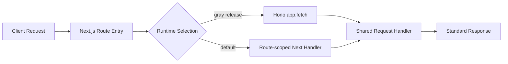

# API Runtime Migration Ledger

## Target Runtime Shape



## Handler Contract

| Layer             | Contract                                              | Responsibility                                                           |
| ----------------- | ----------------------------------------------------- | ------------------------------------------------------------------------ |
| Shared handler    | `(request: Request) => Response \| Promise<Response>` | Business behavior and response semantics.                                |
| Next.js route     | `GET` / `POST` export                                 | Runtime selection, compatibility adapter, and default Next.js execution. |
| Hono route        | `app.get` / `app.post`                                | Direct Hono mounting for migrated handlers.                              |
| Root Hono runtime | Lazy path dispatch                                    | Import only the domain app required by the matched path.                 |

## Local Development Topologies

Local development uses an explicit strategy selected by `LOBE_DEV_TOPOLOGY`.
The strategy resolver lives in `scripts/devTopology.ts` and is consumed by both
`vite.config.ts` and `scripts/devStartupSequence.mts`.

| Topology    | Script                  | Runtime processes  | Next bundler | Browser origin          | API target              | API execution path                                          |
| ----------- | ----------------------- | ------------------ | ------------ | ----------------------- | ----------------------- | ----------------------------------------------------------- |
| `next`      | `bun run dev`           | Next + Vite        | Turbopack    | `http://localhost:3010` | `http://localhost:3010` | Next route handlers                                         |
| `hono`      | `bun run dev:hono`      | Next + Hono + Vite | webpack      | `http://localhost:3010` | `http://localhost:3010` | Next shell forwards API prefixes to `http://localhost:3011` |
| `hono-lite` | `bun run dev:hono-lite` | Hono + Vite        | N/A          | `http://localhost:9876` | `http://localhost:3011` | Vite proxies API prefixes directly to standalone Hono       |
| `vite`      | `bun run dev:vite`      | Vite only          | N/A          | `http://localhost:9876` | Explicit target only    | No local API by default                                     |

`APP_URL` is the public browser origin and is controlled by the selected local
topology. In `next` and `hono` topologies the browser enters through the local
Next.js shell, while Vite only serves development assets and HMR. Override
`APP_URL` with `LOBE_DEV_APP_URL` when a local run needs a custom origin.
`INTERNAL_APP_URL` is the server-to-server callback origin and defaults to the
local API target for `next`, `hono`, and `hono-lite`; override it with
`LOBE_DEV_INTERNAL_APP_URL`. Vite uses a single regex proxy rule,
`^/(?:api|oidc|trpc|webapi|market|f)(?:/|$)`, when the selected topology has a
local API runtime, when `hono-lite` runs the standalone Hono runtime, or when
`LOBE_DEV_API_TARGET` is explicitly set in `vite` mode.

The `hono` topology still starts Next.js so SSR login and auth pages remain
available locally. Next is reduced to a lightweight shell: local rewrites send
API prefixes into the internal `/hono-runtime/*` binding route, which reconstructs the
original request URL and forwards it to the standalone Hono dev runtime through
`LOBE_DEV_HONO_TARGET`. This keeps the root Hono source graph out of the Next.js
dev compiler. The local `hono` topology uses webpack for the Next shell to avoid
Turbopack's webpack-loader worker pool; this is a development-only choice and
does not change the production build path. Because webpack does not consume
`turbopack.rules`, the local webpack shell defines its own `.md` raw-loader rule.
The standalone Hono dev runtime is executed with `vite-node --watch` and the
dedicated `scripts/viteNodeServer.config.ts` config so server-side `.md` imports
from packages such as `@lobechat/agent-templates` and `@lobechat/builtin-skills`
resolve to strings without loading the frontend Vite config. Watch mode is
required because the Hono app lazy-loads route domains after startup; plain
`vite-node` can close its transform server before those request-time imports.
Production Hono
rollout should import the separately compiled Hono dist entry through
`LOBE_HONO_DIST_ENTRY`, whose default fallback is `hono/dist/index.js`.
Login and auth-sensitive routes such as `/api/auth/*` and `/oidc/*` remain on
the native Next.js route path in this local topology. The topology strategy also
sets the route-scoped auth and OIDC runtime environment variables to `next`, so
a broad local `LOBE_API_RUNTIME=hono` setting cannot redirect login callbacks
away from Next.js.

The `hono-lite` topology intentionally does not start Next.js. It is suitable
for SPA and API work after a local browser session exists. For this mode,
`bun run dev:login -- --email dev@local.test` opens the local Vite origin at
`/api/auth/dev/local-login`; Vite proxies that request to Hono, and the
development-only Better Auth plugin signs a local database session cookie. The
endpoint is available only when `NODE_ENV=development` and
`LOBE_DEV_AUTH_BOOTSTRAP=1`; the topology sets this flag by default, while
production builds and normal runtime routes remain unchanged.

## Developer Usage Guide

### Choose a topology

| Development goal                                | Command                 | Use this when                                                                  | Avoid this when                                                                    |
| ----------------------------------------------- | ----------------------- | ------------------------------------------------------------------------------ | ---------------------------------------------------------------------------------- |
| Validate production-like Next.js behavior       | `bun run dev`           | Debugging SSR, auth pages, middleware, or any route that must stay on Next.js. | Measuring the standalone Hono API graph or reducing local Next.js memory pressure. |
| Develop the API on Hono with a local Next shell | `bun run dev:hono`      | You still need local SSR login pages, but API traffic should execute on Hono.  | You need to compare native Next route execution without Hono forwarding.           |
| Develop SPA and API without Next.js             | `bun run dev:hono-lite` | You already have or can bootstrap a local session and are not editing SSR UI.  | You need `/signin`, OIDC consent, or other Next-rendered pages.                    |
| Run Vite only                                   | `bun run dev:vite`      | You want a frontend-only Vite server with an explicit external API target.     | You expect local API routes to be available automatically.                         |

### Production-like local API verification

Use `dev:hono` when the browser must enter through Next.js but API execution
should be delegated to Hono:

```bash
bun run dev:hono
```

This starts:

| Process title     | Default port | Responsibility                                       |
| ----------------- | ------------ | ---------------------------------------------------- |
| `lobe-dev-hono`   | N/A          | Startup supervisor for local topology orchestration. |
| `lobe-hono-3011`  | `3011`       | Standalone Hono runtime.                             |
| Next.js dev shell | `3010`       | SSR pages and the `/hono-runtime/*` binding route.   |
| Vite dev server   | `9876`       | SPA assets and HMR.                                  |

The browser origin remains `http://localhost:3010`. API prefixes are forwarded
through the local Next shell into Hono, while auth and OIDC routes remain on the
native Next path so SSR login continues to work.

### Hono-lite local login

`dev:hono-lite` does not start Next.js. Since `/signin` is rendered by Next.js,
use the development login helper to create a local Better Auth session directly
against the local Hono-backed instance:

```bash
bun run dev:hono-lite
bun run dev:login -- --email dev@local.test --name "Local Dev" --callback /
```

The login helper opens:

```text
http://localhost:9876/api/auth/dev/local-login?email=dev%40local.test&name=Local%20Dev&callbackURL=/
```

Vite proxies this request to Hono. The Better Auth development plugin then:

1. Requires `NODE_ENV=development`.
2. Requires `LOBE_DEV_AUTH_BOOTSTRAP=1`.
3. Finds or creates the requested local user.
4. Creates a Better Auth session.
5. Writes the normal signed `better-auth.session_token` cookie.
6. Redirects to the callback path.

The callback must be a same-origin path. Absolute URLs and protocol-relative
URLs are rejected and normalized to `/`.

### Vite-only external API mode

`dev:vite` starts only the SPA dev server. It does not proxy API traffic unless
`LOBE_DEV_API_TARGET` is explicitly set:

```bash
LOBE_DEV_API_TARGET=https://app.example.com bun run dev:vite
```

This mode is appropriate for frontend-only work against a known remote or local
API endpoint. It is not a replacement for local auth or server-side debugging.

### Environment overrides

| Variable                    | Default by topology                          | Purpose                                                        |
| --------------------------- | -------------------------------------------- | -------------------------------------------------------------- |
| `LOBE_DEV_TOPOLOGY`         | Set by the selected script.                  | Selects `next`, `hono`, `hono-lite`, or `vite`.                |
| `PORT`                      | `3010`                                       | Local Next.js shell port.                                      |
| `HONO_PORT`                 | `3011`                                       | Local standalone Hono runtime port.                            |
| `VITE_PORT`                 | `9876`                                       | Vite SPA dev server port.                                      |
| `LOBE_DEV_APP_URL`          | Topology-specific browser origin.            | Overrides `APP_URL`.                                           |
| `LOBE_DEV_INTERNAL_APP_URL` | Topology-specific server-to-server origin.   | Overrides `INTERNAL_APP_URL`.                                  |
| `LOBE_DEV_API_TARGET`       | Topology-specific API target.                | Overrides Vite API proxy target.                               |
| `LOBE_DEV_HONO_TARGET`      | `http://localhost:${HONO_PORT}` when needed. | Overrides the Next shell's Hono forwarding target.             |
| `LOBE_DEV_AUTH_BOOTSTRAP`   | `1` only in `hono-lite`.                     | Enables the development-only Better Auth local login endpoint. |

### Database prerequisites

The Hono runtime uses the same database schema as the Next.js runtime. If
`SKIP_DB_MIGRATE=1` is set, the selected database must already contain all
columns required by the current checkout.

For example, `brief.listUnresolved` reads `briefs.trigger` and
`briefs.metadata`. A local Neon database that has not applied
`packages/database/migrations/0100_add_metadata_and_trigger_to_briefs.sql` will
fail with:

```text
column briefs.trigger does not exist
```

This is a schema drift failure, not a Hono runtime failure. Apply the migration
to the local development database or switch to a database that has already been
migrated.

### Troubleshooting

| Symptom                                                              | Likely cause                                                    | Action                                                                                   |
| -------------------------------------------------------------------- | --------------------------------------------------------------- | ---------------------------------------------------------------------------------------- |
| `` `after` was called outside a request scope `` in Hono             | Business code imported `next/server.after` directly.            | Use `scheduleAfterResponse` so Next uses `after()` and Hono uses the fallback scheduler. |
| `ERR_CLOSED_SERVER` from `vite-node`                                 | Request-time lazy imports outlived a plain `vite-node` server.  | Use `dev:hono:server` or topology scripts; they run `vite-node --watch`.                 |
| `EADDRINUSE` after editing Hono server files                         | Watch mode re-executed the entry while the old server listened. | The standalone entry closes the previous server before listening again.                  |
| `/signin` does not render in `hono-lite`                             | `hono-lite` does not start Next.js.                             | Use `dev:hono` for SSR login, or use `dev:login` to bootstrap a local session.           |
| API calls work in `dev:hono` but fail in `dev:hono-lite` after login | Missing local DB/env dependency rather than SSR dependency.     | Check server logs, database migrations, and provider credentials for that procedure.     |

## Runtime Switches

| Domain      | Header override       | Global env          | Percent env              | Default |
| ----------- | --------------------- | ------------------- | ------------------------ | ------- |
| tRPC        | `x-lobe-trpc-runtime` | `LOBE_TRPC_RUNTIME` | `LOBE_TRPC_HONO_PERCENT` | `next`  |
| General API | `x-lobe-api-runtime`  | `LOBE_API_RUNTIME`  | `LOBE_API_HONO_PERCENT`  | `next`  |

Route-scoped env variables override global env variables. Migrated general API routes use:

| Route                                                                  | Runtime env                                                          | Percent env                                                               |
| ---------------------------------------------------------------------- | -------------------------------------------------------------------- | ------------------------------------------------------------------------- |
| `/api/agent/stream`                                                    | `LOBE_API_AGENT_STREAM_RUNTIME`                                      | `LOBE_API_AGENT_STREAM_HONO_PERCENT`                                      |
| `/api/auth/[...all]`                                                   | `LOBE_API_AUTH_RUNTIME`                                              | `LOBE_API_AUTH_HONO_PERCENT`                                              |
| `/api/auth/check-user`                                                 | `LOBE_API_AUTH_CHECK_USER_RUNTIME`                                   | `LOBE_API_AUTH_CHECK_USER_HONO_PERCENT`                                   |
| `/api/auth/resolve-username`                                           | `LOBE_API_AUTH_RESOLVE_USERNAME_RUNTIME`                             | `LOBE_API_AUTH_RESOLVE_USERNAME_HONO_PERCENT`                             |
| `/api/dev/agent-tracing`                                               | `LOBE_API_DEV_AGENT_TRACING_RUNTIME`                                 | `LOBE_API_DEV_AGENT_TRACING_HONO_PERCENT`                                 |
| `/api/dev/memory-user-memory/benchmark-locomo`                         | `LOBE_API_DEV_MEMORY_USER_MEMORY_BENCHMARK_LOCOMO_RUNTIME`           | `LOBE_API_DEV_MEMORY_USER_MEMORY_BENCHMARK_LOCOMO_HONO_PERCENT`           |
| `/api/v1/*`                                                            | `LOBE_API_V1_RUNTIME`                                                | `LOBE_API_V1_HONO_PERCENT`                                                |
| `/api/version`                                                         | `LOBE_API_VERSION_RUNTIME`                                           | `LOBE_API_VERSION_HONO_PERCENT`                                           |
| `/api/webhooks/casdoor`                                                | `LOBE_API_WEBHOOKS_CASDOOR_RUNTIME`                                  | `LOBE_API_WEBHOOKS_CASDOOR_HONO_PERCENT`                                  |
| `/api/webhooks/logto`                                                  | `LOBE_API_WEBHOOKS_LOGTO_RUNTIME`                                    | `LOBE_API_WEBHOOKS_LOGTO_HONO_PERCENT`                                    |
| `/api/webhooks/memory-user-memory/pipelines/extract/chat-topic/cancel` | `LOBE_API_WEBHOOKS_MEMORY_EXTRACT_CHAT_TOPIC_CANCEL_RUNTIME`         | `LOBE_API_WEBHOOKS_MEMORY_EXTRACT_CHAT_TOPIC_CANCEL_HONO_PERCENT`         |
| `/api/webhooks/memory-extraction/benchmark-locomo`                     | `LOBE_API_WEBHOOKS_MEMORY_EXTRACTION_BENCHMARK_LOCOMO_RUNTIME`       | `LOBE_API_WEBHOOKS_MEMORY_EXTRACTION_BENCHMARK_LOCOMO_HONO_PERCENT`       |
| `/api/webhooks/memory-extraction`                                      | `LOBE_API_WEBHOOKS_MEMORY_EXTRACTION_RUNTIME`                        | `LOBE_API_WEBHOOKS_MEMORY_EXTRACTION_HONO_PERCENT`                        |
| `/api/webhooks/memory-user-memory/persona/update-writing`              | `LOBE_API_WEBHOOKS_MEMORY_USER_PERSONA_UPDATE_WRITING_RUNTIME`       | `LOBE_API_WEBHOOKS_MEMORY_USER_PERSONA_UPDATE_WRITING_HONO_PERCENT`       |
| `/api/webhooks/video/:provider`                                        | `LOBE_API_WEBHOOKS_VIDEO_RUNTIME`                                    | `LOBE_API_WEBHOOKS_VIDEO_HONO_PERCENT`                                    |
| `/api/workflows/agent-eval-run/execute-test-case`                      | `LOBE_API_WORKFLOWS_AGENT_EVAL_RUN_EXECUTE_TEST_CASE_RUNTIME`        | `LOBE_API_WORKFLOWS_AGENT_EVAL_RUN_EXECUTE_TEST_CASE_HONO_PERCENT`        |
| `/api/workflows/agent-eval-run/finalize-run`                           | `LOBE_API_WORKFLOWS_AGENT_EVAL_RUN_FINALIZE_RUN_RUNTIME`             | `LOBE_API_WORKFLOWS_AGENT_EVAL_RUN_FINALIZE_RUN_HONO_PERCENT`             |
| `/api/workflows/agent-eval-run/on-thread-complete`                     | `LOBE_API_WORKFLOWS_AGENT_EVAL_RUN_ON_THREAD_COMPLETE_RUNTIME`       | `LOBE_API_WORKFLOWS_AGENT_EVAL_RUN_ON_THREAD_COMPLETE_HONO_PERCENT`       |
| `/api/workflows/agent-eval-run/on-trajectory-complete`                 | `LOBE_API_WORKFLOWS_AGENT_EVAL_RUN_ON_TRAJECTORY_COMPLETE_RUNTIME`   | `LOBE_API_WORKFLOWS_AGENT_EVAL_RUN_ON_TRAJECTORY_COMPLETE_HONO_PERCENT`   |
| `/api/workflows/agent-eval-run/paginate-test-cases`                    | `LOBE_API_WORKFLOWS_AGENT_EVAL_RUN_PAGINATE_TEST_CASES_RUNTIME`      | `LOBE_API_WORKFLOWS_AGENT_EVAL_RUN_PAGINATE_TEST_CASES_HONO_PERCENT`      |
| `/api/workflows/agent-eval-run/resume-agent-trajectory`                | `LOBE_API_WORKFLOWS_AGENT_EVAL_RUN_RESUME_AGENT_TRAJECTORY_RUNTIME`  | `LOBE_API_WORKFLOWS_AGENT_EVAL_RUN_RESUME_AGENT_TRAJECTORY_HONO_PERCENT`  |
| `/api/workflows/agent-eval-run/resume-thread-trajectory`               | `LOBE_API_WORKFLOWS_AGENT_EVAL_RUN_RESUME_THREAD_TRAJECTORY_RUNTIME` | `LOBE_API_WORKFLOWS_AGENT_EVAL_RUN_RESUME_THREAD_TRAJECTORY_HONO_PERCENT` |
| `/api/workflows/agent-eval-run/run-agent-trajectory`                   | `LOBE_API_WORKFLOWS_AGENT_EVAL_RUN_RUN_AGENT_TRAJECTORY_RUNTIME`     | `LOBE_API_WORKFLOWS_AGENT_EVAL_RUN_RUN_AGENT_TRAJECTORY_HONO_PERCENT`     |
| `/api/workflows/agent-eval-run/run-benchmark`                          | `LOBE_API_WORKFLOWS_AGENT_EVAL_RUN_RUN_BENCHMARK_RUNTIME`            | `LOBE_API_WORKFLOWS_AGENT_EVAL_RUN_RUN_BENCHMARK_HONO_PERCENT`            |
| `/api/workflows/agent-eval-run/run-thread-trajectory`                  | `LOBE_API_WORKFLOWS_AGENT_EVAL_RUN_RUN_THREAD_TRAJECTORY_RUNTIME`    | `LOBE_API_WORKFLOWS_AGENT_EVAL_RUN_RUN_THREAD_TRAJECTORY_HONO_PERCENT`    |
| `/f/:id`                                                               | `LOBE_FILE_PROXY_RUNTIME`                                            | `LOBE_FILE_PROXY_HONO_PERCENT`                                            |
| `/market/agent/*`                                                      | `LOBE_MARKET_AGENT_RUNTIME`                                          | `LOBE_MARKET_AGENT_HONO_PERCENT`                                          |
| `/market/oidc/*`                                                       | `LOBE_MARKET_OIDC_RUNTIME`                                           | `LOBE_MARKET_OIDC_HONO_PERCENT`                                           |
| `/market/social/*`                                                     | `LOBE_MARKET_SOCIAL_RUNTIME`                                         | `LOBE_MARKET_SOCIAL_HONO_PERCENT`                                         |
| `/market/user/:username`                                               | `LOBE_MARKET_USER_PROFILE_RUNTIME`                                   | `LOBE_MARKET_USER_PROFILE_HONO_PERCENT`                                   |
| `/market/user/me`                                                      | `LOBE_MARKET_USER_ME_RUNTIME`                                        | `LOBE_MARKET_USER_ME_HONO_PERCENT`                                        |
| `/oidc/callback/desktop`                                               | `LOBE_OIDC_CALLBACK_DESKTOP_RUNTIME`                                 | `LOBE_OIDC_CALLBACK_DESKTOP_HONO_PERCENT`                                 |
| `/oidc/clear-session`                                                  | `LOBE_OIDC_CLEAR_SESSION_RUNTIME`                                    | `LOBE_OIDC_CLEAR_SESSION_HONO_PERCENT`                                    |
| `/oidc/consent`                                                        | `LOBE_OIDC_CONSENT_RUNTIME`                                          | `LOBE_OIDC_CONSENT_HONO_PERCENT`                                          |
| `/oidc/handoff`                                                        | `LOBE_OIDC_HANDOFF_RUNTIME`                                          | `LOBE_OIDC_HANDOFF_HONO_PERCENT`                                          |
| `/oidc/[...oidc]`                                                      | `LOBE_OIDC_PROVIDER_RUNTIME`                                         | `LOBE_OIDC_PROVIDER_HONO_PERCENT`                                         |
| `/webapi/chat/:provider`                                               | `LOBE_WEBAPI_CHAT_RUNTIME`                                           | `LOBE_WEBAPI_CHAT_HONO_PERCENT`                                           |
| `/webapi/create-image/comfyui`                                         | `LOBE_WEBAPI_CREATE_IMAGE_COMFYUI_RUNTIME`                           | `LOBE_WEBAPI_CREATE_IMAGE_COMFYUI_HONO_PERCENT`                           |
| `/webapi/models/:provider`                                             | `LOBE_WEBAPI_MODELS_RUNTIME`                                         | `LOBE_WEBAPI_MODELS_HONO_PERCENT`                                         |
| `/webapi/models/:provider/pull`                                        | `LOBE_WEBAPI_MODELS_PULL_RUNTIME`                                    | `LOBE_WEBAPI_MODELS_PULL_HONO_PERCENT`                                    |
| `/webapi/stt/openai`                                                   | `LOBE_WEBAPI_STT_OPENAI_RUNTIME`                                     | `LOBE_WEBAPI_STT_OPENAI_HONO_PERCENT`                                     |
| `/webapi/trace`                                                        | `LOBE_WEBAPI_TRACE_RUNTIME`                                          | `LOBE_WEBAPI_TRACE_HONO_PERCENT`                                          |
| `/webapi/tts/edge`                                                     | `LOBE_WEBAPI_TTS_EDGE_RUNTIME`                                       | `LOBE_WEBAPI_TTS_EDGE_HONO_PERCENT`                                       |
| `/webapi/tts/microsoft`                                                | `LOBE_WEBAPI_TTS_MICROSOFT_RUNTIME`                                  | `LOBE_WEBAPI_TTS_MICROSOFT_HONO_PERCENT`                                  |
| `/webapi/tts/openai`                                                   | `LOBE_WEBAPI_TTS_OPENAI_RUNTIME`                                     | `LOBE_WEBAPI_TTS_OPENAI_HONO_PERCENT`                                     |
| `/webapi/user/avatar/:id/:image`                                       | `LOBE_WEBAPI_USER_AVATAR_RUNTIME`                                    | `LOBE_WEBAPI_USER_AVATAR_HONO_PERCENT`                                    |

## Migration Status

| Route pattern                                                          | Domain                         | Status             | Reason / next action                                                                                                                                                                                                                                                     |
| ---------------------------------------------------------------------- | ------------------------------ | ------------------ | ------------------------------------------------------------------------------------------------------------------------------------------------------------------------------------------------------------------------------------------------------------------------ |
| `/hono-runtime/[...path]`                                              | Next Hono binding              | Hono-native        | Internal Next.js shell binding. In local `hono` topology it forwards to `LOBE_DEV_HONO_TARGET`; in production Hono rollout it calls the fetch-compatible Hono dist app loaded from `LOBE_HONO_DIST_ENTRY`.                                                               |
| `/trpc/async/[trpc]`                                                   | tRPC async router              | Migrated           | Shared handler under `src/server/trpc-runtime/async.ts`; Next defaults to `next`; Hono mounted under `src/server/trpc-hono`.                                                                                                                                             |
| `/trpc/lambda/[trpc]`                                                  | tRPC lambda router             | Migrated           | Shared handler under `src/server/trpc-runtime/lambda.ts`; gray-release parity covered by runtime tests.                                                                                                                                                                  |
| `/trpc/mobile/[trpc]`                                                  | tRPC mobile router             | Migrated           | Shared handler under `src/server/trpc-runtime/mobile.ts`; Hono path uses the same context factory.                                                                                                                                                                       |
| `/trpc/tools/[trpc]`                                                   | tRPC tools router              | Migrated           | Shared handler under `src/server/trpc-runtime/tools.ts`; Hono path reuses the route-scoped handler.                                                                                                                                                                      |
| `/api/version`                                                         | Version metadata               | Migrated           | Shared handler under `src/server/api-runtime/version.ts`; Next and Hono parity covered by tests.                                                                                                                                                                         |
| `/api/agent/[[...route]]`                                              | Agent runtime callbacks        | Hono-native        | Already mounted by `src/server/agent-hono`; root Hono runtime dispatches lazily to avoid loading unrelated domains.                                                                                                                                                      |
| `/api/workflows/[[...route]]`                                          | Workflow callbacks             | Hono-native        | Already mounted by `src/server/workflows-hono`; root Hono runtime dispatches lazily.                                                                                                                                                                                     |
| `/api/v1/[[...route]]`                                                 | OpenAPI                        | Migrated           | Shared handler under `src/server/api-runtime/openapi.ts`; Next defaults to `next`; Hono parity covered by `/api/v1/health` tests.                                                                                                                                        |
| `/webapi/chat/[provider]`                                              | Model chat streaming           | Migrated           | Shared handler under `src/server/api-runtime/chat.ts`; unauthorized parity covered across Next and Hono while preserving streaming response delegation.                                                                                                                  |
| `/webapi/models/[provider]`                                            | Provider models                | Migrated           | Shared handler under `src/server/api-runtime/models.ts`; unauthorized parity covered across Next and Hono.                                                                                                                                                               |
| `/webapi/models/[provider]/pull`                                       | Provider model pull            | Migrated           | Shared handler under `src/server/api-runtime/models.ts`; unauthorized parity covered across Next and Hono.                                                                                                                                                               |
| `/webapi/create-image/comfyui`                                         | Image generation               | Migrated           | Shared handler under `src/server/api-runtime/createImage.ts`; unauthorized parity covered across Next and Hono while preserving internal Bearer-token bypass.                                                                                                            |
| `/webapi/stt/openai`                                                   | Speech-to-text                 | Migrated           | Shared handler under `src/server/api-runtime/speech.ts`; response parity covered across Next and Hono.                                                                                                                                                                   |
| `/webapi/tts/edge`                                                     | Edge TTS                       | Migrated           | Shared handler under `src/server/api-runtime/speech.ts`; response parity covered across Next and Hono.                                                                                                                                                                   |
| `/webapi/tts/microsoft`                                                | Microsoft TTS                  | Migrated           | Shared handler under `src/server/api-runtime/speech.ts`; response parity covered across Next and Hono.                                                                                                                                                                   |
| `/webapi/tts/openai`                                                   | OpenAI TTS                     | Migrated           | Shared handler under `src/server/api-runtime/speech.ts`; response parity covered across Next and Hono.                                                                                                                                                                   |
| `/webapi/user/avatar/[id]/[image]`                                     | Avatar proxy                   | Migrated           | Shared handler under `src/server/api-runtime/userAvatar.ts`; root Hono route handles dynamic params; missing-avatar parity covered across Next and Hono.                                                                                                                 |
| `/webapi/trace`                                                        | Trace events                   | Migrated           | Shared handler under `src/server/api-runtime/trace.ts`; Next keeps `after()` as the scheduler while Hono uses a non-blocking runtime-neutral scheduler.                                                                                                                  |
| `/webapi/revalidate`                                                   | Cache revalidation             | Not migratable now | Depends on `next/cache` `revalidateTag`; keep as Next-only unless a Hono-side cache invalidation abstraction is introduced.                                                                                                                                              |
| `/api/auth/[...all]`                                                   | Better Auth                    | Migrated           | Shared handler under `src/server/api-runtime/betterAuth.ts`; the Better Auth request handler is reused through the adapter-compatible standard `Request` entry, while Next keeps the same GET/POST method surface and Hono mounts the catch-all auth path.               |
| `/api/auth/check-user`                                                 | Auth lookup                    | Migrated           | Shared handler under `src/server/api-runtime/auth.ts`; validation parity covered across Next and Hono.                                                                                                                                                                   |
| `/api/auth/resolve-username`                                           | Username lookup                | Migrated           | Shared handler under `src/server/api-runtime/auth.ts`; validation parity covered across Next and Hono.                                                                                                                                                                   |
| `/api/webhooks/casdoor`                                                | Casdoor webhook                | Migrated           | Shared handler under `src/server/api-runtime/webhooks.ts`; failed-verification parity covered across Next and Hono.                                                                                                                                                      |
| `/api/webhooks/logto`                                                  | Logto webhook                  | Migrated           | Shared handler under `src/server/api-runtime/webhooks.ts`; failed-verification parity covered across Next and Hono.                                                                                                                                                      |
| `/api/webhooks/video/[provider]`                                       | Video provider webhook         | Migrated           | Shared handler under `src/server/api-runtime/videoWebhook.ts`; invalid-JSON parity covered across Next and Hono before provider, DB, download, or billing side effects.                                                                                                  |
| `/api/webhooks/memory-extraction`                                      | Memory extraction webhook      | Migrated           | Shared handler under `src/server/api-runtime/memoryExtraction.ts`; date-validation parity covered across Next and Hono before workflow side effects.                                                                                                                     |
| `/api/webhooks/memory-extraction/benchmark-locomo`                     | Memory benchmark webhook       | Migrated           | Shared handler under `src/server/api-runtime/memoryExtractionBenchmark.ts`; invalid-payload parity covered across Next and Hono before database or extraction side effects.                                                                                              |
| `/api/webhooks/memory-user-memory/persona/update-writing`              | Persona update webhook         | Migrated           | Shared handler under `src/server/api-runtime/memoryExtraction.ts`; missing-user validation parity covered across Next and Hono before workflow or direct-mode side effects.                                                                                              |
| `/api/webhooks/memory-user-memory/pipelines/extract/chat-topic/cancel` | Memory workflow cancellation   | Migrated           | Shared handler under `src/server/api-runtime/memoryExtraction.ts`; invalid-payload parity covered across Next and Hono before DB or Upstash cancellation side effects.                                                                                                   |
| `/api/dev/agent-tracing`                                               | Development tracing files      | Migrated           | Shared handler under `src/server/api-runtime/dev.ts`; non-development gate and development missing-file parity covered across Next and Hono.                                                                                                                             |
| `/api/dev/memory-user-memory/benchmark-locomo`                         | Development benchmark          | Migrated           | Shared handler under `src/server/api-runtime/memoryBenchmarkDev.ts`; disabled-feature parity covered across Next and Hono before embedding, database, or model-runtime side effects.                                                                                     |
| `/api/agent/stream`                                                    | Agent SSE stream               | Migrated           | Shared handler under `src/server/api-runtime/agentStream.ts`; existing route tests cover SSE headers, connection events, history, cancellation, heartbeat, and terminal events; missing-parameter parity covers Next and Hono runtime selection.                         |
| `/api/workflows/agent-eval-run/execute-test-case`                      | Agent eval workflow step       | Migrated           | Shared workflow handler under `src/server/workflows/agentEvalRun/handlers/executeTestCase.ts`; Next and Hono wrap the same handler with runtime-specific Upstash `serve`; missing-payload validation is covered before DB or workflow side effects.                      |
| `/api/workflows/agent-eval-run/finalize-run`                           | Agent eval workflow step       | Migrated           | Shared workflow handler under `src/server/workflows/agentEvalRun/handlers/finalizeRun.ts`; Next and Hono wrap the same handler with runtime-specific Upstash `serve`; missing-payload validation is covered before aggregation side effects.                             |
| `/api/workflows/agent-eval-run/on-thread-complete`                     | Agent eval completion callback | Migrated           | Shared handler under `src/server/api-runtime/agentEvalRunWorkflow.ts`; missing-field parity covered across Next and Hono before DB/finalize side effects.                                                                                                                |
| `/api/workflows/agent-eval-run/on-trajectory-complete`                 | Agent eval completion callback | Migrated           | Shared handler under `src/server/api-runtime/agentEvalRunWorkflow.ts`; missing-field parity covered across Next and Hono before DB/finalize side effects.                                                                                                                |
| `/api/workflows/agent-eval-run/paginate-test-cases`                    | Agent eval workflow step       | Migrated           | Shared workflow handler under `src/server/workflows/agentEvalRun/handlers/paginateTestCases.ts`; Next and Hono wrap the same handler with runtime-specific Upstash `serve`; missing-payload validation is covered before pagination, fanout, or DB side effects.         |
| `/api/workflows/agent-eval-run/resume-agent-trajectory`                | Agent eval workflow step       | Migrated           | Shared workflow handler under `src/server/workflows/agentEvalRun/handlers/resumeAgentTrajectory.ts`; Next and Hono wrap the same handler with runtime-specific Upstash `serve`; missing-payload validation is covered before resumed execution side effects.             |
| `/api/workflows/agent-eval-run/resume-thread-trajectory`               | Agent eval workflow step       | Migrated           | Shared workflow handler under `src/server/workflows/agentEvalRun/handlers/resumeThreadTrajectory.ts`; Next and Hono wrap the same handler with runtime-specific Upstash `serve`; missing-payload validation is covered before resumed thread execution side effects.     |
| `/api/workflows/agent-eval-run/run-agent-trajectory`                   | Agent eval workflow step       | Migrated           | Shared workflow handler under `src/server/workflows/agentEvalRun/handlers/runAgentTrajectory.ts`; Next and Hono wrap the same handler with runtime-specific Upstash `serve`; missing-payload validation is covered before agent execution side effects.                  |
| `/api/workflows/agent-eval-run/run-benchmark`                          | Agent eval workflow step       | Migrated           | Shared workflow handler under `src/server/workflows/agentEvalRun/handlers/runBenchmark.ts`; Next uses `@upstash/workflow/nextjs` `serve`, Hono uses `@upstash/workflow/hono` `serve`, and missing-payload validation is covered before DB or workflow side effects.      |
| `/api/workflows/agent-eval-run/run-thread-trajectory`                  | Agent eval workflow step       | Migrated           | Shared workflow handler under `src/server/workflows/agentEvalRun/handlers/runThreadTrajectory.ts`; Next and Hono wrap the same handler with runtime-specific Upstash `serve`; missing-payload validation is covered before thread execution side effects.                |
| `/f/[id]`                                                              | File proxy                     | Migrated           | Shared handler under `src/server/api-runtime/fileProxy.ts`; root Hono route handles `/f/:id`; missing-file parity covered across Next and Hono.                                                                                                                          |
| `/market/agent/[[...segments]]`                                        | Market agent proxy             | Migrated           | Shared handler under `src/server/api-runtime/market.ts`; missing-action parity covered across Next and Hono before Market SDK calls.                                                                                                                                     |
| `/market/oidc/[[...segments]]`                                         | Market OIDC proxy              | Migrated           | Shared handler under `src/server/api-runtime/market.ts`; missing-endpoint parity covered across Next and Hono before Market SDK or trusted-session token calls.                                                                                                          |
| `/market/social/[[...segments]]`                                       | Market social proxy            | Migrated           | Shared handler under `src/server/api-runtime/market.ts`; unknown-action parity covered across Next and Hono after authenticated MarketService creation.                                                                                                                  |
| `/market/user/[username]`                                              | Market public user             | Migrated           | Shared handler under `src/server/api-runtime/market.ts`; missing-user parity covered across Next and Hono.                                                                                                                                                               |
| `/market/user/me`                                                      | Market current user            | Migrated           | Shared handler under `src/server/api-runtime/market.ts`; invalid-payload parity covered across Next and Hono.                                                                                                                                                            |
| `/oidc/[...oidc]`                                                      | OIDC provider                  | Migrated           | Shared handler under `src/server/api-runtime/oidc.ts`; neutral Node request/response collection now accepts standard `Request`, while interaction-cookie access remains isolated behind the OIDC service path. Disabled-provider parity is covered across Next and Hono. |
| `/oidc/callback/desktop`                                               | Desktop OIDC callback          | Migrated           | Shared handler under `src/server/api-runtime/oidc.ts`; Next injects `after()` while Hono uses the runtime-neutral scheduler, with invalid-request redirect parity covered before database side effects.                                                                  |
| `/oidc/clear-session`                                                  | OIDC session cleanup           | Migrated           | Shared handler under `src/server/api-runtime/oidc.ts`; reads the OIDC session id from the standard `Cookie` header and emits explicit `Set-Cookie` expirations, with unauthenticated parity covered before DB mutation.                                                  |
| `/oidc/consent`                                                        | OIDC consent                   | Migrated           | Shared handler under `src/server/api-runtime/oidc.ts`; `OIDCService` now accepts a source `Request` for interaction cookies, and server-error parity is covered across Next and Hono before successful consent side effects.                                             |
| `/oidc/handoff`                                                        | OIDC handoff lookup            | Migrated           | Shared handler under `src/server/api-runtime/oidc.ts`; missing-query parity covered across Next and Hono before database consume side effects.                                                                                                                           |

## Batch Policy

| Batch type                  | Required tests                                                                     |
| --------------------------- | ---------------------------------------------------------------------------------- |
| Static JSON endpoint        | Next default response, Hono-forced response, direct Hono app response.             |
| Authenticated JSON endpoint | All static JSON tests plus authenticated and unauthenticated parity.               |
| Webhook endpoint            | Signature failure, valid payload, invalid payload, and side-effect boundary tests. |
| Streaming endpoint          | Headers, first chunk, heartbeat, abort cleanup, and terminal event behavior.       |
| Redirect/proxy endpoint     | Status, `Location`, cache behavior, and missing-resource behavior.                 |
