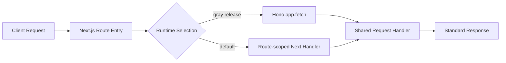

# API Runtime Migration Ledger

## Target Runtime Shape

## Handler Contract

| Layer             | Contract                                              | Responsibility                                                           |
| ----------------- | ----------------------------------------------------- | ------------------------------------------------------------------------ |
| Shared handler    | `(request: Request) => Response \| Promise<Response>` | Business behavior and response semantics.                                |
| Next.js route     | `GET` / `POST` export                                 | Runtime selection, compatibility adapter, and default Next.js execution. |
| Hono route        | `app.get` / `app.post`                                | Direct Hono mounting for migrated handlers.                              |
| Root Hono runtime | Lazy path dispatch                                    | Import only the domain app required by the matched path.                 |

## Runtime Switches

| Domain      | Header override       | Global env          | Percent env              | Default |
| ----------- | --------------------- | ------------------- | ------------------------ | ------- |
| tRPC        | `x-lobe-trpc-runtime` | `LOBE_TRPC_RUNTIME` | `LOBE_TRPC_HONO_PERCENT` | `next`  |
| General API | `x-lobe-api-runtime`  | `LOBE_API_RUNTIME`  | `LOBE_API_HONO_PERCENT`  | `next`  |

Route-scoped env variables override global env variables. Migrated general API routes use:

| Route                                                                  | Runtime env                                                          | Percent env                                                               |
| ---------------------------------------------------------------------- | -------------------------------------------------------------------- | ------------------------------------------------------------------------- |
| `/api/agent/stream`                                                    | `LOBE_API_AGENT_STREAM_RUNTIME`                                      | `LOBE_API_AGENT_STREAM_HONO_PERCENT`                                      |
| `/api/auth/[...all]`                                                   | `LOBE_API_AUTH_RUNTIME`                                              | `LOBE_API_AUTH_HONO_PERCENT`                                              |
| `/api/auth/check-user`                                                 | `LOBE_API_AUTH_CHECK_USER_RUNTIME`                                   | `LOBE_API_AUTH_CHECK_USER_HONO_PERCENT`                                   |
| `/api/auth/resolve-username`                                           | `LOBE_API_AUTH_RESOLVE_USERNAME_RUNTIME`                             | `LOBE_API_AUTH_RESOLVE_USERNAME_HONO_PERCENT`                             |
| `/api/dev/agent-tracing`                                               | `LOBE_API_DEV_AGENT_TRACING_RUNTIME`                                 | `LOBE_API_DEV_AGENT_TRACING_HONO_PERCENT`                                 |
| `/api/dev/memory-user-memory/benchmark-locomo`                         | `LOBE_API_DEV_MEMORY_USER_MEMORY_BENCHMARK_LOCOMO_RUNTIME`           | `LOBE_API_DEV_MEMORY_USER_MEMORY_BENCHMARK_LOCOMO_HONO_PERCENT`           |
| `/api/v1/*`                                                            | `LOBE_API_V1_RUNTIME`                                                | `LOBE_API_V1_HONO_PERCENT`                                                |
| `/api/version`                                                         | `LOBE_API_VERSION_RUNTIME`                                           | `LOBE_API_VERSION_HONO_PERCENT`                                           |
| `/api/webhooks/casdoor`                                                | `LOBE_API_WEBHOOKS_CASDOOR_RUNTIME`                                  | `LOBE_API_WEBHOOKS_CASDOOR_HONO_PERCENT`                                  |
| `/api/webhooks/logto`                                                  | `LOBE_API_WEBHOOKS_LOGTO_RUNTIME`                                    | `LOBE_API_WEBHOOKS_LOGTO_HONO_PERCENT`                                    |
| `/api/webhooks/memory-user-memory/pipelines/extract/chat-topic/cancel` | `LOBE_API_WEBHOOKS_MEMORY_EXTRACT_CHAT_TOPIC_CANCEL_RUNTIME`         | `LOBE_API_WEBHOOKS_MEMORY_EXTRACT_CHAT_TOPIC_CANCEL_HONO_PERCENT`         |
| `/api/webhooks/memory-extraction/benchmark-locomo`                     | `LOBE_API_WEBHOOKS_MEMORY_EXTRACTION_BENCHMARK_LOCOMO_RUNTIME`       | `LOBE_API_WEBHOOKS_MEMORY_EXTRACTION_BENCHMARK_LOCOMO_HONO_PERCENT`       |
| `/api/webhooks/memory-extraction`                                      | `LOBE_API_WEBHOOKS_MEMORY_EXTRACTION_RUNTIME`                        | `LOBE_API_WEBHOOKS_MEMORY_EXTRACTION_HONO_PERCENT`                        |
| `/api/webhooks/memory-user-memory/persona/update-writing`              | `LOBE_API_WEBHOOKS_MEMORY_USER_PERSONA_UPDATE_WRITING_RUNTIME`       | `LOBE_API_WEBHOOKS_MEMORY_USER_PERSONA_UPDATE_WRITING_HONO_PERCENT`       |
| `/api/webhooks/video/:provider`                                        | `LOBE_API_WEBHOOKS_VIDEO_RUNTIME`                                    | `LOBE_API_WEBHOOKS_VIDEO_HONO_PERCENT`                                    |
| `/api/workflows/agent-eval-run/execute-test-case`                      | `LOBE_API_WORKFLOWS_AGENT_EVAL_RUN_EXECUTE_TEST_CASE_RUNTIME`        | `LOBE_API_WORKFLOWS_AGENT_EVAL_RUN_EXECUTE_TEST_CASE_HONO_PERCENT`        |
| `/api/workflows/agent-eval-run/finalize-run`                           | `LOBE_API_WORKFLOWS_AGENT_EVAL_RUN_FINALIZE_RUN_RUNTIME`             | `LOBE_API_WORKFLOWS_AGENT_EVAL_RUN_FINALIZE_RUN_HONO_PERCENT`             |
| `/api/workflows/agent-eval-run/on-thread-complete`                     | `LOBE_API_WORKFLOWS_AGENT_EVAL_RUN_ON_THREAD_COMPLETE_RUNTIME`       | `LOBE_API_WORKFLOWS_AGENT_EVAL_RUN_ON_THREAD_COMPLETE_HONO_PERCENT`       |
| `/api/workflows/agent-eval-run/on-trajectory-complete`                 | `LOBE_API_WORKFLOWS_AGENT_EVAL_RUN_ON_TRAJECTORY_COMPLETE_RUNTIME`   | `LOBE_API_WORKFLOWS_AGENT_EVAL_RUN_ON_TRAJECTORY_COMPLETE_HONO_PERCENT`   |
| `/api/workflows/agent-eval-run/paginate-test-cases`                    | `LOBE_API_WORKFLOWS_AGENT_EVAL_RUN_PAGINATE_TEST_CASES_RUNTIME`      | `LOBE_API_WORKFLOWS_AGENT_EVAL_RUN_PAGINATE_TEST_CASES_HONO_PERCENT`      |
| `/api/workflows/agent-eval-run/resume-agent-trajectory`                | `LOBE_API_WORKFLOWS_AGENT_EVAL_RUN_RESUME_AGENT_TRAJECTORY_RUNTIME`  | `LOBE_API_WORKFLOWS_AGENT_EVAL_RUN_RESUME_AGENT_TRAJECTORY_HONO_PERCENT`  |
| `/api/workflows/agent-eval-run/resume-thread-trajectory`               | `LOBE_API_WORKFLOWS_AGENT_EVAL_RUN_RESUME_THREAD_TRAJECTORY_RUNTIME` | `LOBE_API_WORKFLOWS_AGENT_EVAL_RUN_RESUME_THREAD_TRAJECTORY_HONO_PERCENT` |
| `/api/workflows/agent-eval-run/run-agent-trajectory`                   | `LOBE_API_WORKFLOWS_AGENT_EVAL_RUN_RUN_AGENT_TRAJECTORY_RUNTIME`     | `LOBE_API_WORKFLOWS_AGENT_EVAL_RUN_RUN_AGENT_TRAJECTORY_HONO_PERCENT`     |
| `/api/workflows/agent-eval-run/run-benchmark`                          | `LOBE_API_WORKFLOWS_AGENT_EVAL_RUN_RUN_BENCHMARK_RUNTIME`            | `LOBE_API_WORKFLOWS_AGENT_EVAL_RUN_RUN_BENCHMARK_HONO_PERCENT`            |
| `/api/workflows/agent-eval-run/run-thread-trajectory`                  | `LOBE_API_WORKFLOWS_AGENT_EVAL_RUN_RUN_THREAD_TRAJECTORY_RUNTIME`    | `LOBE_API_WORKFLOWS_AGENT_EVAL_RUN_RUN_THREAD_TRAJECTORY_HONO_PERCENT`    |
| `/f/:id`                                                               | `LOBE_FILE_PROXY_RUNTIME`                                            | `LOBE_FILE_PROXY_HONO_PERCENT`                                            |
| `/market/agent/*`                                                      | `LOBE_MARKET_AGENT_RUNTIME`                                          | `LOBE_MARKET_AGENT_HONO_PERCENT`                                          |
| `/market/oidc/*`                                                       | `LOBE_MARKET_OIDC_RUNTIME`                                           | `LOBE_MARKET_OIDC_HONO_PERCENT`                                           |
| `/market/social/*`                                                     | `LOBE_MARKET_SOCIAL_RUNTIME`                                         | `LOBE_MARKET_SOCIAL_HONO_PERCENT`                                         |
| `/market/user/:username`                                               | `LOBE_MARKET_USER_PROFILE_RUNTIME`                                   | `LOBE_MARKET_USER_PROFILE_HONO_PERCENT`                                   |
| `/market/user/me`                                                      | `LOBE_MARKET_USER_ME_RUNTIME`                                        | `LOBE_MARKET_USER_ME_HONO_PERCENT`                                        |
| `/oidc/callback/desktop`                                               | `LOBE_OIDC_CALLBACK_DESKTOP_RUNTIME`                                 | `LOBE_OIDC_CALLBACK_DESKTOP_HONO_PERCENT`                                 |
| `/oidc/clear-session`                                                  | `LOBE_OIDC_CLEAR_SESSION_RUNTIME`                                    | `LOBE_OIDC_CLEAR_SESSION_HONO_PERCENT`                                    |
| `/oidc/consent`                                                        | `LOBE_OIDC_CONSENT_RUNTIME`                                          | `LOBE_OIDC_CONSENT_HONO_PERCENT`                                          |
| `/oidc/handoff`                                                        | `LOBE_OIDC_HANDOFF_RUNTIME`                                          | `LOBE_OIDC_HANDOFF_HONO_PERCENT`                                          |
| `/oidc/[...oidc]`                                                      | `LOBE_OIDC_PROVIDER_RUNTIME`                                         | `LOBE_OIDC_PROVIDER_HONO_PERCENT`                                         |
| `/webapi/chat/:provider`                                               | `LOBE_WEBAPI_CHAT_RUNTIME`                                           | `LOBE_WEBAPI_CHAT_HONO_PERCENT`                                           |
| `/webapi/create-image/comfyui`                                         | `LOBE_WEBAPI_CREATE_IMAGE_COMFYUI_RUNTIME`                           | `LOBE_WEBAPI_CREATE_IMAGE_COMFYUI_HONO_PERCENT`                           |
| `/webapi/models/:provider`                                             | `LOBE_WEBAPI_MODELS_RUNTIME`                                         | `LOBE_WEBAPI_MODELS_HONO_PERCENT`                                         |
| `/webapi/models/:provider/pull`                                        | `LOBE_WEBAPI_MODELS_PULL_RUNTIME`                                    | `LOBE_WEBAPI_MODELS_PULL_HONO_PERCENT`                                    |
| `/webapi/stt/openai`                                                   | `LOBE_WEBAPI_STT_OPENAI_RUNTIME`                                     | `LOBE_WEBAPI_STT_OPENAI_HONO_PERCENT`                                     |
| `/webapi/trace`                                                        | `LOBE_WEBAPI_TRACE_RUNTIME`                                          | `LOBE_WEBAPI_TRACE_HONO_PERCENT`                                          |
| `/webapi/tts/edge`                                                     | `LOBE_WEBAPI_TTS_EDGE_RUNTIME`                                       | `LOBE_WEBAPI_TTS_EDGE_HONO_PERCENT`                                       |
| `/webapi/tts/microsoft`                                                | `LOBE_WEBAPI_TTS_MICROSOFT_RUNTIME`                                  | `LOBE_WEBAPI_TTS_MICROSOFT_HONO_PERCENT`                                  |
| `/webapi/tts/openai`                                                   | `LOBE_WEBAPI_TTS_OPENAI_RUNTIME`                                     | `LOBE_WEBAPI_TTS_OPENAI_HONO_PERCENT`                                     |
| `/webapi/user/avatar/:id/:image`                                       | `LOBE_WEBAPI_USER_AVATAR_RUNTIME`                                    | `LOBE_WEBAPI_USER_AVATAR_HONO_PERCENT`                                    |

## Migration Status

| Route pattern                                                          | Domain                         | Status             | Reason / next action                                                                                                                                                                                                                                                     |
| ---------------------------------------------------------------------- | ------------------------------ | ------------------ | ------------------------------------------------------------------------------------------------------------------------------------------------------------------------------------------------------------------------------------------------------------------------ |
| `/trpc/async/[trpc]`                                                   | tRPC async router              | Migrated           | Shared handler under `src/server/trpc-runtime/async.ts`; Next defaults to `next`; Hono mounted under `src/server/trpc-hono`.                                                                                                                                             |
| `/trpc/lambda/[trpc]`                                                  | tRPC lambda router             | Migrated           | Shared handler under `src/server/trpc-runtime/lambda.ts`; gray-release parity covered by runtime tests.                                                                                                                                                                  |
| `/trpc/mobile/[trpc]`                                                  | tRPC mobile router             | Migrated           | Shared handler under `src/server/trpc-runtime/mobile.ts`; Hono path uses the same context factory.                                                                                                                                                                       |
| `/trpc/tools/[trpc]`                                                   | tRPC tools router              | Migrated           | Shared handler under `src/server/trpc-runtime/tools.ts`; Hono path reuses the route-scoped handler.                                                                                                                                                                      |
| `/api/version`                                                         | Version metadata               | Migrated           | Shared handler under `src/server/api-runtime/version.ts`; Next and Hono parity covered by tests.                                                                                                                                                                         |
| `/api/agent/[[...route]]`                                              | Agent runtime callbacks        | Hono-native        | Already mounted by `src/server/agent-hono`; root Hono runtime dispatches lazily to avoid loading unrelated domains.                                                                                                                                                      |
| `/api/workflows/[[...route]]`                                          | Workflow callbacks             | Hono-native        | Already mounted by `src/server/workflows-hono`; root Hono runtime dispatches lazily.                                                                                                                                                                                     |
| `/api/v1/[[...route]]`                                                 | OpenAPI                        | Migrated           | Shared handler under `src/server/api-runtime/openapi.ts`; Next defaults to `next`; Hono parity covered by `/api/v1/health` tests.                                                                                                                                        |
| `/webapi/chat/[provider]`                                              | Model chat streaming           | Migrated           | Shared handler under `src/server/api-runtime/chat.ts`; unauthorized parity covered across Next and Hono while preserving streaming response delegation.                                                                                                                  |
| `/webapi/models/[provider]`                                            | Provider models                | Migrated           | Shared handler under `src/server/api-runtime/models.ts`; unauthorized parity covered across Next and Hono.                                                                                                                                                               |
| `/webapi/models/[provider]/pull`                                       | Provider model pull            | Migrated           | Shared handler under `src/server/api-runtime/models.ts`; unauthorized parity covered across Next and Hono.                                                                                                                                                               |
| `/webapi/create-image/comfyui`                                         | Image generation               | Migrated           | Shared handler under `src/server/api-runtime/createImage.ts`; unauthorized parity covered across Next and Hono while preserving internal Bearer-token bypass.                                                                                                            |
| `/webapi/stt/openai`                                                   | Speech-to-text                 | Migrated           | Shared handler under `src/server/api-runtime/speech.ts`; response parity covered across Next and Hono.                                                                                                                                                                   |
| `/webapi/tts/edge`                                                     | Edge TTS                       | Migrated           | Shared handler under `src/server/api-runtime/speech.ts`; response parity covered across Next and Hono.                                                                                                                                                                   |
| `/webapi/tts/microsoft`                                                | Microsoft TTS                  | Migrated           | Shared handler under `src/server/api-runtime/speech.ts`; response parity covered across Next and Hono.                                                                                                                                                                   |
| `/webapi/tts/openai`                                                   | OpenAI TTS                     | Migrated           | Shared handler under `src/server/api-runtime/speech.ts`; response parity covered across Next and Hono.                                                                                                                                                                   |
| `/webapi/user/avatar/[id]/[image]`                                     | Avatar proxy                   | Migrated           | Shared handler under `src/server/api-runtime/userAvatar.ts`; root Hono route handles dynamic params; missing-avatar parity covered across Next and Hono.                                                                                                                 |
| `/webapi/trace`                                                        | Trace events                   | Migrated           | Shared handler under `src/server/api-runtime/trace.ts`; Next keeps `after()` as the scheduler while Hono uses a non-blocking runtime-neutral scheduler.                                                                                                                  |
| `/webapi/revalidate`                                                   | Cache revalidation             | Not migratable now | Depends on `next/cache` `revalidateTag`; keep as Next-only unless a Hono-side cache invalidation abstraction is introduced.                                                                                                                                              |
| `/api/auth/[...all]`                                                   | Better Auth                    | Migrated           | Shared handler under `src/server/api-runtime/betterAuth.ts`; the Better Auth request handler is reused through the adapter-compatible standard `Request` entry, while Next keeps the same GET/POST method surface and Hono mounts the catch-all auth path.               |
| `/api/auth/check-user`                                                 | Auth lookup                    | Migrated           | Shared handler under `src/server/api-runtime/auth.ts`; validation parity covered across Next and Hono.                                                                                                                                                                   |
| `/api/auth/resolve-username`                                           | Username lookup                | Migrated           | Shared handler under `src/server/api-runtime/auth.ts`; validation parity covered across Next and Hono.                                                                                                                                                                   |
| `/api/webhooks/casdoor`                                                | Casdoor webhook                | Migrated           | Shared handler under `src/server/api-runtime/webhooks.ts`; failed-verification parity covered across Next and Hono.                                                                                                                                                      |
| `/api/webhooks/logto`                                                  | Logto webhook                  | Migrated           | Shared handler under `src/server/api-runtime/webhooks.ts`; failed-verification parity covered across Next and Hono.                                                                                                                                                      |
| `/api/webhooks/video/[provider]`                                       | Video provider webhook         | Migrated           | Shared handler under `src/server/api-runtime/videoWebhook.ts`; invalid-JSON parity covered across Next and Hono before provider, DB, download, or billing side effects.                                                                                                  |
| `/api/webhooks/memory-extraction`                                      | Memory extraction webhook      | Migrated           | Shared handler under `src/server/api-runtime/memoryExtraction.ts`; date-validation parity covered across Next and Hono before workflow side effects.                                                                                                                     |
| `/api/webhooks/memory-extraction/benchmark-locomo`                     | Memory benchmark webhook       | Migrated           | Shared handler under `src/server/api-runtime/memoryExtractionBenchmark.ts`; invalid-payload parity covered across Next and Hono before database or extraction side effects.                                                                                              |
| `/api/webhooks/memory-user-memory/persona/update-writing`              | Persona update webhook         | Migrated           | Shared handler under `src/server/api-runtime/memoryExtraction.ts`; missing-user validation parity covered across Next and Hono before workflow or direct-mode side effects.                                                                                              |
| `/api/webhooks/memory-user-memory/pipelines/extract/chat-topic/cancel` | Memory workflow cancellation   | Migrated           | Shared handler under `src/server/api-runtime/memoryExtraction.ts`; invalid-payload parity covered across Next and Hono before DB or Upstash cancellation side effects.                                                                                                   |
| `/api/dev/agent-tracing`                                               | Development tracing files      | Migrated           | Shared handler under `src/server/api-runtime/dev.ts`; non-development gate and development missing-file parity covered across Next and Hono.                                                                                                                             |
| `/api/dev/memory-user-memory/benchmark-locomo`                         | Development benchmark          | Migrated           | Shared handler under `src/server/api-runtime/memoryBenchmarkDev.ts`; disabled-feature parity covered across Next and Hono before embedding, database, or model-runtime side effects.                                                                                     |
| `/api/agent/stream`                                                    | Agent SSE stream               | Migrated           | Shared handler under `src/server/api-runtime/agentStream.ts`; existing route tests cover SSE headers, connection events, history, cancellation, heartbeat, and terminal events; missing-parameter parity covers Next and Hono runtime selection.                         |
| `/api/workflows/agent-eval-run/execute-test-case`                      | Agent eval workflow step       | Migrated           | Shared workflow handler under `src/server/workflows/agentEvalRun/handlers/executeTestCase.ts`; Next and Hono wrap the same handler with runtime-specific Upstash `serve`; missing-payload validation is covered before DB or workflow side effects.                      |
| `/api/workflows/agent-eval-run/finalize-run`                           | Agent eval workflow step       | Migrated           | Shared workflow handler under `src/server/workflows/agentEvalRun/handlers/finalizeRun.ts`; Next and Hono wrap the same handler with runtime-specific Upstash `serve`; missing-payload validation is covered before aggregation side effects.                             |
| `/api/workflows/agent-eval-run/on-thread-complete`                     | Agent eval completion callback | Migrated           | Shared handler under `src/server/api-runtime/agentEvalRunWorkflow.ts`; missing-field parity covered across Next and Hono before DB/finalize side effects.                                                                                                                |
| `/api/workflows/agent-eval-run/on-trajectory-complete`                 | Agent eval completion callback | Migrated           | Shared handler under `src/server/api-runtime/agentEvalRunWorkflow.ts`; missing-field parity covered across Next and Hono before DB/finalize side effects.                                                                                                                |
| `/api/workflows/agent-eval-run/paginate-test-cases`                    | Agent eval workflow step       | Migrated           | Shared workflow handler under `src/server/workflows/agentEvalRun/handlers/paginateTestCases.ts`; Next and Hono wrap the same handler with runtime-specific Upstash `serve`; missing-payload validation is covered before pagination, fanout, or DB side effects.         |
| `/api/workflows/agent-eval-run/resume-agent-trajectory`                | Agent eval workflow step       | Migrated           | Shared workflow handler under `src/server/workflows/agentEvalRun/handlers/resumeAgentTrajectory.ts`; Next and Hono wrap the same handler with runtime-specific Upstash `serve`; missing-payload validation is covered before resumed execution side effects.             |
| `/api/workflows/agent-eval-run/resume-thread-trajectory`               | Agent eval workflow step       | Migrated           | Shared workflow handler under `src/server/workflows/agentEvalRun/handlers/resumeThreadTrajectory.ts`; Next and Hono wrap the same handler with runtime-specific Upstash `serve`; missing-payload validation is covered before resumed thread execution side effects.     |
| `/api/workflows/agent-eval-run/run-agent-trajectory`                   | Agent eval workflow step       | Migrated           | Shared workflow handler under `src/server/workflows/agentEvalRun/handlers/runAgentTrajectory.ts`; Next and Hono wrap the same handler with runtime-specific Upstash `serve`; missing-payload validation is covered before agent execution side effects.                  |
| `/api/workflows/agent-eval-run/run-benchmark`                          | Agent eval workflow step       | Migrated           | Shared workflow handler under `src/server/workflows/agentEvalRun/handlers/runBenchmark.ts`; Next uses `@upstash/workflow/nextjs` `serve`, Hono uses `@upstash/workflow/hono` `serve`, and missing-payload validation is covered before DB or workflow side effects.      |
| `/api/workflows/agent-eval-run/run-thread-trajectory`                  | Agent eval workflow step       | Migrated           | Shared workflow handler under `src/server/workflows/agentEvalRun/handlers/runThreadTrajectory.ts`; Next and Hono wrap the same handler with runtime-specific Upstash `serve`; missing-payload validation is covered before thread execution side effects.                |
| `/f/[id]`                                                              | File proxy                     | Migrated           | Shared handler under `src/server/api-runtime/fileProxy.ts`; root Hono route handles `/f/:id`; missing-file parity covered across Next and Hono.                                                                                                                          |
| `/market/agent/[[...segments]]`                                        | Market agent proxy             | Migrated           | Shared handler under `src/server/api-runtime/market.ts`; missing-action parity covered across Next and Hono before Market SDK calls.                                                                                                                                     |
| `/market/oidc/[[...segments]]`                                         | Market OIDC proxy              | Migrated           | Shared handler under `src/server/api-runtime/market.ts`; missing-endpoint parity covered across Next and Hono before Market SDK or trusted-session token calls.                                                                                                          |
| `/market/social/[[...segments]]`                                       | Market social proxy            | Migrated           | Shared handler under `src/server/api-runtime/market.ts`; unknown-action parity covered across Next and Hono after authenticated MarketService creation.                                                                                                                  |
| `/market/user/[username]`                                              | Market public user             | Migrated           | Shared handler under `src/server/api-runtime/market.ts`; missing-user parity covered across Next and Hono.                                                                                                                                                               |
| `/market/user/me`                                                      | Market current user            | Migrated           | Shared handler under `src/server/api-runtime/market.ts`; invalid-payload parity covered across Next and Hono.                                                                                                                                                            |
| `/oidc/[...oidc]`                                                      | OIDC provider                  | Migrated           | Shared handler under `src/server/api-runtime/oidc.ts`; neutral Node request/response collection now accepts standard `Request`, while interaction-cookie access remains isolated behind the OIDC service path. Disabled-provider parity is covered across Next and Hono. |
| `/oidc/callback/desktop`                                               | Desktop OIDC callback          | Migrated           | Shared handler under `src/server/api-runtime/oidc.ts`; Next injects `after()` while Hono uses the runtime-neutral scheduler, with invalid-request redirect parity covered before database side effects.                                                                  |
| `/oidc/clear-session`                                                  | OIDC session cleanup           | Migrated           | Shared handler under `src/server/api-runtime/oidc.ts`; reads the OIDC session id from the standard `Cookie` header and emits explicit `Set-Cookie` expirations, with unauthenticated parity covered before DB mutation.                                                  |
| `/oidc/consent`                                                        | OIDC consent                   | Migrated           | Shared handler under `src/server/api-runtime/oidc.ts`; `OIDCService` now accepts a source `Request` for interaction cookies, and server-error parity is covered across Next and Hono before successful consent side effects.                                             |
| `/oidc/handoff`                                                        | OIDC handoff lookup            | Migrated           | Shared handler under `src/server/api-runtime/oidc.ts`; missing-query parity covered across Next and Hono before database consume side effects.                                                                                                                           |

## Batch Policy

| Batch type                  | Required tests                                                                     |
| --------------------------- | ---------------------------------------------------------------------------------- |
| Static JSON endpoint        | Next default response, Hono-forced response, direct Hono app response.             |
| Authenticated JSON endpoint | All static JSON tests plus authenticated and unauthenticated parity.               |
| Webhook endpoint            | Signature failure, valid payload, invalid payload, and side-effect boundary tests. |
| Streaming endpoint          | Headers, first chunk, heartbeat, abort cleanup, and terminal event behavior.       |
| Redirect/proxy endpoint     | Status, `Location`, cache behavior, and missing-resource behavior.                 |
