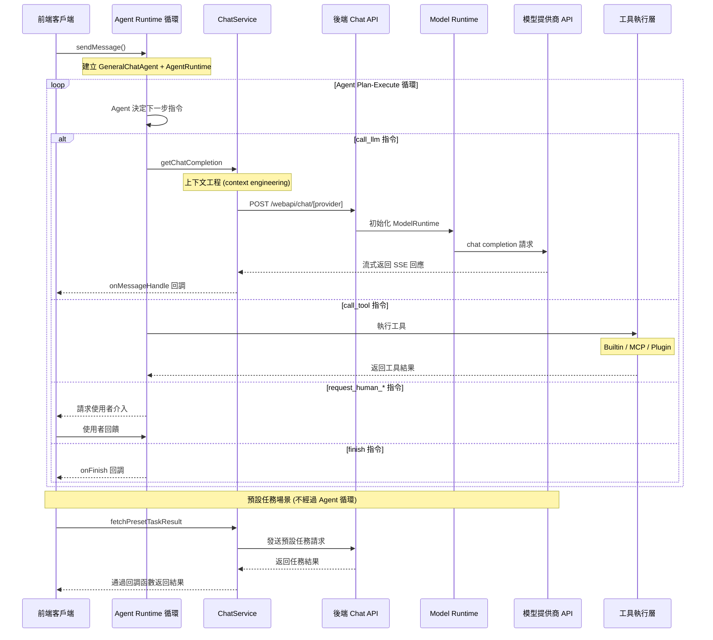

# Chat API 前後端交互邏輯

本文件說明了 LobeChat Chat API 在前後端交互中的實現邏輯，
包括事件序列和涉及的核心組件。

## 交互時序圖



## 主要步驟說明

### 1. 客戶端發起請求

使用者發送訊息後，`sendMessage()`
（`src/store/chat/slices/aiChat/actions/conversationLifecycle.ts`）
建立使用者訊息和助手訊息佔位，然後調用 `internal_execAgentRuntime()`。

### 2. Agent Runtime 驅動循環

Agent Runtime 是整個 chat 流程的**核心執行引擎**。
每次聊天交互（從簡單問答到複雜多步工具調用）都通過
`AgentRuntime.step()` 循環驅動。

**初始化**
（`src/store/chat/slices/aiChat/actions/streamingExecutor.ts`）：

1. 解析 agent 設定（模型、provider、插件列表等）
2. 通過 `createAgentToolsEngine()` 建立工具註冊表
3. 建立 `GeneralChatAgent`（"大腦"，決定下一步做什麼）
   和 `AgentRuntime`（"引擎"，執行指令）
4. 通過 `createAgentExecutors()` 注入自訂執行器

**執行循環**：

```ts
while (state.status !== 'done' && state.status !== 'error') {
  result = await runtime.step(state, nextContext);
  // GeneralChatAgent 決定: call_llm → call_tool → call_llm → finish
}
```

每一步中，`GeneralChatAgent` 根據當前狀態返回一條
`AgentInstruction`，`AgentRuntime` 通過對應的 executor 執行：

- `call_llm`：調用 LLM（見下方步驟 3-5）
- `call_tool`：執行工具調用（見下方步驟 6）
- `finish`：結束循環
- `compress_context`：上下文壓縮
- `request_human_approve` / `request_human_prompt` /
  `request_human_select`：請求使用者介入

### 3. 前端處理 LLM 請求

當 Agent 發出 `call_llm` 指令時，executor 調用 ChatService：

- `src/services/chat/index.ts` 對訊息、工具和參數進行預處理
- `src/services/chat/mecha/` 下的模組完成上下文工程
  （context engineering），包括 agent 設定解析、
  模型參數解析、MCP 上下文注入等
- 調用 `getChatCompletion` 準備請求參數
- 使用 `@lobechat/fetch-sse` 包中的 `fetchSSE`
  發送請求到後端 API

### 4. 後端處理請求

- `src/app/(backend)/webapi/chat/[provider]/route.ts` 接收請求
- 調用 `initModelRuntimeFromDB` 從資料庫讀取使用者的
  provider 設定，初始化 ModelRuntime
- 同時存在 tRPC 路由
  `src/server/routers/lambda/aiChat.ts`，
  用於伺服端訊息發送和結構化輸出等場景

### 5. 模型調用與回應處理

- `ModelRuntime`
  （`packages/model-runtime/src/core/ModelRuntime.ts`）
  調用相應模型提供商的 API，返回流式回應
- 前端通過 `fetchSSE` 和
  [fetchEventSource](https://github.com/Azure/fetch-event-source)
  處理流式回應
- 對不同類型的事件（文字、工具調用、推理等）進行處理
- 通過回調函數將結果傳遞迴客戶端

### 6. 工具調用場景

當 AI 模型在回應中返回 `tool_calls` 字段時，Agent 會發出
`call_tool` 指令。LobeChat 支援三種工具類型：

**Builtin 工具**：搭載在應用程式中的工具，通過本地執行器直接執行。

- 前端通過 `invokeBuiltinTool` 方法在客戶端直接執行
- 包括搜尋、DALL-E 圖像生成等搭載功能

**MCP 工具**：通過
[Model Context Protocol](https://modelcontextprotocol.io/)
連接的外部工具。

- 前端通過 `invokeMCPTypePlugin` 方法調用
  `MCPService`（`src/services/mcp.ts`）
- 支援 stdio、HTTP（streamable-http/SSE）
  和雲端（Klavis）三種連接方式
- MCP 工具的註冊和發現通過 MCP 伺服器設定管理

**Plugin 工具**：傳統插件體系，通過 API 閘道調用。
該體系預期將逐步廢棄，由 MCP 工具體系替代。

- 前端通過 `invokeDefaultTypePlugin` 方法調用
- 獲取插件設定和清單、建立認證請求頭、
  發送請求到插件閘道

工具執行完成後，結果寫入訊息並返回給 Agent 循環，
Agent 會再次調用 LLM 基於工具結果生成最終回應。
工具分發邏輯位於
`src/store/chat/slices/plugin/actions/pluginTypes.ts`。

### 7. 預設任務處理

預設任務是系統預定義的特定功能任務，
通常在使用者執行特定操作時觸發
（不經過 Agent Runtime 循環，直接調用 LLM）。
這些任務使用 `fetchPresetTaskResult` 方法執行，
該方法與正常聊天流程類似，
但會使用專門設計的提示詞（prompt chain）。

**執行時機**：

1. **角色資訊自動生成**：當使用者建立或編輯角色時觸發
   - 角色頭像生成（通過 `autoPickEmoji` 方法）
   - 角色描述生成（通過 `autocompleteAgentDescription` 方法）
   - 角色標籤生成（通過 `autocompleteAgentTags` 方法）
   - 角色標題生成（通過 `autocompleteAgentTitle` 方法）
2. **訊息翻譯**：使用者手動點擊翻譯按鈕時觸發
   （通過 `translateMessage` 方法）
3. **網頁搜尋**：當啟用搜尋但模型不支援工具調用時，
   通過 `fetchPresetTaskResult` 實現搜尋功能

**實際程式碼示例**：

角色頭像自動生成實現：

```ts
// src/features/AgentSetting/store/action.ts
autoPickEmoji: async () => {
  const { config, meta, dispatchMeta } = get();
  const systemRole = config.systemRole;

  chatService.fetchPresetTaskResult({
    onFinish: async (emoji) => {
      dispatchMeta({ type: 'update', value: { avatar: emoji } });
    },
    onLoadingChange: (loading) => {
      get().updateLoadingState('avatar', loading);
    },
    params: merge(
      get().internal_getSystemAgentForMeta(),
      chainPickEmoji(
        [meta.title, meta.description, systemRole]
          .filter(Boolean)
          .join(','),
      ),
    ),
    trace: get().getCurrentTracePayload({
      traceName: TraceNameMap.EmojiPicker,
    }),
  });
};
```

翻譯功能實現：

```ts
// src/store/chat/slices/translate/action.ts
translateMessage: async (id, targetLang) => {
  // ...省略部分程式碼...

  // 檢測語言
  chatService.fetchPresetTaskResult({
    onFinish: async (data) => {
      if (data && supportLocales.includes(data)) from = data;
      await updateMessageTranslate(id, {
        content,
        from,
        to: targetLang,
      });
    },
    params: merge(
      translationSetting,
      chainLangDetect(message.content),
    ),
    trace: get().getCurrentTracePayload({
      traceName: TraceNameMap.LanguageDetect,
    }),
  });

  // 執行翻譯
  chatService.fetchPresetTaskResult({
    onMessageHandle: (chunk) => {
      if (chunk.type === 'text') {
        content = chunk.text;
        internal_dispatchMessage({
          id,
          type: 'updateMessageTranslate',
          value: { content, from, to: targetLang },
        });
      }
    },
    onFinish: async () => {
      await updateMessageTranslate(id, {
        content,
        from,
        to: targetLang,
      });
      internal_toggleChatLoading(
        false,
        id,
        n('translateMessage(end)', { id }) as string,
      );
    },
    params: merge(
      translationSetting,
      chainTranslate(message.content, targetLang),
    ),
    trace: get().getCurrentTracePayload({
      traceName: TraceNameMap.Translation,
    }),
  });
};
```

### 8. 完成

當 Agent 發出 `finish` 指令時，循環結束，
調用 `onFinish` 回調，提供完整的回應結果。

## 客戶端 vs 伺服端執行

Agent Runtime 循環的執行位置取決於場景：

- **客戶端循環**（瀏覽器）：常規 1:1 對話、繼續生成、
  群組編排決策。循環在瀏覽器中執行，
  入口為 `internal_execAgentRuntime()`
  （`src/store/chat/slices/aiChat/actions/streamingExecutor.ts`）
- **伺服端循環**（隊列 / 本地）：群聊 supervisor agent、
  子 agent 任務、API/Cron 觸發。循環在伺服端執行，
  通過 SSE 流式推送事件到客戶端，
  入口為 `AgentRuntimeService.executeStep()`
  （`src/server/services/agentRuntime/AgentRuntimeService.ts`），
  tRPC 路由為 `src/server/routers/lambda/aiAgent.ts`

## Model Runtime

Model Runtime（`packages/model-runtime/`）是 LobeChat 中
與 LLM 模型提供商交互的核心抽象層，
負責將不同提供商的 API 相容為統一接口。

**核心職責**：

- **統一抽象層**：通過 `LobeRuntimeAI` 接口
  （`packages/model-runtime/src/core/BaseAI.ts`）
  隱藏不同 AI 提供商 API 的差異
- **模型初始化**：通過 provider 映射表
  （`packages/model-runtime/src/runtimeMap.ts`）
  初始化對應的執行時實例
- **能力封裝**：`chat`（聊天流式請求）、
  `models`（模型列表）、`embeddings`（文字嵌入）、
  `createImage`（圖像生成）、`textToSpeech`（語音合成）、
  `generateObject`（結構化輸出）

**核心接口**：

```ts
// packages/model-runtime/src/core/BaseAI.ts
export interface LobeRuntimeAI {
  baseURL?: string;
  chat?(
    payload: ChatStreamPayload,
    options?: ChatMethodOptions,
  ): Promise<Response>;
  generateObject?(
    payload: GenerateObjectPayload,
    options?: GenerateObjectOptions,
  ): Promise<any>;
  embeddings?(
    payload: EmbeddingsPayload,
    options?: EmbeddingsOptions,
  ): Promise<Embeddings[]>;
  models?(): Promise<any>;
  createImage?: (
    payload: CreateImagePayload,
  ) => Promise<CreateImageResponse>;
  textToSpeech?: (
    payload: TextToSpeechPayload,
    options?: TextToSpeechOptions,
  ) => Promise<ArrayBuffer>;
}
```

**相容器架構**：通過 `openaiCompatibleFactory` 和
`anthropicCompatibleFactory` 兩種工廠函數，
大多數提供商只需少量設定即可接入。
目前支援超過 40 個模型提供商
（OpenAI、Anthropic、Google、Azure、Bedrock、Ollama 等），
各實現位於 `packages/model-runtime/src/providers/`。

## Agent Runtime

Agent Runtime（`packages/agent-runtime/`）是
LobeChat 的 Agent 編排引擎。
如上文所述，它是驅動整個 chat 流程的核心執行引擎。

**核心組件**：

- **`AgentRuntime`**
  （`packages/agent-runtime/src/core/runtime.ts`）：
  "引擎"，執行 Agent 指令循環，
  支援 `call_llm`、`call_tool`、`finish`、
  `compress_context`、`request_human_*` 等指令類型
- **`GeneralChatAgent`**
  （`packages/agent-runtime/src/agents/GeneralChatAgent.ts`）：
  "大腦"，根據當前狀態決定下一步執行什麼指令
- **`GroupOrchestrationRuntime`**
  （`packages/agent-runtime/src/groupOrchestration/`）：
  多 Agent 編排，支援 speak /broadcast/
  delegate /executeTask 等協作模式
- **`UsageCounter`**：token 使用和費用追蹤
- **`InterventionChecker`**：
  安全黑名單管理 Agent 行為邊界
