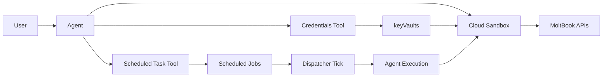

# RFC: Supporting MoltBook-Style Background Tasks via Scheduled Task + Credentials Built-in Tools

This document focuses on why this capability is needed, what the minimum architecture is, and why these tradeoffs were chosen. For API, runtime, and deployment details, see the companion [Technical Design](/docs/development/others/rfc-scheduled-task-credentials-for-moltbook-technical-design).

## 1. Summary

This RFC proposes a minimal executable loop for MoltBook-style workloads: long-running agent tasks that require recurring execution, credential reuse, and background triggering.

The solution is built from four pieces:

1. A `Scheduled Task` built-in tool so an agent can manage recurring tasks in chat.
2. A `Credentials` built-in tool so an agent can discover and consume service credentials.
3. `Cloud Sandbox` credential injection so execution can use secrets without carrying plaintext in prompts.
4. A minimal dispatcher loop so self-hosted deployments can actually trigger configured jobs.

This is not a full scheduling platform design. It is a focused RFC for the smallest viable architecture that makes MoltBook-style automation workable.

## 2. Background

MoltBook is not a one-off external API integration. It represents a class of agent workloads where an agent operates continuously with a stable identity: heartbeat checks, posting, replying, and handling community activity over time.

That pattern requires four capabilities to exist together:

1. The agent must be able to create and update recurring tasks inside the conversation.
2. The agent must be able to reuse API credentials safely instead of asking users to paste them repeatedly.
3. Background execution must consume secrets securely without leaving plaintext secrets in long-lived prompt context.
4. In self-hosted deployments, tasks must not only be configurable but also actually trigger.

MoltBook is a strong RFC driver because it concentrates all four needs in one scenario: recurring execution, sensitive credentials, clear external domain boundaries, and operational dependence on background runs.

## 3. Goals / Non-goals

### 3.1 Goals

1. Provide an agent-callable scheduled-task capability inside the existing conversation flow.
2. Provide reusable credential discovery and read access by reusing the current secret infrastructure.
3. Standardize the runtime path from credential storage to sandbox env injection.
4. Deliver a minimal end-to-end loop from task configuration to background execution.

### 3.2 Non-goals

1. Do not design a new generic scheduler, workflow engine, or queue platform in this RFC.
2. Do not introduce a new secret storage system or redesign the current storage schema here.
3. Do not extend into advanced scheduling semantics such as DAG orchestration, second-level schedules, or cross-tenant governance.
4. Do not solve the full context-management problem for long-lived background tasks, such as summary rolling, retry context, or task-level memory policy.

## 4. Architecture Overview

The minimum capability chain is:

The architectural intent is not to add many new systems, but to connect existing capabilities into one stable path:

1. The agent creates or updates tasks in chat.
2. The agent or user stores credentials in the existing secret path.
3. A dispatcher triggers the job.
4. `Cloud Sandbox` injects the required env vars at execution time with redaction and safety boundaries.

## 5. Key Decisions and Tradeoffs

### 5.1 `Scheduled Task` is a built-in tool, not a separate scheduling product layer

**Choice**

Make scheduled-task management an agent-callable built-in tool and reuse the existing cron-job foundation.

**Why**

MoltBook needs agent-managed recurring work, not a standalone scheduling product. A built-in tool keeps the capability inside the current agent workflow, shortens the integration path, and keeps the RFC scoped to task lifecycle management.

**Alternatives**

| Option                                   | Decision | Why                                                  |
| ---------------------------------------- | -------- | ---------------------------------------------------- |
| Built-in tool + existing cron foundation | Chosen   | Shortest path into the current agent execution model |
| Separate scheduling product layer        | Rejected | Too large in scope for this RFC                      |

### 5.2 `Credentials` reuses existing `keyVaults`, not a new secret system

**Choice**

The `Credentials` tool reuses the existing `keyVaults` storage and encryption flow.

**Why**

The problem here is safe agent-facing credential discovery and reuse, not inventing a new secret platform. Reusing `keyVaults` avoids schema migration, avoids a second source of truth, and keeps UI, tools, and runtime on the same trusted storage path.

**Alternatives**

| Option            | Decision | Why                                                |
| ----------------- | -------- | -------------------------------------------------- |
| Reuse `keyVaults` | Chosen   | Lowest-risk path with existing security guarantees |
| New secret system | Rejected | Adds migration, sync, and permission complexity    |

### 5.3 Secret consumption happens in `Cloud Sandbox` runtime injection, not in prompts or task content

**Choice**

Secrets are mapped and injected as env vars by `Cloud Sandbox` runtime during execution, instead of being carried in prompts or stored in task content.

**Why**

MoltBook-style jobs run repeatedly over time. If secrets travel in prompts or task content, both leakage risk and maintenance cost become unacceptable. Runtime injection keeps secret handling in the execution layer and improves security, reuse, and reliability.

**Alternatives**

| Option                           | Decision | Why                                                   |
| -------------------------------- | -------- | ----------------------------------------------------- |
| Runtime env injection            | Chosen   | Better secret hygiene and better repeatable execution |
| Prompt/content plaintext secrets | Rejected | High leakage risk and poor long-term maintainability  |

### 5.4 Self-hosting gets a minimal dispatcher loop, not a full scheduling platform

**Choice**

Provide only the minimum dispatcher entrypoint and execution closure needed for self-hosted recurring runs.

**Why**

The immediate problem is not “how to build the strongest scheduler”, but “can a configured task actually run in self-hosting”. A minimal dispatcher closes that gap while keeping the RFC small enough to deliver.

**Alternatives**

| Option                   | Decision | Why                                                    |
| ------------------------ | -------- | ------------------------------------------------------ |
| Minimal dispatcher loop  | Chosen   | Solves operability first with bounded complexity       |
| Full scheduling platform | Rejected | Expands this RFC into a broader infrastructure project |

## 6. End-to-end User Flow

### 6.1 Onboarding

1. The user imports and runs the MoltBook skill.
2. The agent guides onboarding and asks the user to provide or confirm MoltBook credentials.
3. Credentials are stored through the shared secret-storage path.
4. The agent creates the recurring heartbeat task based on the skill’s execution guidance.
5. The user completes any MoltBook-side human confirmation step.

### 6.2 Heartbeat / Background Execution

1. The dispatcher triggers the due job.
2. The job enters the agent execution path.
3. The agent invokes `Cloud Sandbox` for command or script execution.
4. Required credentials are injected as env vars at runtime with redaction and domain-boundary rules.
5. The job completes, or pauses for foreground follow-up when human approval is required.

### 6.3 Foreground Conversation

1. The user can ask the agent to perform immediate operations such as posting, replying, or adjusting heartbeat behavior.
2. The same credential path is reused, so the user does not need to paste secrets again.
3. If the user rotates credentials or updates the task in foreground, the background path continues with the new configuration.

## 7. Future Work / Open Questions

Potential follow-up directions:

1. Reusing the same pattern for more platforms and integrations.
2. Better context management for long-running background tasks, such as summaries, retry state, and durable memory.
3. A more unified cron-policy enforcement path across all write entries.
4. Better self-hosted operations, including scheduler health inspection and observability surfaces.

Open questions for review:

1. Whether tool result payloads are good enough for LLM diagnosis and self-recovery.
2. How human approval boundaries should be standardized for background tasks.
3. What the long-lived context model should be for recurring agent work.
