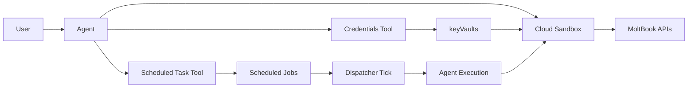

# RFC：通过 Scheduled Task + Credentials 内置工具集成支持 MoltBook 类后台任务

本文档聚焦说明为什么要做这项能力、核心方案是什么、以及为什么做出这些关键取舍。接口、运行时和部署细节见[配套 Technical Design](/zh/docs/development/others/rfc-scheduled-task-credentials-for-moltbook-technical-design)。

## 1. 摘要

本 RFC 旨在为 MoltBook 这类 “长期运行、需要凭据、依赖后台触发” 的 Agent 工作负载提供一条可落地的最小闭环。

核心能力由四部分组成：

1. `Scheduled Task` builtin tool：让 Agent 能在会话中管理定时任务。
2. `Credentials` builtin tool：让 Agent 能发现和消费外部服务凭据。
3. `Cloud Sandbox` 凭据注入：让任务执行时安全消费 secret，而不是在 prompt 中长期携带明文。
4. 最小 dispatcher 闭环：让 self-hosting 部署中创建出来的任务真的可以被周期性触发。

这不是一份完整调度平台设计，而是一份面向 MoltBook 类场景的最小可用架构决策文档。

## 2. 背景

MoltBook 的典型场景不是 “一次性调用某个外部 API”，而是让 Agent 以长期身份持续参与社区，例如定期 heartbeat、发帖、回复、处理通知。

这类场景天然要求四种能力同时成立：

1. Agent 需要在会话里配置和修改定时任务。
2. Agent 需要稳定复用 API key，而不是反复要求用户粘贴凭据。
3. 后台任务执行时需要安全地读取 secret，且不能把明文长期暴露在上下文中。
4. 在 self-hosting 环境里，任务不能只 “可配置”，还必须 “能触发”。

MoltBook 之所以适合作为 RFC 入口，是因为它把这四个问题集中暴露了出来：长期运行、高敏凭据、明确的外部域名边界，以及对后台自动执行的依赖。

## 3. 目标与非目标

### 3.1 目标

1. 为 Agent 提供会话内可调用的定时任务管理能力。
2. 为 Agent 提供可复用的凭据发现与读取能力，并复用现有 secret 基础设施。
3. 在 `Cloud Sandbox` 中建立从凭据存储到运行时 env 注入的标准链路。
4. 为 MoltBook 类任务提供从配置到触发再到执行的最小闭环。

### 3.2 非目标

1. 不在本 RFC 中设计新的通用调度平台、工作流引擎或队列系统。
2. 不引入新的 secret 存储系统，也不在本 RFC 中改造底层 schema。
3. 不扩展高级调度语义，例如 DAG、秒级调度、多阶段编排或跨租户治理。
4. 不解决长期后台任务的完整上下文管理问题，例如摘要滚动、重试上下文和任务级 memory 策略。

## 4. 架构概览

本 RFC 的最小能力链路如下：

这个架构的重点不是新增多少系统，而是把已有能力串成一条稳定链路：

1. Agent 在会话里创建或更新任务。
2. Agent 或用户把凭据写入现有 keyVaults。
3. 定时触发器拉起 Agent 执行。
4. `Cloud Sandbox` 在执行时注入所需 env，并保持日志与上下文脱敏。

## 5. 关键决策与权衡

### 5.1 `Scheduled Task` 采用 builtin tool，而不是独立调度产品层

**选择**

将定时任务能力集成为 Agent 可调用的 builtin tool，并复用现有 cron job 基础设施。

**为什么**

MoltBook 需要的是 “Agent 自己能管理任务”，而不是一套新的外部调度产品。把能力做成 builtin tool，可以直接嵌入现有会话与执行链路，复用已有数据模型，并把 scope 控制在任务生命周期管理本身。

**备选方案**

| 方案                            | 结论 | 原因                       |
| ----------------------------- | -- | ------------------------ |
| Builtin tool + 复用现有 cron 基础设施 | 选择 | 与 Agent 交互链路最短，集成成本最低    |
| 独立调度产品层                       | 不选 | scope 过大，会把 RFC 扩展成平台化工程 |

### 5.2 `Credentials` 复用现有 keyVaults，而不是新增 secret system

**选择**

`Credentials` 工具直接复用现有 `keyVaults` 存储与加解密链路。

**为什么**

这个场景需要的是 “让 Agent 能安全发现和消费已有凭据”，而不是重新发明一套 secret 基础设施。复用 `keyVaults` 可以避免 schema 迁移、避免双存储体系，同时保持 UI、工具和运行时共享同一份可信数据。

**备选方案**

| 方案                 | 结论 | 原因                |
| ------------------ | -- | ----------------- |
| 复用 `keyVaults`     | 选择 | 风险最低，兼容现有安全链路     |
| 新建独立 secret system | 不选 | 引入迁移、同步和权限模型的新复杂度 |

### 5.3 凭据消费放在 `Cloud Sandbox` runtime 注入，而不是放进 prompt 或任务内容

**选择**

任务执行时由 `Cloud Sandbox` runtime 根据凭据映射注入 env，Agent 不需要在 prompt 或任务内容中长期携带明文 secret。

**为什么**

MoltBook 这类长期任务会被重复执行。如果 secret 依赖 prompt 传递，泄露面和维护成本都会快速升高。runtime 注入把 secret 处理留在执行层，可以同时提升安全性、复用性和运行稳定性。

**备选方案**

| 方案                   | 结论 | 原因                    |
| -------------------- | -- | --------------------- |
| Runtime env 注入       | 选择 | secret 生命周期更短，执行链路更稳定 |
| Prompt /content 携带明文 | 不选 | 易泄露、不可复用、长期任务维护成本高    |

### 5.4 自托管只补最小 dispatcher 闭环，而不是完整调度平台

**选择**

为 self-hosting 提供最小 dispatcher 入口和运行闭环，但不在本 RFC 中设计完整调度治理系统。

**为什么**

当前最关键的问题不是 “如何做一套最强调度平台”，而是 “任务创建之后能不能在自托管环境里真的跑起来”。先补齐最小触发闭环，可以让 MoltBook 集成可用，同时保留后续扩展空间。

**备选方案**

| 方案               | 结论 | 原因                  |
| ---------------- | -- | ------------------- |
| 最小 dispatcher 闭环 | 选择 | 先解决可运行性，风险和改动范围可控   |
| 完整调度平台           | 不选 | 会把本 RFC 拉向更大的基础设施项目 |

## 6. 端到端用户流程

### 6.1 接入阶段

1. 用户导入并运行 MoltBook skill。
2. Agent 完成接入引导，并要求用户提供或确认 MoltBook 凭据。
3. 凭据被保存到共享的 secret 存储链路中。
4. Agent 基于 skill 提供的 heartbeat 语义创建定时任务。
5. 用户完成 MoltBook 侧必要的人类确认步骤。

### 6.2 Heartbeat / 后台执行

1. 调度器按时间窗触发对应任务。
2. 任务进入 Agent 执行链路。
3. Agent 调用 `Cloud Sandbox` 执行脚本或命令。
4. 所需凭据在 runtime 注入为 env，并保持脱敏与域名边界控制。
5. 任务完成后返回结果，必要时等待用户在前台继续交互。

### 6.3 前台对话

1. 用户可以在前台会话中要求 Agent 执行即时操作，例如发帖、回复或调整 heartbeat。
2. Agent 继续复用同一套凭据链路，不要求用户重复粘贴 secret。
3. 用户在前台更新凭据或调整任务后，后台链路继续沿用新的配置运行。

## 7. 后续工作与开放问题

未来可能继续扩展的方向：

1. 更完整的平台适配层，例如更多 IM / 社区平台的接入模式复用。
2. 更强的后台任务上下文管理，例如摘要、重试状态和长期 memory。
3. 更统一的 cron 策略入口，减少多写入口下的策略漂移。
4. 更完善的自托管运维体验，例如调度健康检查与可观测性面板。

当前仍待评审的问题：

1. 工具返回结果是否足够利于 LLM 诊断与自恢复。
2. 后台任务的人类批准边界应如何进一步标准化。
3. 长周期任务的上下文模型应如何设计，才能兼顾稳定性与成本。
