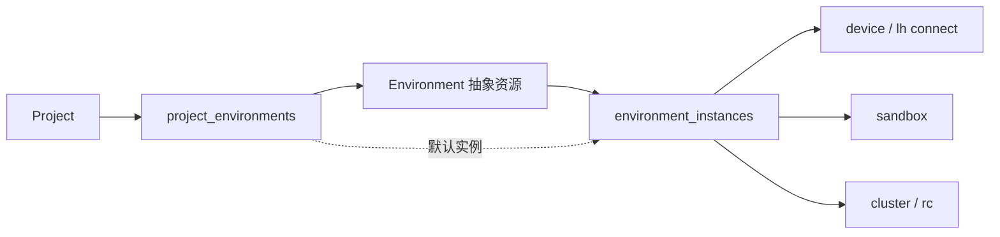

# Environment：抽象资源与实例

本 PR 提供三张表、共享配置类型、数据库约束测试及一份尚未发布的迁移。没有新增 Jobs，也没有接入运行工具、API、Topic 路由或自动同步。

## 核心定义

Environment 是抽象工作资源：Git 仓库、文件来源、初始化方式和必要资源要求。它独立于 Project、Agent、Device 和云端 Provider 存在。

Instance 是该资源的一份具体落地，分为：

- `device`：用户设备上的一份目录。通过 `lh connect` 接入的远端开发机器也属于 device。
- `sandbox`：沙箱中的一份工作环境。
- `cluster`：通过 rc 控制的集群资源中的一份工作环境。

多个 Project 关联同一 Environment 表示共享抽象定义。只有选择同一个 Instance 才表示共享具体工作目录和运行资源。不同实例的文件不自动同步。

## environments

| 字段                     | 职责                                              |
| ------------------------ | ------------------------------------------------- |
| id                       | UUID，稳定资源身份                                |
| user\_id / workspace\_id | 个人或 Workspace 归属，沿用仓库 scope 语义        |
| name / description       | 用户可读标识                                      |
| enabled                  | 环境登记是否可用，不是实例运行状态                |
| configuration            | 明确类型的抽象配置，不含 Provider、设备或物理路径 |
| configuration\_version   | 配置版本，后续写入服务负责递增                    |
| timestamps               | 仓库标准时间字段                                  |

configuration 包含可选的 sources（git URL/ref/ 相对目标路径，或文件来源 URI / 相对目标路径）、bootstrapCommand 和 requirements（CPU / 内存 / GPU）。来源路径是实例内的相对布局，不是某台机器的绝对路径。无来源的现有文件夹也可使用空配置登记。

不把 code /office/training 作为互斥环境类型。资源要求只描述需要什么能力，实际选用的 Provider、镜像和资源规格属于 Instance。

## environment\_instances

| 字段                                                | 职责                                                              |
| --------------------------------------------------- | ----------------------------------------------------------------- |
| id / environment\_id                                | 实例身份和所属环境                                                |
| name / kind                                         | 名称与 device、sandbox、cluster 分类                              |
| device\_id                                          | device 实例使用的内部 devices.id 外键                             |
| provider / provider\_scope / provider\_resource\_id | sandbox/cluster 的适配器及外部资源身份；cluster 的控制适配器为 rc |
| working\_directory                                  | 该实例实际工作目录                                                |
| configuration\_version / configuration\_snapshot    | 实例采用的抽象配置版本及快照                                      |
| configuration                                       | 实例配置：可选镜像、资源选择、空闲超时                            |
| enabled                                             | 是否允许使用此实例                                                |
| status                                              | 最近记录的 pending /ready/stopped/error，默认 pending             |
| timestamps                                          | 仓库标准时间字段                                                  |

实例归属从 Environment 推导，不重复保存可漂移的租户字段。使用实例还必须检查 Device 或外部资源的权限。

实例表本轮登记已知运行端，sandbox/cluster 需要明确的外部资源引用；尚未分配资源的创建意图与调度重试不在本表本轮契约中。

约束：

- device 必须有 device\_id，不能混入 Provider 绑定。
- 非 device 的外部绑定必须提供非空 Provider、scope、resource ID，并且不能带 device\_id。当前共享类型只开放 sandbox 和 cluster。
- 同一设备上的同一路径只能登记一份实例；不同目录可以是同一环境的不同实例。
- 外部实例按 kind、Provider、scope、resource ID、路径去重，不能假定外部 ID 跨账户唯一。
- 配置版本必须为正，配置快照必须是 JSON 对象。
- 删除设备或抽象环境前必须显式清理实例绑定。删除实例记录不自动删除文件或外部资源。

ready 是登记状态，不证明设备此刻在线；后续执行服务必须结合 Device Gateway 或 Provider 状态检查。实例不能仅因 Topic 不活跃而被自动回收，后台训练等进程需明确保活策略。

## project\_environments

| 字段                                | 职责                           |
| ----------------------------------- | ------------------------------ |
| id / project\_id / environment\_id  | 项目与抽象环境的关联           |
| workspace\_id / added\_by\_user\_id | 项目 scope 投影与添加人        |
| enabled / is\_default / sort\_order | 项目内启用、默认环境选择与排序 |
| default\_instance\_id               | 可选的项目级默认实例偏好       |
| timestamps                          | 仓库标准时间字段               |

项目和环境关联唯一；每个项目最多一个默认环境，默认关联必须启用。

(environment\_id, default\_instance\_id) 通过复合外键引用实例的 (environment\_id, id)，防止选中另一环境的实例。实例表仍使用独立 UUID 主键；复合唯一索引仅用于外键约束。

默认实例是项目偏好，不是权限授予。未设置时由后续执行选择流程决定，不能静默挑选其他用户的设备。删除被默认引用的实例前先显式清除或切换默认选择。

## 三个场景

| 场景         | Environment                         | Instance                                          |
| ------------ | ----------------------------------- | ------------------------------------------------- |
| 代码开发     | GitHub URL、分支要求、初始化命令    | Mac 本地 checkout、云端 sandbox 中的一份 checkout |
| 日常文件工作 | 文档 / 素材来源和处理要求，可无 Git | 设备文件夹或沙箱工作目录                          |
| 模型训练     | 数据来源、准备步骤、GPU 要求        | 本地 GPU 设备、GPU sandbox 或 rc 集群中的实例     |

训练进程的启动、查询和取消由执行工具或外部系统负责；Environment 不增加 Jobs。集群调度、分布式训练拓扑也不属于本 PR。

## 权限、删除与后续接入

数据库约束不代替授权。项目、环境和默认实例的租户 / 访问校验，配置深层验证，路径规范化、去重与相对路径越界检查，都须在新增写入 / 执行服务时实现。仅添加关联不扩大环境或设备权限。

删除 Project 只级联删除关联。删除 Environment 需要先清理项目关联和实例；用户 / Workspace 删除也受到 Environment 的 RESTRICT 保护，必须接入资源清理流程后再启用产品写入。

后续需要接入实例的实际创建 / 发现、Topic 的实例选择与 Operation 的执行溯源，以及文件持久化、同步和凭据授权。working\_directory 不承诺持久化；来源 URI 不提供访问凭据；configuration 中不能存放秘密值。

本 PR 没有产品消费入口，不要求新产品 acceptance；数据库测试与 lint 是单独质量检查，不声称已经验证了 lh、sandbox 或 rc 的运行集成。
