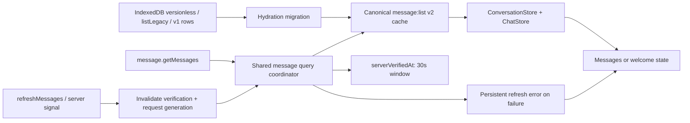

# Message Refresh and Cache Consistency Implementation Plan

**Status:** Implemented locally. Repository checks and targeted automated tests pass. The manual
browser matrix is pending and owned by the user. PR-preparation checks (`bun run i18n`, an explicit
final `/deep-review`, and any standalone circular-dependency check) have not been claimed as run.

**Date:** 2026-07-10

**Review baseline:** The initial reassessment recorded 1 P1 and 3 P2 findings. The supplied
follow-up review also recorded 1 P1 and 3 P2 findings. F3 and F4 each appeared in both reviews.
After preserving both sources and merging those duplicate pairs, the final blocking register
contains 2 P1 and 4 P2 findings.

The follow-up review reports 45 related tests, TypeScript, ESLint, and circular-dependency checks
passing. Those checks do not cover persistent-key migration, false server freshness, background
failure over an empty result, automatic-retry feedback, or status-layout geometry.

## Goal

Make conversation switching feel immediate without weakening message consistency:

- render usable cached messages first;
- reconcile with the server in the background;
- keep routine background reconciliation silent;
- show blocking feedback only when no settled data exists;
- preserve settled content, including a valid empty conversation, when a refresh fails;
- ensure cache-key changes do not discard offline history or orphan IndexedDB rows.

## First-Principles Reassessment Outcome

F1–F6 are all reproducible in the reviewed implementation. Two parts of the original plan needed
correction before implementation:

1. Persistent migration cannot start at v1. IndexedDB may still contain the earlier versionless
   `message:list` and `message:listLegacy` schemas, and the IDB tier has no age-based expiry. The
   migration therefore recognizes all three legacy forms, while only copying rows whose identity
   can be proven.
2. Navigation and forced refresh are different operations. `switchTopic` historically called
   `refreshMessages`; making that call a hard invalidation would discard a just-completed prefetch
   and force a duplicate mount query. Navigation now uses a soft `revalidateMessages` ensure,
   while mutations, server signals, and explicit refresh use hard `refreshMessages` invalidation.

## Product Decision

The user is switching conversations to read or continue working, not to observe cache
revalidation. The final behavior follows this rule:

> Show cached content immediately, verify it in the background, and surface feedback only when
> the user is blocked or the verification fails.

Consequences:

1. Remove the routine `Fetching latest messages...` status from conversation switching.
2. Keep the first-load skeleton when no settled message list exists.
3. Show a full-surface error only when the first load fails without settled data.
4. Keep messages or the welcome state visible when a background refresh fails, and add a
   persistent, non-overlapping retry row.
5. Treat a message list as fresh only after a successful server query. Cache hydration and local
   write-through do not prove server freshness.

## Review Reconciliation

This table preserves the two source reviews before deduplication. “Initial” refers to the first
reassessment of the implementation. “Follow-up” refers to the supplied review with 1 P1 and 3 P2
findings.

| Source ID   | Priority | Reported finding                                                                                      | Final finding                                 |
| ----------- | -------- | ----------------------------------------------------------------------------------------------------- | --------------------------------------------- |
| Initial-1   | P1       | Cache hydration and local write-through can mark a list fresh without a successful server response.   | F2                                            |
| Initial-2   | P2       | A settled empty conversation is classified as having no usable data after a background failure.       | F3                                            |
| Initial-3   | P2       | SWR automatic retry is mistaken for an explicit user retry, so error and progress feedback oscillate. | F6                                            |
| Initial-4   | P2       | The absolute refresh status can overlap the last message and intercept input.                         | F4                                            |
| Follow-up-1 | P1       | The canonical key change has no migration for persistent legacy `message:list` rows.                  | F1                                            |
| Follow-up-2 | P2       | A successfully loaded empty conversation is later treated as a first-load failure.                    | F3 (duplicate)                                |
| Follow-up-3 | P2       | The fixed refresh status does not reserve its own height and covers the last message.                 | F4 (duplicate, with layout geometry evidence) |
| Follow-up-4 | P2       | `refreshMessages` does not invalidate the new freshness state before SWR revalidation.                | F5                                            |

The initial reassessment also produced implementation constraints that do not need separate
priority findings: keep the service transport independent from client cache policy, remove the
delayed loader instead of tuning its timing, retain semantic Retry controls, and add the missing
state-matrix, race, migration, and layout tests.

## Final Blocking Register

| ID  | Priority | Finding                                                                                                                                                          | Final resolution                                                                                                                                                                                                                                                                                                                                    |
| --- | -------- | ---------------------------------------------------------------------------------------------------------------------------------------------------------------- | --------------------------------------------------------------------------------------------------------------------------------------------------------------------------------------------------------------------------------------------------------------------------------------------------------------------------------------------------- |
| F1  | P1       | Canonical message keys cannot read existing `message:list` IndexedDB rows. Old rows never expire and would remain orphaned.                                      | Introduce message-key schema v2 and run an idempotent legacy-to-v2 migration before IndexedDB hydration completes, including versionless `message:list`, `message:listLegacy`, and v1 rows. Hydrate the migrated v2 entry in the same boot, then remove a source only after the replacement is safely persisted or the row is proven unrecoverable. |
| F2  | P1       | Cache hydration and local write-through can falsely mark a message list as server-fresh. A failed request may therefore suppress the next required verification. | Let only a successful coordinated server query establish verification. Cached `onData`, local replacement, optimistic data, gateway data, and write-through `mutate` never update verification time. A failed query leaves the identity unverified.                                                                                                 |
| F3  | P2       | A successfully loaded empty conversation is treated like a first-load failure during a later refresh error.                                                      | Use settled state (`messagesInit` / defined SWR data), not message count, to distinguish first load from background refresh. Preserve the welcome state and render the refresh error beside it.                                                                                                                                                     |
| F4  | P2       | The absolute refresh status overlaps the last message and can intercept clicks.                                                                                  | Remove routine background loading feedback and move the remaining refresh-error row outside the virtualized scroll viewport. It must participate in layout instead of covering content.                                                                                                                                                             |
| F5  | P2       | `refreshMessages` revalidates SWR but does not invalidate the new freshness registry.                                                                            | Hard refresh invalidates matching server-verification and request-generation state before SWR `mutate`, including with no subscriber. Topic navigation uses a separate soft ensure so verified/in-flight prefetch remains reusable.                                                                                                                 |
| F6  | P2       | SWR automatic retry is presented as an explicit retry in progress, causing the error surface to disappear or oscillate.                                          | Keep the background error stable during automatic revalidation. Track progress only for a user-triggered Retry action; disable that control until its request settles without changing the settled content.                                                                                                                                         |

## Non-Goals

- Do not add server-side message versions or delta queries in this change.
- Do not redesign the shared SWR persistence provider for unrelated domains.
- Do not add a general synchronization center or global loading indicator.
- Do not change message streaming ownership or gateway reconciliation rules.
- Do not make direct `messageService.getMessages` callers share UI request state.

## Expected UX State Model

| Settled message list | Request state              | Surface behavior                                                                                         |
| -------------------- | -------------------------- | -------------------------------------------------------------------------------------------------------- |
| No                   | Loading                    | Render `SkeletonList`.                                                                                   |
| No                   | Failed                     | Render full-page `AsyncError`; retry re-runs the same query.                                             |
| Yes, non-empty       | Background validating      | Keep messages visible; show no loading status.                                                           |
| Yes, empty           | Background validating      | Keep the welcome state visible; show no loading status.                                                  |
| Yes, non-empty       | Background failed          | Keep messages visible and show a persistent refresh-error row with Retry.                                |
| Yes, empty           | Background failed          | Keep the welcome state visible and show the same refresh-error row.                                      |
| Yes                  | Explicit retry in progress | Keep content and the error row visible; show progress on the Retry control and prevent duplicate clicks. |
| Yes                  | Retry failed again         | Keep the error row and Retry action available.                                                           |
| Any                  | Agent runtime streaming    | Preserve the existing streaming source-of-truth rules and suppress conflicting focus revalidation.       |

## Target Data Flow



## Detailed Design

### 1. Canonical Key v2 and IndexedDB Migration

Define one canonical server-query context for message lists:

```ts
interface CanonicalMessageListContext {
  agentId: string | null;
  groupId: string | null;
  threadId: string | null;
  topicId: string | null;
  topicShareId?: string;
}
```

Key rules:

- `messageKeys.list` normalizes to this shape.
- UI-only fields such as `scope`, `documentId`, `subAgentId`, and `workspaceSlug` do not enter the
  server-query key.
- Workspace augmentation remains outside the message context and keeps its existing trailing-key
  position.
- Increment `MESSAGE_CACHE_VERSION` from `1` to `2`. This is a key-schema change even though the
  `UIChatMessage[]` payload shape is unchanged.
- Keep the pure normalizer with the key definition. `MessageService` must remain a transport layer
  and must not import client cache state.

Run a targeted migration during `loadIdb`, after selecting rows for the active identity scope and
before hydrating the SWR Map:

1. Select current provider-version rows whose persisted SWR original key is versionless
   `message:list`, `message:listLegacy`, or `message:list` schema v1.
2. Normalize `_k[1]`, replace its message-key schema with v2, preserve any trailing workspace
   segment, and serialize the new key with SWR's `unstable_serialize`.
3. Update the persisted SWR state `_k` to the canonical v2 original key while preserving `data`,
   `error`, and other SWR state fields.
4. If `_k` is absent, derive the context from cached message rows only when agent, topic, and thread
   identity are explicitly present and unambiguous. Group rows, empty lists, and missing thread
   identity must not be copied to a guessed conversation; delete them as legacy data and record a
   debug diagnostic.
5. When several legacy variants collapse into one canonical key, keep the row with the newest
   `updatedAt`.
6. Persist the canonical row and delete its legacy sources in one IndexedDB transaction. Never
   delete the source first.
7. Hydrate the canonical in-memory entry during the same boot, so the first post-upgrade launch
   still works offline.
8. Make the migration idempotent. A v2 row is never rewritten, and a failed migration is retried on
   the next boot.

The migration is scope-local: personal users and each workspace migrate independently. It must not
read, merge, or delete another identity scope.

### 2. Server-Verified Freshness

The 30-second window remains useful for a completed prefetch followed by an immediate conversation
switch, but its meaning changes from generic “freshness” to “recently verified by the server.”

Refactor the cache coordinator accordingly:

- Rename `messageListFetchedAt` to `messageListVerifiedAt`.
- Only a successful `runMessageListQuery` response may update `messageListVerifiedAt`.
- Cached `onData`, `replaceMessages`, optimistic updates, gateway snapshots, and write-through
  `mutate` calls must not update verification time.
- Starting a real revalidation clears the previous verification timestamp. A failed request leaves
  the entry unverified and eligible for retry.
- Keep verification identity scoped by user/workspace and canonical query context.
- Keep the bounded registry; 500 entries remains sufficient for the short verification window.

`getMessageListFetchPolicy` may set:

- `dedupingInterval: 30_000` for SWR's native request dedupe;
- `revalidateIfStale: false` only when the same canonical query has a successful, non-invalidated
  server verification inside the window.

### 3. Explicit Invalidation and Request Generation

Add an invalidation API that accepts the same predicate shape used by `refreshMessages`:

```ts
invalidateMessageListClientState(
  (context) => context.agentId === agentId && context.topicId === topicId,
);
```

It must:

1. operate only inside the current cache scope;
2. delete matching `messageListVerifiedAt` entries synchronously;
3. advance a request generation for matching identities;
4. prevent a request started before invalidation from restoring the verified timestamp;
5. ensure a later caller does not reuse an invalidated request generation.

When an older request settles after invalidation, resolve its callers through the current-generation
query rather than publishing the obsolete result. This preserves in-flight deduplication without
allowing explicit invalidation to be cancelled by an older promise.

`refreshMessages` must invalidate client state before SWR `mutate`. This ordering covers the
important no-subscriber case: a background Agent can invalidate an inactive conversation, and the
next mount will revalidate even though `mutate` had no mounted hook to trigger immediately.

`switchTopic` must not call that hard-refresh path. It calls `revalidateMessages`, which:

- returns immediately for a recently server-verified canonical query;
- shares a matching in-flight prefetch through the coordinator;
- otherwise revalidates only the concrete canonical key for the destination context, without
  advancing the request generation or touching sibling group/thread keys.

### 4. Prefetch and Write-Through

Keep the useful parts of the current cache work:

- prefetch and mounted hooks use the same canonical v2 key;
- prefetch and both UI stores share one in-flight query per scoped identity;
- successful prefetch seeds SWR and counts as server verification;
- direct service reads remain independent;
- settled local mutations continue to write through to the canonical SWR key so switch-back can
  render immediately;
- local write-through does not suppress the next required server verification;
- a failed background prefetch stays non-blocking and logs through the existing `debug` convention,
  not a stray `console.error`.

### 5. ChatList Feedback

Remove the routine background loading presentation:

- delete the `RefreshingHint` component introduced by the intermediate implementation;
- stop injecting background validation feedback into the virtualized footer;
- remove the unused `chatList.refreshing` copy after confirming no other consumers remain;
- do not render any status for ordinary `isValidating` over settled data.

Replace it with a failure-only component, for example `RefreshError`:

- reuse `AsyncError` normalization so `401`, `403`, and `meta.shouldRetry === false` do not show a
  false Retry action;
- keep the semantic base-ui `Button` improvement;
- do not derive user-retry progress from `error && isValidating`; SWR sets the same validating state
  during automatic retries;
- keep the error row stable during automatic retries instead of replacing it with loading feedback;
- track an explicit Retry action separately so the error remains visible while its control shows
  progress and disables duplicate clicks;
- keep `aria-live="polite"` for the failure transition.

Render the refresh error in a `ChatList` shell outside the virtualized scroll viewport:

```text
ChatList shell (column, height: 100%)
├── content (flex: 1, min-height: 0)
│   ├── VirtualizedList, or
│   └── Welcome
└── background refresh error row (layout participant)
```

This placement works for both non-empty and empty settled conversations and does not alter
virtualized data. The net implementation needs no `VirtualizedList` prop or style change because the
row is composed as its sibling in `ChatList`.

Use `messagesInit` as the primary settled-state signal:

- `!messagesInit && error` → first-load full-page error;
- `messagesInit && error` → preserve messages or welcome and show background refresh error;
- message count decides between messages and welcome, never between first-load and background
  failure.

## Implemented File Changes

### Cache key and migration

- Modify `src/libs/swr/keys.ts`
  - canonical message-list context;
  - message-key schema v2.
- Create `src/libs/swr/migrations/messageListCache.ts`
  - identify, canonicalize, merge, and migrate versionless, `message:listLegacy`, and v1 rows;
  - preserve already-canonical v2 rows that SWR persisted before `_k` was available.
- Create `src/libs/swr/migrations/messageListCache.test.ts`.
- Modify `src/libs/swr/localDataCache.ts`
  - add the transactional move/batch operation required by migration.
- Modify `src/libs/swr/localDataCache.test.ts`.
- Modify `src/libs/swr/localStorageProvider.ts`
  - run migration before IDB hydration.
- Modify `src/libs/swr/cacheProvider.integration.test.tsx`.

### Query and store behavior

- Create `src/services/message/cache.ts`
  - server-verification registry;
  - scoped invalidation;
  - request generations;
  - in-flight sharing.
- Create `src/services/message/cache.test.ts`.
- Modify `src/services/message/index.ts`
  - remove the dependency on client cache policy.
- Modify `src/services/message/server.test.ts`.
- Modify `src/store/chat/slices/message/actions/query.ts`
  - invalidate before refresh;
  - stop marking local replacements as server-verified;
  - preserve canonical write-through and prefetch.
- Modify `src/store/chat/slices/message/action.test.ts`.
- Modify `src/store/chat/slices/topic/action.ts` and its tests
  - use soft revalidation for navigation instead of hard invalidation.
- Modify `src/features/Conversation/store/slices/data/action.ts` and its tests.

### UI and copy

- Modify `src/features/Conversation/ChatList/index.tsx`
  - settled-state branching;
  - silent background validation;
  - non-overlapping background error row.
- Delete `src/features/Conversation/ChatList/components/RefreshingHint.tsx`.
- Create failure-only `src/features/Conversation/ChatList/components/RefreshError.tsx`.
- Create `src/features/Conversation/ChatList/hooks/useMessageRefreshError.ts` and its test.
- Create `src/features/Conversation/ChatList/resolveMessageListFeedback.ts` and its test.
- Modify `src/components/AsyncError/index.tsx` for semantic Retry controls and explicit progress.
- Update `packages/locales/src/default/chat.ts`, `locales/en-US/chat.json`, and
  `locales/zh-CN/chat.json`.

## Automated Regression Coverage

### Persistent migration

- A v1 full-context key hydrates through its canonical v2 key while offline.
- Versionless `message:list` and `message:listLegacy` rows follow the same safe migration rules.
- The v1 row is removed only after the v2 row is persisted.
- Multiple v1 variants that collapse to one v2 key keep the newest `updatedAt` data.
- Already-migrated v2 rows are unchanged on repeated hydration.
- Non-message rows are untouched.
- Personal and workspace scopes remain isolated.
- A migration write failure keeps the legacy source and retries on the next boot.
- An original-key-less canonical v2 empty snapshot is never mistaken for legacy data.
- Mixed `null` and string identities cannot be collapsed into a guessed conversation.

### Verification and invalidation

- Equivalent prefetch and mounted contexts share one canonical key.
- Only successful server queries mark a list verified.
- Cached `onData` and local write-through never mark a list verified.
- A failed revalidation remains unverified even when cached data is present.
- `refreshMessages` clears verification with and without an active subscriber.
- A request invalidated while in flight cannot restore verification or publish an older generation.
- A successful prefetch makes the subsequent soft navigation ensure return without mutating SWR.
- The query coordinator shares matching in-flight calls, while topic navigation uses soft
  revalidation and explicit refresh advances the generation.
- An unverified soft revalidation targets only the destination canonical key, not sibling
  group/thread keys.
- User/workspace scopes never share verification or in-flight requests.

### UI state and retry logic

- Unsettled, non-new conversation without an error selects the skeleton state.
- Unsettled, non-new conversation with an error selects the first-load error state.
- Settled data with an error selects background feedback; streaming suppresses that feedback.
- Explicit retry keeps the retained error stable and exposes only its own progress state.
- SWR automatic retry keeps the error row stable and never presents itself as a user-triggered
  retry.
- Repeated retry failure remains actionable.
- Retained error and retry state do not leak across canonical message-list identities.

The pure state resolver covers first-load versus settled-background decisions, including a settled
empty list. The Retry hook tests cover automatic retry stability, duplicate-click suppression,
repeated failure, and identity changes. Actual ChatList composition, non-retryable button rendering,
and browser geometry remain manual checks below rather than being claimed as automated coverage.

## Manual and PR-Preparation Verification Remaining

The user will verify these browser and accessibility stories:

- The refresh error never overlaps the last message at the bottom of the list.
- The error row works in narrow Fleet columns, task drawers, desktop chat, and mobile widths.
- The Retry control works by pointer, Enter, and Space.
- Loading/error transitions announce once through the live region without repeated automatic-retry
  churn.
- A settled non-empty conversation keeps its messages during a failed refresh.
- A settled empty conversation keeps its welcome state during a failed refresh.
- An in-flight prefetch followed by navigation/mount performs only one server request.

Before opening a PR, also run `bun run i18n`, the requested standalone circular-dependency check if
it is not part of the repository check at that time, and an explicit final `/deep-review`.

## Verification Commands

Run the repository check once against all changed files:

```bash
bun run check
bun run check --type
git diff --check
```

Do not run the full `bun run test` suite. Before opening the PR, run:

```bash
bun run i18n
```

The user will verify the critical browser stories:

1. Upgrade with only versionless, `message:listLegacy`, or v1 IndexedDB messages available,
   disconnect the network, and open a cached conversation.
2. Switch rapidly between prefetched conversations and confirm no visible loading status or
   duplicate request.
3. Fail a focus refresh over a non-empty conversation and confirm content remains usable.
4. Fail a focus refresh over an empty conversation and confirm the welcome state remains visible.
5. Retry from the error row and confirm stable progress and repeated-failure behavior.
6. Check the bottom row in desktop chat, Fleet, task drawer, and a mobile-width viewport.

After the user-owned browser matrix passes, run `/deep-review` because this change touches the core
message cache, offline recovery, and the primary chat surface.

## Acceptance Criteria

- An upgraded offline client can open legacy message history when its identity can be proven and its
  provider version is eligible for hydration.
- Recoverable, provider-version-eligible legacy rows do not remain orphaned after successful
  migration; ambiguous rows are never copied to a guessed conversation.
- Routine conversation switching never displays `Fetching latest messages...`.
- First-load failure never becomes a permanent skeleton.
- Background failure never replaces settled messages or a settled empty/welcome state.
- Refresh feedback is a layout participant outside the scroll viewport; browser confirmation that
  it never overlaps or blocks content is pending with the user.
- Explicit refresh invalidation forces the next relevant mount to verify with the server.
- Cache hydration and local mutation cannot falsely extend the server-verification window.
- Automatic retries keep failure feedback stable; only an explicit Retry action changes the Retry
  control's progress state.
- Prefetch and mounted reads share requests without crossing users or workspaces.
- Streaming message state remains protected from stale DB revalidation.
- Repository lint/tests, targeted regression tests, TypeScript, and `git diff --check` pass.
- Browser scenarios, i18n generation, the explicit final deep review, and any separate circular
  dependency check remain PR-preparation gates and are not yet marked complete.
