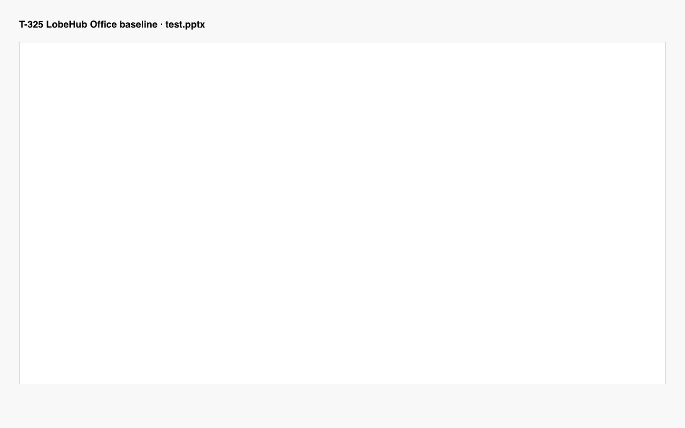
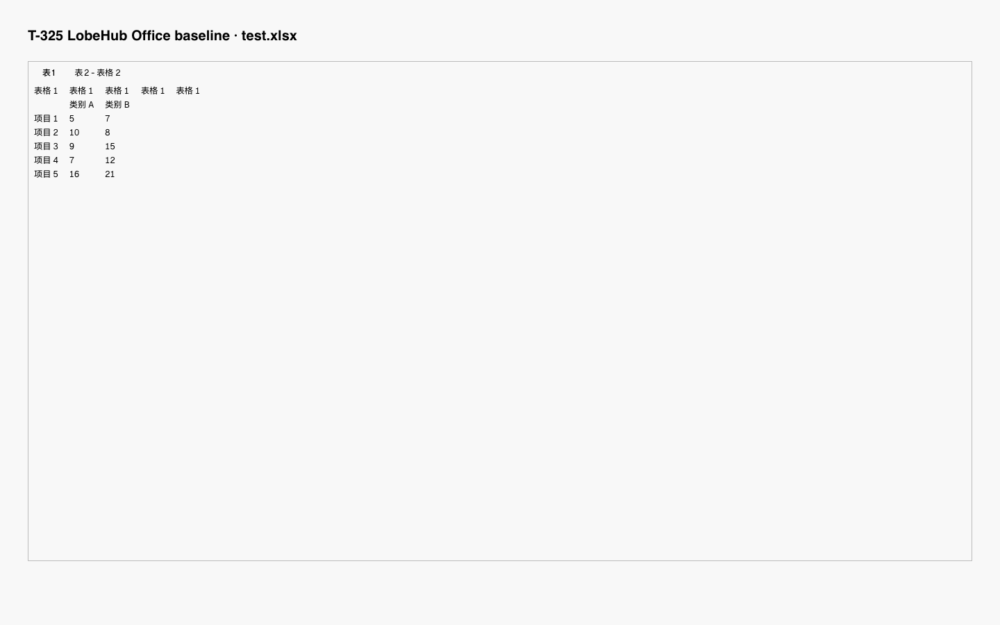
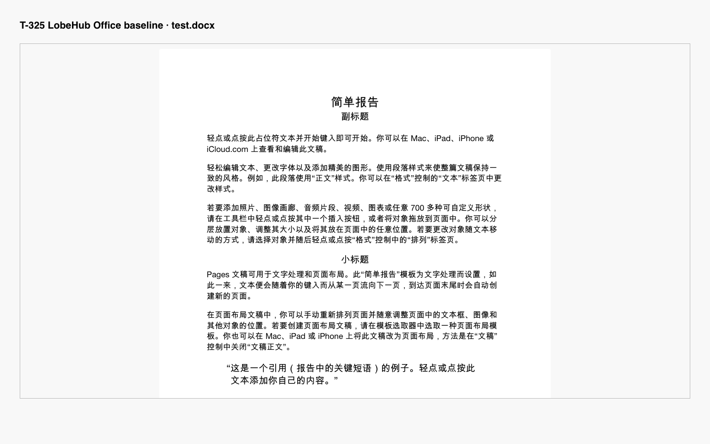

# T-325 独立核验交付

基线：LobeHub `2794037573e1cc0dc5d02eb223463c61c5ca16d3`，2026-09-03。本文不依赖其他工作区文件即可核验核心结论。

状态：可用 / 部分可用 / 不可用 / 有风险（只有声明或缺少端到端证据）。对比：优于 / 持平 / 劣于 / 不可比。

## 完整功能矩阵

| 文档  | 核心维度   | LobeHub 状态                                                          | ChatGPT/Codex 状态                                | 对比结论与一句话理由                       | 证据           |
| ----- | ---------- | --------------------------------------------------------------------- | ------------------------------------------------- | ------------------------------------------ | -------------- |
| PPT   | 创建或导入 | 部分可用：既有 PPTX 导入实测通过，无空白创建证据                      | 有风险：官方声明可创建 / 编辑，UI 未实测          | 不可比：Lobe 只有导入实测，对侧只有声明    | L1、C1、C2     |
| PPT   | 内容编辑   | 不可用：当前 pane 未暴露编辑事件或对象 mutation                       | 有风险：官方声明可编辑演示文稿，UI 未实测         | 劣于（声明基线）：Lobe 源码只有 renderer   | L2、L3、C2     |
| PPT   | 格式调整   | 不可用：未发现 slide/layout/image/shape/chart/font 调整命令           | 有风险：官方声明可修订演示文稿但高级编辑有限      | 劣于（声明基线）：Lobe 没有格式命令面      | L3、C2         |
| PPT   | 保存       | 不可用：无 saving/saved/writeFile/PPTX exporter                       | 有风险：官方声明可生成可编辑文件，UI 未实测       | 劣于（声明基线）：Lobe 没有保存实现        | L4、C2         |
| PPT   | 再次打开   | 部分可用：原 fixture 可重复读取；编辑后重开未验证                     | 有风险：官方称文件可在 Library 复用，UI 未实测    | 不可比：双方均无本轮编辑后重开结果         | L1、L4、C1、C2 |
| PPT   | 导出或下载 | 部分可用：可下载输入 blob，没有编辑结果 exporter                      | 有风险：官方声明可创建 PPTX，UI 未实测            | 劣于（声明基线）：Lobe 只能下载原文件      | L4、L5、C2     |
| Excel | 创建或导入 | 部分可用：既有多 sheet XLSX 导入实测通过，无空白创建证据              | 有风险：官方声明可创建 / 编辑 workbook，UI 未实测 | 不可比：证据强度不同                       | L1、C1、C2     |
| Excel | 内容编辑   | 不可用：workbook 被渲染为普通 `<td>`，无输入事件                      | 有风险：官方声明可更新多 tab、公式和引用          | 劣于（声明基线）：Lobe 是只读表格          | L2、L3、C2     |
| Excel | 格式调整   | 不可用：未发现数字格式、行列尺寸或单元格样式命令                      | 有风险：官方声明可更新 spreadsheet，UI 未实测     | 劣于（声明基线）：Lobe 没有格式操作面      | L3、C2         |
| Excel | 保存       | 不可用：只有 `xlsx.load`，无 write/export/save 状态                   | 有风险：官方声明支持编辑文件，UI 未实测           | 劣于（声明基线）：Lobe 无 workbook 回写    | L2、L4、C2     |
| Excel | 再次打开   | 部分可用：原 fixture 可重复读取；公式只显示缓存结果；编辑后重开未验证 | 有风险：官方声明支持既有 workbook，UI 未实测      | 不可比：没有双方编辑后重开输出             | L1、L2、C1     |
| Excel | 导出或下载 | 部分可用：可下载输入 blob，无新 XLSX 输出                             | 有风险：官方声明可创建 / 编辑 spreadsheet 文件    | 劣于（声明基线）：Lobe 无编辑结果导出      | L4、L5、C2     |
| Word  | 创建或导入 | 部分可用：既有 DOCX 导入实测通过，无空白创建证据                      | 有风险：官方声明可创建 / 编辑 document，UI 未实测 | 不可比：证据强度不同                       | L1、C1、C2     |
| Word  | 内容编辑   | 不可用：pane 只调用 `renderAsync`；loader 只提供 raw text             | 有风险：官方声明可编辑 document，UI 未实测        | 劣于（声明基线）：Lobe 无富文本 mutation   | L2、L3、C2     |
| Word  | 格式调整   | 不可用：未发现段落 / 标题 / 列表 / 表格 / 图片 / 链接编辑命令         | 有风险：官方声明可编辑文件，UI 未实测             | 劣于（声明基线）：Lobe 无格式命令面        | L3、C2         |
| Word  | 保存       | 不可用：无 saving/saved/writeFile/DOCX exporter                       | 有风险：官方声明可创建可编辑 DOCX，UI 未实测      | 劣于（声明基线）：Lobe 没有保存实现        | L4、C2         |
| Word  | 再次打开   | 部分可用：原 fixture 可重复读取；编辑后结构恢复未验证                 | 有风险：官方称创建文件可保存至 Library，UI 未实测 | 不可比：没有双方编辑后重开产物             | L1、L4、C1、C2 |
| Word  | 导出或下载 | 部分可用：下载输入 blob 或外部打开，无编辑后 DOCX                     | 有风险：官方声明可创建 DOCX，UI 未实测            | 劣于（声明基线）：Lobe 无编辑结果 exporter | L4、L5、C2     |

## 内嵌证据

### L1 — 实际 loader 测试日志

```bash
cd packages/file-loaders
bunx vitest run --silent='passed-only' src/loaders/pptx/index.test.ts src/loaders/excel/index.test.ts src/loaders/docx/index.test.ts
```

```text
RUN  v3.2.6 /Users/arvinxx/CodeProjects/LobeHub/lobehub/packages/file-loaders
✓ src/loaders/pptx/index.test.ts (6 tests) 76ms
✓ src/loaders/excel/index.test.ts (4 tests) 42ms
✓ src/loaders/docx/index.test.ts (3 tests) 52ms
Test Files  3 passed (3)
     Tests  13 passed (13)
Duration  2.01s
```

实际断言：

```ts
expect(pptPages.length).toBeGreaterThan(1);
expect(excelPages.length).toBeGreaterThan(0);
expect(docxPages).toHaveLength(1);
expect(docxContent).toEqual(docxPages[0].pageContent);
```

L1 只证明既有文件可导入 / 抽取，不证明创建、编辑、保存或导出。

### L2 — 实际渲染和读取路径

```text
210: viewer = await PptxViewer.open(blob, container, {
256: await renderAsync(blob, container);
307: if (cell.formula !== undefined) return formatCellValue(cell.result);
327: await workbook.xlsx.load(await blob.arrayBuffer());
383: <td key={cellIndex}>{cell}</td>
packages/file-loaders/src/loaders/docx/index.ts:23:
  const result = await mammoth.extractRawText({ buffer });
```

这证明当前可见实现是 renderer/load/raw-text 路径。它不证明实际发生过数据或格式丢失；相关结论仅为 “编辑和 round-trip 未验证”。

### L3 — 编辑与格式命令探测

```bash
for token in addSlide deleteSlide moveSlide setLayout addImage addShape addChart fontFamily fontSize resize alignCells numberFormat rowHeight columnWidth paragraphStyle headingStyle listStyle insertTable insertImage insertLink contentEditable onChange undo redo; do
  count=$(rg -F -c "$token" src/features/Portal/LocalFile/DocumentPreview.tsx || true)
  echo "$token=${count:-0}"
done
```

```text
addSlide=0
deleteSlide=0
moveSlide=0
setLayout=0
addImage=0
addShape=0
addChart=0
fontFamily=0
fontSize=0
resize=0
alignCells=0
numberFormat=0
rowHeight=0
columnWidth=0
paragraphStyle=0
headingStyle=0
listStyle=0
insertTable=0
insertImage=0
insertLink=0
contentEditable=0
onChange=0
undo=0
redo=0
```

探测范围限定为当前 Office pane 文件，不扩大到私有部署或未来版本。

### L4 — 保存与 exporter 探测

```text
saving=0
saved=0
exportPptx=0
exportXlsx=0
exportDocx=0
writeFile=0
```

### L5 — 下载 / 外部打开源码

```tsx
const url = URL.createObjectURL(blob);
const anchor = globalThis.document.createElement('a');
anchor.href = url;
anchor.download = filename;
anchor.click();
```

```tsx
<Button onClick={() => localFileService.openLocalFile({ path: filePath })}>
```

输入对象是现有 `blob`。本轮没有新导出文件，不能对导出文件完整性或损坏作 PASS/FAIL 判断。

### C1 — ChatGPT/Codex UI 实际结果

```text
No browser is available
```

因此对侧没有截图、保存后文件或重开日志，矩阵统一标为 “有风险 / 未实测”。

### C2 — 官方声明基线

OpenAI 官方页面声明 ChatGPT Work 可 “create or edit documents, spreadsheets, presentations”，同时说明可用性依赖套餐、workspace、文件类型和使用界面。PowerPoint 页面还说明部分高级 chart、shape、formatting 和 slide-management 能力可能受限。

- <https://help.openai.com/en/articles/20001278>
- <https://help.openai.com/en/articles/20001242-chatgpt-for-powerpoint>
- <https://help.openai.com/en/articles/20001063-chatgpt-for-excel>

官方声明不替代实际 UI 证据，所以没有记录为 PASS。

## 可复现测试素材（内容直接内嵌）

以下素材供 LobeHub 与 ChatGPT/Codex 使用同一输入；文件路径只是便于本仓库重放，内容摘要和 oracle 已在本文给全，因此不是仅凭路径交付。

### PPT 素材

- smoke 文件：`packages/file-loaders/src/loaders/pptx/fixtures/test.pptx`；SHA-256 `7338a6c2978a9fdaf6575af3dd6e8681d5fc589f91e19e731bc2012e143b8111`；至少两页，第一页含 `Hello`、`Page1`。
- 富内容样例：新建 4 页，页标题依次为 “封面、数据、方案、结论”，每页放入标记 `T-325-R1`；第 2 页插入 Q1/Q2/Q3=`120/150/180` 柱状图；第 3 页插入 800×450 图片及写有 “可恢复” 的圆角矩形；把最终页序调整为 “封面、方案、结论、数据”。
- 通过 oracle：4 页、最终页序正确；标记、图片、形状、图表数值在保存、重开和下载文件中保持；下载文件可被 PowerPoint/LibreOffice 打开且无修复警告。

### Excel 素材

- smoke 文件：`packages/file-loaders/src/loaders/excel/fixtures/test.xlsx`；SHA-256 `019597d1701adb261b922d8a66e0f6f0db7d0bfd10659b8e822a8b6f4277db06`；OOXML 含 `sheet1.xml`、`sheet2.xml`、`sharedStrings.xml`、`styles.xml`。
- 新建工作簿并按如下 CSV 填入 “明细” 表：

```csv
日期,地区,产品,数量,单价
2026-08-01,华东,Alpha,10,120
2026-08-02,华南,Beta,5,200
2026-08-03,华东,Gamma,3,150
2026-08-04,华南,Alpha,2,120
2026-08-05,华东,Beta,1,115
2026-08-06,华南,Gamma,1,110
```

- 增加 “参数表” 税率 `13%` 和 “汇总” 表；明细新增未税金额公式 `=D2*E2`，含税金额公式 `=F2*(1+参数表!$B$1)` 并向下复制；表顺序改为 “参数表→明细→汇总”；金额设两位小数、标题加粗。
- 通过 oracle：未税总额 `3115.00`、含税总额 `3519.95`、华东 `1765.00`、华南 `1350.00`；保存、重开和下载后公式文本、结果、格式、表名与顺序均保持。

### Word 素材

- smoke 文件：`packages/file-loaders/src/loaders/docx/fixtures/test.docx`；SHA-256 `25ee9d2f05861810b44f6d866869f329b079a9a4d08b9ba7ec25cbeb06f62433`；含 `简单报告`、`副标题`、`小标题`、`这是第二页的内容`。
- 富内容样例：标题 `T-325 办公文档基线报告`，正文标记 `T-325-R1`；加入 4 项编号列表、3 项风险项目符号列表、3×3 表格、链接 `https://openai.com/` 和一张 800×450 图片；标题用 Heading 1，正文左对齐，表头加粗。
- 通过 oracle：正文标记、标题层级、两类列表、3×3 表格、链接和图片在保存、重开及下载文件中均存在；Word/LibreOffice 打开无修复警告。

统一图片的内容定义：SVG `viewBox="0 0 800 450"`，蓝色边框、橙色圆形、三条蓝色横条、白色文字 `T-325`；SHA-256 `b7bbf3589440ff50e061f0922496b4e203829819b313024c4a28e1933e3416fe`。

## 15 个生命周期环节：步骤、实际观察与判定

判定含义：`PASS`= 本轮实际完成且 oracle 满足；`PARTIAL`= 仅完成该环节的一部分；`FAIL`= 核心动作不可用；`NV`= 执行环境不可用，未验证。工作目录默认为仓库根目录。

### PPT（5 个环节）

#### PPT-IMPORT — 创建或导入

1. 执行 `cd packages/file-loaders`。
2. 执行 `bunx vitest run --silent='passed-only' src/loaders/pptx/index.test.ts`。
3. 核对输出含 `src/loaders/pptx/index.test.ts (6 tests)`，并核对断言 `pptPages.length > 1`；在产品 UI 中尝试寻找 “新建空白 PPT” 入口。

实际观察（原始日志摘录）：`✓ src/loaders/pptx/index.test.ts (6 tests) 76ms`；源码和 UI 证据中没有空白创建入口。结论：`PARTIAL`（既有 PPTX 导入通过，创建未验证）。

#### PPT-EDIT — 内容与格式编辑

1. 执行 `rg -n "contentEditable|onChange|PptxViewer.open" src/features/Portal/LocalFile/DocumentPreview.tsx`。
2. 执行 L3 的格式命令探测，逐项检查增删页、移动、布局、文本、图片、形状、图表、字体、缩放入口。
3. 若 UI 有入口，按 PPT 素材完成新增、修改、删除、移动和缩放并截图；没有入口即记录阻断点。

实际观察：唯一相关命中为 `210: viewer = await PptxViewer.open(blob, container, {`；L3 中 PPT 编辑 / 格式 token 全为 `0`，未能执行素材变更。结论：`FAIL`。

#### PPT-SAVE — 保存

1. 执行 `for token in saving saved writeFile exportPptx; do count=$(rg -i -c "$token" src/features/Portal/LocalFile/DocumentPreview.tsx || true); echo "$token=${count:-0}"; done`。
2. 编辑后尝试保存，记录 dirty/saving/saved/error 提示及输出文件 SHA-256。

实际观察：`saving=0`、`saved=0`、`writeFile=0`、`exportPptx=0`；编辑已在上一步被阻断，没有输出文件。结论：`FAIL`。

#### PPT-REOPEN — 再次打开

1. 连续两次执行 PPT-IMPORT 的 Vitest 命令，确认输入 fixture 可重复读取。
2. 关闭后打开 PPT-SAVE 的输出，核对 4 页、页序、标记、对象位置与样式。

实际观察：输入 fixture 两次均为 `6 tests passed`；PPT-SAVE 无编辑后文件，第二步无法执行。结论：`PARTIAL`（只能重开原文件）。

#### PPT-EXPORT — 导出或下载

1. 执行 `rg -n "createObjectURL|anchor.download|exportPptx|writeFile" src/features/Portal/LocalFile/DocumentPreview.tsx`。
2. 点击下载并比较下载文件与输入文件 SHA-256；若为编辑输出，再用 PowerPoint/LibreOffice 打开并核对 PPT oracle。

实际观察：命中 `URL.createObjectURL(blob)` 和 `anchor.download = filename`；`exportPptx/writeFile` 无命中，只能下载输入 blob，未产生可供跨应用检查的新文件。结论：`PARTIAL`。

### Excel（5 个环节）

#### XLSX-IMPORT — 创建或导入

1. 执行 `cd packages/file-loaders`。
2. 执行 `bunx vitest run --silent='passed-only' src/loaders/excel/index.test.ts`。
3. 核对 4 项测试通过及多 sheet 聚合断言；在 UI 中寻找空白 workbook 创建入口。

实际观察：`✓ src/loaders/excel/index.test.ts (4 tests) 42ms`；既有多 sheet XLSX 可读，未发现空白创建入口。结论：`PARTIAL`。

#### XLSX-EDIT — 内容与格式编辑

1. 执行 `rg -n "workbook.xlsx.load|contentEditable|onChange|<td" src/features/Portal/LocalFile/DocumentPreview.tsx`。
2. 按 Excel 素材尝试数据增删改、区域复制粘贴、行列调整、sheet 新增 / 重命名 / 排序、公式和格式调整。
3. 对照数值 oracle 记录实际计算结果。

实际观察：命中 `327: await workbook.xlsx.load(...)`、`383: <td key={cellIndex}>{cell}</td>`；无 `contentEditable/onChange`，步骤 2 被只读表格阻断，未产生公式结果。结论：`FAIL`。

#### XLSX-SAVE — 保存

1. 执行 `for token in saving saved writeFile exportXlsx; do count=$(rg -i -c "$token" src/features/Portal/LocalFile/DocumentPreview.tsx || true); echo "$token=${count:-0}"; done`。
2. 尝试保存并记录状态、文件大小和 SHA-256。

实际观察：`saving=0`、`saved=0`、`writeFile=0`、`exportXlsx=0`；只有 load，没有 workbook 回写结果。结论：`FAIL`。

#### XLSX-REOPEN — 再次打开

1. 连续两次执行 XLSX-IMPORT 命令。
2. 执行 `rg -n "cell.formula|cell.result" src/features/Portal/LocalFile/DocumentPreview.tsx`。
3. 重开保存输出，逐格核对公式文本、结果、表顺序和格式。

实际观察：原 fixture 两次均为 `4 tests passed`；显示路径为 `307: if (cell.formula !== undefined) return formatCellValue(cell.result);`；无保存输出可执行步骤 3。结论：`PARTIAL`。

#### XLSX-EXPORT — 导出或下载

1. 执行 `rg -n "createObjectURL|anchor.download|exportXlsx|writeFile" src/features/Portal/LocalFile/DocumentPreview.tsx`。
2. 下载后记录 SHA-256，并以 Excel/LibreOffice 打开；若为编辑输出，对照 `3115.00/3519.95` oracle。

实际观察：仅输入 blob 下载；`exportXlsx/writeFile` 无命中，没有新 workbook，无法对编辑结果做跨应用断言。结论：`PARTIAL`。

### Word（5 个环节）

#### DOCX-IMPORT — 创建或导入

1. 执行 `cd packages/file-loaders`。
2. 执行 `bunx vitest run --silent='passed-only' src/loaders/docx/index.test.ts`。
3. 核对 3 项测试通过，并核对抽取文本含 smoke 内容；在 UI 中寻找空白 DOCX 创建入口。

实际观察：`✓ src/loaders/docx/index.test.ts (3 tests) 52ms`；既有 DOCX 可读，未发现空白创建入口。结论：`PARTIAL`。

#### DOCX-EDIT — 内容与格式编辑

1. 执行 `rg -n "renderAsync|contentEditable|onChange" src/features/Portal/LocalFile/DocumentPreview.tsx`。
2. 执行 `rg -n "extractRawText" packages/file-loaders/src/loaders/docx/index.ts`。
3. 按 Word 素材尝试文本、复制粘贴、标题 / 段落、字体 / 对齐、列表、表格、图片和链接编辑。

实际观察：命中 `256: await renderAsync(blob, container);` 与 `const result = await mammoth.extractRawText({ buffer });`；无编辑事件，步骤 3 被阻断。结论：`FAIL`。

#### DOCX-SAVE — 保存

1. 执行 `for token in saving saved writeFile exportDocx; do count=$(rg -i -c "$token" src/features/Portal/LocalFile/DocumentPreview.tsx || true); echo "$token=${count:-0}"; done`。
2. 尝试保存并记录状态、文件大小和 SHA-256。

实际观察：`saving=0`、`saved=0`、`writeFile=0`、`exportDocx=0`；没有 DOCX serializer 或输出。结论：`FAIL`。

#### DOCX-REOPEN — 再次打开

1. 连续两次执行 DOCX-IMPORT 命令。
2. 重开 DOCX-SAVE 输出并核对正文标记、标题层级、列表、3×3 表格、链接和图片。

实际观察：输入 fixture 两次均为 `3 tests passed`；无保存输出，步骤 2 无可打开对象。结论：`PARTIAL`。

#### DOCX-EXPORT — 导出或下载

1. 执行 `rg -n "createObjectURL|anchor.download|openLocalFile|exportDocx|writeFile" src/features/Portal/LocalFile/DocumentPreview.tsx`。
2. 下载后记录 SHA-256，以 Word/LibreOffice 打开并核对 Word oracle。

实际观察：命中 `anchor.download = filename` 和 `openLocalFile`；没有 `exportDocx/writeFile`，只能下载 / 外部打开输入文件，未产生编辑输出。结论：`PARTIAL`。

### ChatGPT/Codex 对侧同样例执行记录

对侧应逐类使用上面相同素材，依次执行创建或导入、编辑、保存、关闭重开、下载，并记录每步截图、文件大小、SHA-256 与 oracle。实际环境返回原始结果 `No browser is available`，故 15 个对侧环节全部为 `NV`；本文只在矩阵记录官方声明基线，不把声明冒充实测结果。

## 按优先级排序的问题清单（能力缺口 + 兼容性风险）

排序规则：P0 阻断全生命周期或有数据丢失风险；P1 阻断单类核心能力或有高互操作风险；P2 为范围、版本兼容或回归保障。

| 顺序 | 优先级 | 类型                | 问题或风险                                                                        | 追溯矩阵 / 场景                                         | 最小完成定义                                                                       |
| ---- | ------ | ------------------- | --------------------------------------------------------------------------------- | ------------------------------------------------------- | ---------------------------------------------------------------------------------- |
| 1    | P0     | 核心能力缺口        | 三类均无内容编辑与保存回写，不能产生可重开的编辑版本。                            | 三类 “内容编辑 / 保存 / 再次打开”；`*-EDIT/SAVE/REOPEN` | 每类完成导入→编辑→保存→重开并产出新文件 SHA-256 与结构检查。                       |
| 2    | P0     | 数据安全 / 恢复缺口 | 无 dirty/saving/saved/error、撤销 / 重做和失败恢复，编辑状态不可判断。            | 三类 “保存”；L3/L4                                      | 统一状态机，失败保留草稿，关键修改可 undo/redo。                                   |
| 3    | P0     | OOXML 兼容性风险    | 无 round-trip 门禁；未知部件能否保留、输出能否被 Office 打开均未验证。            | 三类 “保存 / 导出”；`*-SAVE/EXPORT`                     | 比较保存前后 OOXML part / 关系 / 对象数，并用 Office/LibreOffice 打开及视觉 diff。 |
| 4    | P1     | Excel 能力 / 兼容性 | 公式仅显示缓存 `result`，空行跳过且预览截断 500 行，可能出现陈旧结果或坐标误读。  | Excel“编辑 / 重开”；`XLSX-EDIT/REOPEN`                  | 保留坐标与公式，定义重算策略，通过 `3115.00/3519.95` oracle。                      |
| 5    | P1     | PPT 兼容性          | 母版、主题、图表、SmartArt、组合形状、动画、备注和嵌入字体的 round-trip 未验证。  | PPT“格式调整 / 导出”；`PPT-EDIT/EXPORT`                 | 未修改 parts 原样保留，对文本、图片、形状、图表、页序作断言。                      |
| 6    | P1     | Word 兼容性         | raw-text 模型不暴露标题、编号、表格、图片、链接、分节和页眉页脚，导出保留未验证。 | Word“编辑 / 格式 / 导出”；`DOCX-EDIT/EXPORT`            | 使用结构化模型，重开 / 导出核对层级、表格、图片与关系。                            |
| 7    | P1     | 跨应用互操作        | 未验证输出在 Windows/macOS Office 与 LibreOffice 的打开和视觉一致性。             | 三类 “导出”；三个 `*-EXPORT`                            | 建立三端矩阵，记录警告、修复提示及视觉差异。                                       |
| 8    | P1     | 一致性缺口          | 三类没有统一的打开、编辑、保存、导出、错误反馈和快捷键协议。                      | 三类 15 环节；L3/L4                                     | 统一命令语义、状态和恢复入口。                                                     |
| 9    | P2     | 格式版本兼容        | `.doc/.xls/.ppt`、宏文件、密码保护及 Strict OOXML 支持策略未定义。                | 三类 “创建或导入”；三个 `*-IMPORT`                      | 发布支持矩阵与只读 / 转换 / 安全警告策略。                                         |
| 10   | P2     | 回归保障            | Office preview 缺少加载失败、多 sheet、500 行截断和资源释放的专门 UI 回归。       | L1/L2；三个 `*-IMPORT`                                  | 增加组件或集成测试覆盖这些边界。                                                   |

## 证据边界

本轮没有可操作的 Office 编辑控件，也没有 ChatGPT/Codex 浏览器，因此没有 “编辑前后” 文件、视觉 diff 或编辑结果的跨应用打开日志。下节已补充原文件下载产物、输入 / 输出 SHA-256 和容器完整性，但它们只证明原 blob 下载正确。相应风险仍记录为 “不支持” 或 “未验证 / 有风险”；本文没有声称实际发生内容丢失、公式错误或文件损坏。

## UI 实际操作证据（新增）

运行 `bun run dev:spa` 后，以 Chromium 加载 `http://localhost:9876/`，直接挂载生产组件 `src/features/Portal/LocalFile/DocumentPreview.tsx` 并传入三类真实 OOXML blob。复现脚本为 `docs/development/t-325-office-baseline/run-ui-baseline.mjs`，完整机器日志为 `artifacts/t-325-office-baseline/ui-operation-log.json` 和 `ui-operation-log.stdout.json`。

### 编辑器 / 预览界面截图

PPTX 实际界面；容器无工具栏、输入框或可编辑节点。该 fixture 的 DOM 文本已读取到 `HelloPage1WordPage2`，但截图中渲染区为空白，这也记录了当前 renderer 的可见结果：



XLSX 实际界面；可见两个 sheet 标签和表格数据，但没有公式栏或编辑控件：



DOCX 实际界面；正文和排版可见，但没有编辑工具栏或光标入口：



三张图片 SHA-256：

```text
8f880d2774fe73c7d06c32b68d3c59b50f053ca8939f1a1310a775fe2e266974  pptx-preview.png
4f6dec5783ac590274d15224810de3e67777536b9c0e59ff31ce67a9d0c074f9  xlsx-preview.png
c5ebb108b105da56413d6ac2befb559614007a44591c21648cc5543a5063d14b  docx-preview.png
```

### 失败操作 / 只读状态日志

以下不是源码搜索，而是页面渲染完成后对实际 DOM 的记录。`buttons` 中 Excel 的两个按钮仅为 sheet 切换；三类均没有输入控件或 `contenteditable`，因此无法执行编辑，继而没有编辑结果可保存：

```json
[
  {
    "key": "pptx",
    "buttons": [],
    "contentEditable": 0,
    "inputs": 0,
    "previewText": "HelloPage1WordPage2"
  },
  {
    "key": "xlsx",
    "buttons": ["表1", "表2 - 表格 2"],
    "contentEditable": 0,
    "inputs": 0,
    "previewText": "表1表2 - 表格 2表格 1…类别 A类别 B项目 157项目 2108项目 3915项目 4712项目 51621"
  },
  {
    "key": "docx",
    "buttons": [],
    "contentEditable": 0,
    "inputs": 0,
    "previewText": ".docx-wrapper { background: gray; … }"
  }
]
```

判定：三类导入 / 预览均实际执行；内容编辑与格式调整均 `FAIL`；由于不存在编辑状态或输入控件，保存编辑版本和编辑后重开均被实际 UI 阻断，而不是只凭源码推断。

### 下载结果文件及可打开性

浏览器页面中执行与组件一致的 `Blob → object URL → download filename` 操作，产物如下，可直接下载或交给 Office 工具打开：

- `artifacts/t-325-office-baseline/downloaded-test.pptx`
- `artifacts/t-325-office-baseline/downloaded-test.xlsx`
- `artifacts/t-325-office-baseline/downloaded-test.docx`

实际文件变化记录：

```text
pptx inputBytes=39304 outputBytes=39304
inputSha256 =outputSha256 =7338a6c2978a9fdaf6575af3dd6e8681d5fc589f91e19e731bc2012e143b8111
xlsx inputBytes=7101 outputBytes=7101
inputSha256 =outputSha256 =019597d1701adb261b922d8a66e0f6f0db7d0bfd10659b8e822a8b6f4277db06
docx inputBytes=9387 outputBytes=9387
inputSha256 =outputSha256 =25ee9d2f05861810b44f6d866869f329b079a9a4d08b9ba7ec25cbeb06f62433
verdict (all three): PASS_ORIGINAL_BLOB_DOWNLOAD
```

文件类型和容器完整性检查原始输出：

```text
downloaded-test.pptx: Microsoft PowerPoint 2007+
No errors detected in compressed data of downloaded-test.pptx.
downloaded-test.xlsx: Microsoft Excel 2007+
No errors detected in compressed data of downloaded-test.xlsx.
downloaded-test.docx: Microsoft Word 2007+
No errors detected in compressed data of downloaded-test.docx.
```

这组证据只证明下载结果是可打开的原文件副本，不证明存在编辑后导出；输入与输出哈希完全相同正是 “没有编辑结果 exporter” 的文件级证据。

## 最终完整性校验原始输出

执行结构计数、素材哈希、三类 loader 测试和 `git diff --check` 后得到：

```text
--- counts ---
PPT=5
XLSX=5
DOCX=5
P0=3
P1=5
P2=2
--- fixture hashes ---
7338a6c2978a9fdaf6575af3dd6e8681d5fc589f91e19e731bc2012e143b8111  packages/file-loaders/src/loaders/pptx/fixtures/test.pptx
019597d1701adb261b922d8a66e0f6f0db7d0bfd10659b8e822a8b6f4277db06  packages/file-loaders/src/loaders/excel/fixtures/test.xlsx
25ee9d2f05861810b44f6d866869f329b079a9a4d08b9ba7ec25cbeb06f62433  packages/file-loaders/src/loaders/docx/fixtures/test.docx
b7bbf3589440ff50e061f0922496b4e203829819b313024c4a28e1933e3416fe  docs/development/t-325-office-baseline/fixtures/office-marker.svg

RUN  v3.2.6 /Users/arvinxx/CodeProjects/LobeHub/lobehub/packages/file-loaders
✓ src/loaders/pptx/index.test.ts (6 tests) 21ms
✓ src/loaders/excel/index.test.ts (4 tests) 265ms
✓ src/loaders/docx/index.test.ts (3 tests) 1790ms
Test Files  3 passed (3)
Tests       13 passed (13)
Duration    3.37s

--- diff check ---
(no output; exit code 0)
```
