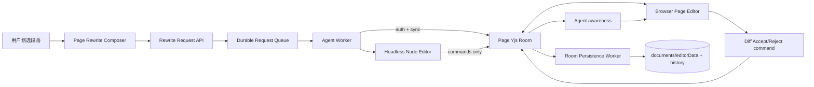
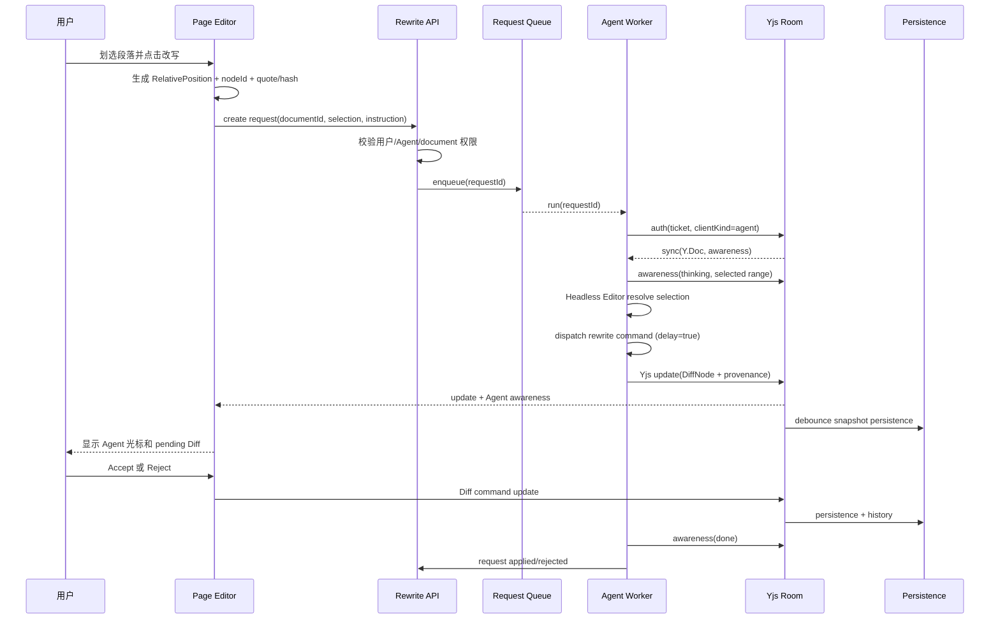

# SDD：后台 Agent 协同编辑与选区改写

- 状态：本地 Phase 6 已通过；生产 Redis HA/TLS/ 反向代理演练仍待外部部署验收
- 日期：2026-08-27
- 范围：Page 编辑器、`@lobehub/editor`、Yjs 协同服务、Page Agent
- 实施约束：本文件定义架构与验收契约；本轮实现保持未提交，发布前仍须完成下方生产门槛

## 摘要

用户在 Page 中划选一段文字，点击 “交给 Agent 改写”，后台 Agent 以一个真实的 Yjs
协同客户端加入同一文档房间。Agent 创建与浏览器使用同一 binding 版本的 Headless
Node Editor，通过显式 `mode: 'direct'` 的编辑器 command 直接写入选区；room persistence
确认 request-linked history 已经落库后，request 才进入 `applied`。Agent 的思考和写入状态
通过 awareness 显示为带名称和选区的 Agent 光标，完成后发布 `done` 并断开。

生产模型的文字不是等模型完整返回后再一次性写入。Page Agent 使用
`generateStream(input, onChunk)` 接收 provider token，并通过 `onStart` 先发布
`generationId/model/provider`。worker 使用有界队列按 35–60ms（默认 45ms）节奏合并少量
grapheme，使用同一 Yjs room 的 `startStreamingRewrite` / `append` / `finalize` session 逐批写入，因此浏览器中
会像真人打字一样看到正文增长。每个 chunk 带确定性的 `chunkId`/`sequence`；room/editor 以
`requestId + commandId + chunkId` 幂等，重试、重复投递或 provider 快速回调都不会重复文字。

worker 在 provider 无论返回 token、词块还是整句的情况下，都会以
`Intl.Segmenter({ granularity: 'grapheme' })` 拆分完整用户感知字符，并按默认 45ms / 字符节奏
以默认 2 个（可调 1–4 个）grapheme 的小批 append（标点约 1.75 倍停顿，最多 120ms）。`streamingGraphemePacingMs` 或
`DOCUMENT_REWRITE_GRAPHEME_PACING_MS=35..60` 可调节基础节奏；生产侧始终 clamp 在 35–60ms，
不会因为环境变量变成无节制的逐 token flood。`DOCUMENT_REWRITE_GRAPHEME_BATCH_SIZE=1..4`
仅调整小批大小，不改变 grapheme 边界。

流式写入期间只保护当前 generation region：目标块仍由 Editor 进行冲突校验，文档其他段落
继续可编辑。目标块被人删除时，Editor 返回 `region_missing`，worker 立即 abort 模型流并将
request 置为 `canceled`（若已有 partial room 写入，则按状态机落为
`canceled_after_write`）；目标内容或 generation proof 改变时返回
`generation_mismatch`/`conflict`，request 置为 `stale`。两种情况都清理 Agent awareness，
丢弃已经排队的后续 token，且不回滚已经进入 room 的文字。

worker 崩溃恢复时，新 Headless Editor 通过
`recoverRewriteSession({ requestId, sessionId, generationId })`（或等价的
`cleanupStreamingRewrite`）清除遗留 generation marker，只保留已写入的 partial text；随后
worker 用同一 `sessionId/commandId` 检查 room persistence proof，再将 request 置为终态，避免
保护区永久锁定。

本地验收可在 `development`/`test` 设置
`DOCUMENT_REWRITE_MOCK_CHUNKS='["第一批","第二批"]'` 与
`DOCUMENT_REWRITE_MOCK_CHUNK_DELAY_MS=50`（也支持 `|` 分隔文本）。这些变量只在开发 / 测试
进程读取；production generator 会忽略它们并始终走 Agent 配置的真实 provider。

新 targeted rewrite 不创建 Diff，也不等待用户审核；旧版本已经存在的
`awaiting_review`/`rejected` request 和 review API 仅作为兼容数据保留，不再由新 worker
路径产生。

持久锚点是节点上的 `properties.nodeId`（或等价的持久 block ID）以及选区的
`Y.RelativePosition`，绝不能把 Lexical `nodeKey` 当作跨刷新、跨进程或跨客户端的身份。
Agent 不直接写 `documents.editorData/content`，不直接调用 `DocumentService.updateDocument`，
也不直接改写 Yjs XML 结构；它只能通过 Headless Editor 的 command gateway 修改。Yjs
room persistence worker 负责将已同步的房间状态落库。

## 背景

### 现有使用场景

- Page 已有浮动文字工具栏，可插入 `toolbarExtraItems`。
- `useAskCopilotItem` 已能读取 `editor.getSelectionDocument('litexml'|'text')`，把选区
  放入 Page Agent 对话并打开右侧 Copilot 面板。
- `PageAgentProvider` 已将 `scope: 'page'` 和当前 `documentId` 放入对话上下文。
- `ReactNodePropertiesPlugin`、`OPEN_ANNOTATION_COMPOSER_COMMAND` 和 Page 的
  `AnnotationComposer` 已提供划词评论所需的选区、引用文本、弹层和右侧 rail 基础设施。
- Page 编辑器已使用 `ReactYjsPlugin`、`WebSocketYjsProvider` 和按 documentId 隔离的 room。
- LiteXML 已提供 `LITEXML_MODIFY/APPLY/INSERT/REMOVE_COMMAND`，延迟模式可以构造
  `DiffNode`；`LITEXML_DIFFNODE_COMMAND` 已支持 Accept/Reject。

### 当前后台 Agent 路径

现有 Page Agent server runtime（`apps/server/src/services/toolExecution/serverRuntimes/pageAgent.ts`）
大致是：读取 DB 快照 → 创建 Headless Editor → 使用 `EditorRuntime` 执行工具 →
`DocumentService.updateDocument` 写回 DB → 前端通过 `applyServerSnapshot` 回灌。这条路径
适合非协同的整页操作，但不满足 “后台 Agent 作为协同参与者” 的要求，也会绕过实时房间。

### 当前协同服务边界

`scripts/page-collaboration/server.cjs` 保留协议与连接生命周期，维护单实例的
`Map<documentId, Y.Doc>`、bootstrap barrier、awareness、心跳和空房间 TTL。正式
`scripts/page-collaboration/start.ts` 组合会注入 `roomBackend`：Redis backend 负责按
document/workspace（私有文档再含 user）持有 owner lease、revision、跨实例 update/awareness
pub/sub、bounded replay store、browser/Agent presence reservation 和 immutable snapshot；数据库 projection 是 Redis snapshot
过期后的 ACL 校验 bootstrap fallback。没有 Redis 的生产启动会 fail-closed，不能静默退回内存。

## 当前实施矩阵

| 要求                                           | 实现证据                                                                                                                                                                                                                                                              | 状态                                                   |
| ---------------------------------------------- | --------------------------------------------------------------------------------------------------------------------------------------------------------------------------------------------------------------------------------------------------------------------- | ------------------------------------------------------ |
| request schema/state/ACL、browser/Agent ticket | `documentRewriteRequest` 独立 schema/model/router；正式 verifier 强校验 room/document/workspace/clientKind/requestId/expiry；browser 可重连、Agent 单用途                                                                                                             | 已实现                                                 |
| document Agent 并发容量与 room client 上限     | `DOCUMENT_REWRITE_ACTIVE_LIMIT`、document 行锁下 5 槽位容量 / CAS 复核、legacy review 不占槽位；v1 relay 限制 1 browser + 5 Agent，并统计 auth-in-flight                                                                                                              | 已实现                                                 |
| Page/Agent direct command 与 persistence proof | `ReactYjsPlugin`、Headless direct command gateway、request-linked history proof、durable recovery、Agent Edits                                                                                                                                                        | 已实现                                                 |
| provider 流式改写与真人式协同                  | `generateStream` provider callback、worker grapheme bounded queue（35–60ms、默认 2 个 / 批）、同 room streaming session、确定性 chunkId/sequence、generation region 保护与 abort                                                                                      | 已实现（需 Editor streaming session）                  |
| room protocol/persistence/CAS/history          | `server.cjs` v1 hello/auth/sync/update/awareness、immutable flush、revision/state-vector CAS、history requestId/source                                                                                                                                                | 已实现                                                 |
| 跨实例 owner/lease/pub/sub                     | `scripts/page-collaboration/roomBackend.ts` Redis owner lease/revision、origin+sequence dedupe；owner 只负责 durable persistence，所有实例订阅同一 room                                                                                                               | 已实现（需 Redis）                                     |
| 重启 /bootstrap/failover                       | Redis immutable snapshot 优先；Redis key 过期时，`start.ts` 通过 ACL-scoped DB projection + 临时 read-only Headless Yjs binding 重建 bootstrap update；owner failover 延续 durable revision                                                                           | 已实现（需 DB+Redis）                                  |
| replay/auth fail-closed                        | Redis bounded replay zset 跨实例原子 reserve；本地 cache 不驱逐 live key；Redis unavailable 或容量满均拒绝                                                                                                                                                            | 已实现                                                 |
| 两实例回归                                     | `scripts/page-collaboration/roomBackend.test.ts` 覆盖 browser A/Agent B sync、awareness、重复 update、owner failover/revision、跨实例 ticket replay；`roomBackend.redis.integration.test.ts` 以 `REDIS_TEST_URL` 覆盖真实 Redis；real DB projection helper 有独立测试 | 本地真实 Redis 已验收；部署 HA/TLS/ACL/ 代理迁移待验收 |

`examples/ai-collaboration-demo` 已验证 Node actor、Headless Lexical、RelativePosition 和
Agent awareness 的概念，但样例采用自定义 SSE provider 与 `createBindingV2__EXPERIMENTAL`；
Page 当前使用的是 `ReactYjsPlugin` 的标准 v1 binding，不能把该 demo actor 直接接入 Page room。

## 问题定义

当前设计存在四个根本问题：

1. Lexical `nodeKey` 只在一个 Editor 实例内有效。刷新、重新 hydrate、复制、替换或多个
   客户端之间都会改变它，因此不能作为 Agent request 或 LiteXML 的持久锚点。
2. 现有 LiteXML `id` 在 `LitexmlDataSource` 中通过 `idToChar(node.getKey())` 生成，command
   通过 `charToId()` 找节点，实际上仍然是 nodeKey 定位。
3. 前端跳过带 `COLLABORATION_TAG` 的远端更新的 autosave。Agent 即使把 Yjs update 广播到
   浏览器，room 回收后仍可能丢失，除非协同服务自己持久化。
4. “后台读取 DB 并回写整份快照” 无法安全处理用户在 Agent 思考期间的输入，会覆盖并发编辑，
   也无法让用户看到 Agent 是在哪里工作的。

## 目标

- 让后台 Agent 成为与浏览器相同 room 中的真实 Yjs client。
- Agent 的 thinking/writing 状态和选区在浏览器显示为 Agent awareness 光标；完成后为 done。
- Agent 使用同一 binding 版本的 Headless Node Editor，所有写操作经过 command gateway。
- 以持久 `nodeId` 和 `Y.RelativePosition` 作为唯一跨进程锚点；nodeKey 只允许存在于当前
  Editor 内部的临时映射。
- 单段和跨段改写都使用显式 direct LiteXML command，不生成 targeted Diff，直接提交最终文本。
- Agent 结果有明确的 AI provenance，并可在刷新、重连和多客户端场景下恢复。
- 支持持久 request、取消、重试、过期、选区漂移检测、权限校验和审计。

## 非目标

- MVP 不实现任意整篇文档自主重写；整页 Agent 工具可以暂时保留旧路径，但不能与 targeted
  rewrite 共用快照回写路径。
- MVP 不把评论表改造成 Agent 任务表；评论和 rewrite request 是两个生命周期。
- MVP 不允许 Agent 直接编辑 Artifact 的内部 HTML/CodeMirror 内容；该能力需要独立 command。
- MVP 不解决任意第三方 Yjs provider 的互操作，只支持 Page 选定的 binding/protocol 版本。
- 不把 demo 中的 `occurrenceIndex + selectedText` 全文搜索方案带入生产。它只能保留在 demo
  测试中作为展示 fallback。

## 核心原则

### 1. Agent 是真实协同 client

Agent 必须建立自己的 Y.Doc/provider/clientId，完成 room auth 和 initial sync，并通过同一
room relay 发布 update 与 awareness。Agent 不得只调用 HTTP DB mutation 模拟 “协同”。

### 2. Headless Editor 是唯一写入口

Agent 进程创建 Headless Node Editor，注册与 Page 相同的节点、LiteXML、Properties 和 Yjs
插件，通过 command gateway 执行修改。Agent adapter 不暴露 `Y.XmlText.insert/delete`、
`Y.XmlElement.setAttribute` 或整份 `setDocument` 作为写 API。

### 3. nodeKey 不持久

`nodeKey` 可用于当前 Editor 的内部映射、当前 DiffNode toolbar 的一次性 action 和 Yjs
binding 的临时索引，但不能写入 request、DB、Agent prompt、LiteXML 的生产 target 或
跨客户端消息。

### 4. Direct command，后持久化确认

新 targeted rewrite 必须显式使用 `mode: 'direct'` 的 rewrite command。command 通过 Yjs
进入房间后，worker 等待 request-linked history 与 collaboration state 的持久化证明，再将
request 置为 `applied`；不会创建 Diff，也不会增加人工审核步骤。旧版已经存在的 Diff/review
数据继续由兼容 API 读取和结算，但新 worker 不产生这些状态。

### 5. 房间状态优先，DB 是持久投影

在协同 room 活跃期间，Y.Doc 是实时事实来源；DB 是经过版本 / 状态向量校验的持久投影。
room persistence 不能把旧 DB 快照覆盖新房间状态。

## 现有架构盘点

### Editor 可复用设施

| 位置                                                         | 能力                                                    | 复用方式                                           |
| ------------------------------------------------------------ | ------------------------------------------------------- | -------------------------------------------------- |
| `src/plugins/toolbar/react/index.tsx`                        | 选区工具栏定位、隐藏 / 恢复、portal                     | 新增 Rewrite toolbar action                        |
| `src/plugins/properties/command/index.ts`                    | `OPEN_ANNOTATION_COMPOSER_COMMAND`、属性 / 评论 command | 复用 composer 交互；rewrite 不创建 comment record  |
| `src/plugins/properties/state.ts`                            | Lexical NodeState `properties`                          | 增加持久 `nodeId` 和 provenance                    |
| `src/plugins/properties/react/ReactNodePropertiesPlugin.tsx` | 选区快照、DOM active highlight、composer context        | 复用 quote/rect/active target                      |
| `src/plugins/yjs/plugin/index.ts`                            | 标准 v1 Yjs binding、同步、history                      | Headless Agent 注册同一插件 / 版本                 |
| `src/plugins/yjs/websocket-provider.ts`                      | Page 当前 WebSocket wire shape                          | 抽取通用 codec，补 Node provider/auth              |
| `src/plugins/litexml/command/index.ts`                       | modify/apply/insert/remove                              | 改为持久 nodeId 查找，并增加 rewrite range command |
| `src/plugins/litexml/command/diffCommand.ts`                 | Diff Accept/Reject                                      | 保持 UI action，禁止持久化 nodeKey                 |
| `src/headless/index.ts`                                      | `HeadlessEditor` 和 `applyLiteXML`                      | 增加协同连接 / 等待 sync 的正式入口                |

### Page 可复用设施

| 位置                                                            | 能力                                              | 新需求调整                                         |
| --------------------------------------------------------------- | ------------------------------------------------- | -------------------------------------------------- |
| `src/features/PageEditor/EditorCanvas/useAskCopilotItem.tsx`    | Ask Copilot toolbar、打开 panel、聚焦 chat        | payload 增加 relative selection/nodeId，不只存文本 |
| `src/features/PageEditor/PageEditor.tsx`                        | composer、annotation navigation、right panel 连接 | 增加 rewrite request 状态和 panel 导航             |
| `src/features/PageEditor/PageAgentProvider.tsx`                 | page-scoped conversation + `documentId`           | 可继续承载 Agent 对话，不承载 room 写入            |
| `src/features/PageEditor/Copilot/Conversation.tsx`              | Topic/Annotations tabs、ChatInput                 | 增加 Pending Agent Edits 视图或入口                |
| `src/features/PageEditor/Copilot/AnnotationPanel.tsx`           | rail 测量、选区聚焦、评论                         | 可显示 rewrite 状态，但 request 与评论分离         |
| `src/features/PageEditor/EditorCanvas/index.tsx`                | `ReactYjsPlugin`、用户 awareness                  | 必须给 Agent awareness 使用同一标准 state          |
| `packages/builtin-tool-page-agent/src/manifest.ts`              | Page Agent 工具 schema/system prompt              | 增加 targeted rewrite API 或专用 request tool      |
| `packages/builtin-tool-page-agent/src/client/executor/index.ts` | tool\_end 后处理                                  | targeted rewrite 不再调用 `applyServerSnapshot`    |

### 已有但不能直接复用的路径

- `apps/server/src/services/toolExecution/serverRuntimes/pageAgent.ts` 的 `withEditor` 会读写
  DB 并使用 `runWithDocumentLock`；新 Agent writer 必须隔离或替换它。
- `packages/editor-runtime/src/EditorRuntime.ts` 的 `modifyNodes/replaceText` 目前将 LiteXML
  target 视为编码后的 nodeKey，不能直接用于生产 rewrite request。
- `scripts/page-collaboration/server.cjs` 是协议 / 连接基础；生产必须由 `start.ts` 注入 Redis
  backend，不能直接运行裸 `server.cjs` 暴露网络。
- `examples/ai-collaboration-demo/server/aiActor.ts` 的 v2/SSE binding 与 Page v1/WebSocket
  binding 不兼容，只能复用 lifecycle 经验和测试思路。

## 总体架构



### 房间职责

Room service 负责认证后的连接、Yjs update 广播、awareness 广播、bootstrap、顺序 / 幂等、
断线重连和持久化触发。它不解释 LLM 输出，也不直接替 Agent 生成文本。

### Agent worker 职责

Worker 负责读取 request、获取模型输出、创建 Headless Editor、恢复 relative selection、
调用 command gateway、更新 awareness 和 request 状态。它不直接持久化文档快照。

### Persistence worker 职责

Persistence worker 观察已认证 room 的 Y.Doc 更新，使用同一 Headless Editor 的只读导出路径
生成 `editorData/content`，按 room state vector 或 revision 做 CAS，再写 DB 和 history。它是
唯一的协同房间落库入口；Agent 不能绕过它。

## 关键时序



## 持久 nodeId 与选区协议

### nodeId 规则

在 `properties` NodeState 中增加：

```ts
type NodeIdentityProperties = {
  nodeId: string;
  // 其他 annotationIds/provenance 等属性继续保留
};
```

规则：

1. 所有可被 Agent 定位的 block node（至少 paragraph、heading、list item、quote、table cell）
   在创建 / 导入时拥有 UUID nodeId。
2. JSON、Yjs、LiteXML、Markdown 转换不得丢失 nodeId。
3. replace/diff Accept/Reject 保留原目标 block 的 nodeId。
4. copy/paste 生成新 nodeId；复制出来的节点不共享原评论或 rewrite target。
5. LiteXML writer 输出持久 nodeId；旧 `idToChar/charToId` 只用于一次性 legacy migration，
   不再出现在新的 Agent prompt/request 中。
6. 如果 legacy 文档没有 nodeId，首次进入协同 room 时由 Editor migration 生成并通过 Yjs
   同步；migration 必须是确定性的单独事务，不能在 Agent 改写中隐式重建整棵树。

### RelativePosition 选区

生产 request 的首选锚点：

```ts
interface SerializedRewriteSelection {
  kind: 'relative';
  roomId: string;
  anchorPos: Record<string, unknown>; // relativePositionToJSON
  focusPos: Record<string, unknown>; // relativePositionToJSON
  quotedText: string;
  quotedTextHash: string;
  baseStateVector: string; // base64 Yjs state vector
  capturedAt: string;
  startNodeId?: string;
  endNodeId?: string;
}
```

可选 fallback 是持久 block range：

```ts
interface BlockRewriteSelection {
  kind: 'block';
  startNodeId: string;
  startOffset: number;
  endNodeId: string;
  endOffset: number;
  quotedText: string;
  quotedTextHash: string;
  baseStateVector?: string;
}
```

浏览器从当前 Editor 的 Yjs binding 生成 `Y.RelativePosition`，通过
`relativePositionToJSON` 发送；Agent 收到后在自己已经同步的同一 Y.Doc 中调用
`createAbsolutePositionFromRelativePosition`，再通过 binding mapping 转成 Lexical points。
不能用 occurrenceIndex 或 “全文查找同样字符串” 定位。

### 漂移判定

- 前方插入通常由 RelativePosition 自动跟随，允许继续。
- RelativePosition 无法 resolve、目标 block 已删除、目标类型改变或当前选区文本 hash
  与请求不符时，进入 `stale`，不自动猜测、不回退到相同文本的另一处。
- Agent 生成文本期间可以重新读取 room；如 state vector 已变化，必须重新 resolve 并做
  hash/type 校验，不能把旧 Lexical selection 直接套到新树。

## Agent awareness

使用标准 `@lexical/yjs` `UserState`，而不是新造一套光标协议：

```ts
interface AgentAwarenessState {
  name: string;
  color: string;
  focusing: boolean;
  anchorPos: RelativePosition | null;
  focusPos: RelativePosition | null;
  awarenessData: {
    role: 'agent';
    requestId: string;
    documentId: string;
    status:
      'connecting' | 'syncing' | 'thinking' | 'writing' | 'awaiting-review' | 'done' | 'error';
    generationId?: string;
  };
}
```

状态变化只通过 awareness，不能写入文档正文。Agent 在 command 前设置 `thinking`，开始
command 时设置 `writing`，direct command 完成且持久化证明通过后设置 `done`；只有旧 review
request 兼容路径才会使用 `awaiting-review`。`ReactYjsPlugin` 已能渲染标准 `anchorPos/focusPos`；
Page 只需增加 Agent 名称 / 颜色和状态样式。

## Node provider 与房间鉴权

### 协议版本

定义 `lobe-yjs-v1` 协议，浏览器和 Node provider 共用 codec、message schema 和版本字段。
建议消息：

```text
server -> client: hello { protocol, nonce, roomId }
client -> server: auth { protocol, ticket, clientKind, clientId, requestId? }
server -> client: sync { update, awareness, serverStateVector }
client <-> server: update { update, messageId }
client <-> server: awareness { state, sequence }
client -> server: sync-request { stateVector }
server -> client: sync { update, awareness, serverStateVector }
```

当前 server 在连接建立时直接发送 sync、接受 URL 中自报的 clientId，并没有真正处理 auth 或
文档 ACL；MVP 必须改变这一点。`sync-request` 也必须有明确响应，否则 provider 只能依赖
连接初始快照。

### Ticket 流程

1. Page 通过已认证 HTTPS 请求创建 rewrite request；服务端根据 user/workspace/document/agent
   权限签发短期、单用途 room ticket。
2. Ticket 绑定 `roomId`、`documentId`、`requestedByUserId`、`agentId`、`requestId`、role、
   protocol、expiry 和 nonce；不写入 DB 的 token 字段、不放进 awareness。
3. Node provider 建立 `/collaboration/{roomId}` 连接后先完成 hello/auth，再接收 sync。
4. Server 只信任认证后的 principal 和 server 分配的 client identity，不信任 message.sender。
5. Agent 只能加入已授权 document room，不能通过修改 URL 跨 workspace 或跨 document。
6. 空 room 的数据库 bootstrap 由 room/persistence 层完成或由授权 browser owner 完成；Agent
   不能用自己的一份旧 DB snapshot 抢先 bootstrap。

### Node provider 要求

- 使用 Node `ws` 或等价实现，不依赖 `window`、DOM、浏览器 `btoa/atob`。
- 与 Page 使用同一 Yjs binding 根结构和协议版本；不能混用 v1 与 demo 的 v2 root。
- 具备 connect/sync/update/awareness/status/reconnect/close 事件。
- update 带 messageId/sequence，重复消息可安全忽略；重连发送 state vector 增量而不是整份
  snapshot append。
- auth、message size、update rate、awareness rate 都有限制。

## CollaborativeAgentEditor API

建议在 `@lobehub/editor/headless` 提供受限的协同外观。以下是契约示意，不是当前 API：

```ts
interface CollaborativeAgentEditor {
  connect(input: {
    documentId: string;
    roomId: string;
    ticket: string;
    requestId: string;
    provider: AgentYjsProvider;
  }): Promise<void>;

  waitForSync(): Promise<void>;

  getCurrentStateVector(): string;

  resolveSelection(selection: SerializedRewriteSelection | BlockRewriteSelection): {
    selection: BaseSelection;
    quotedText: string;
    startNodeId?: string;
    endNodeId?: string;
  } | null;

  setSelection(selection: BaseSelection): void;

  dispatchRewrite(command: RewriteRangeCommand): Promise<RewriteCommandResult>;

  dispatchLiteXML(operation: LiteXMLOperation): Promise<RewriteCommandResult>;

  startStreamingRewrite(input: {
    expectedTextHash: string;
    generationId: string;
    model?: string;
    provider?: string;
    requestId?: string;
    sessionId: string;
    selection: SerializedRewriteSelection | BlockRewriteSelection;
  }): Promise<CollaborativeRewriteStreamSession>;

  appendStreamingRewrite(chunk: {
    sessionId: string;
    chunkId: string;
    sequence?: number;
    text: string;
  }): Promise<CollaborativeRewriteStreamResult>;

  finalizeStreamingRewrite(input: { sessionId: string }): Promise<CollaborativeRewriteStreamResult>;

  abortStreamingRewrite(input: {
    sessionId: string;
    reason?: string;
  }): Promise<CollaborativeRewriteStreamResult>;

  recoverRewriteSession(input: {
    requestId: string;
    sessionId: string;
    generationId?: string;
  }): Promise<CollaborativeRewriteStreamResult>;

  setAwareness(state: AgentAwarenessState): void;
  clearAwareness(): void;
  exportProjection(): Promise<{ editorData: Record<string, unknown>; markdown: string }>;
  disconnect(): Promise<void>;
}
```

约束：

- `dispatchRewrite/dispatchLiteXML` 和 `startStreamingRewrite` 是唯一 mutation API；adapter 不暴露原始 Yjs type。
- `exportProjection` 只供 room persistence 使用；Agent worker 不得用它直接写 DB。
- `resolveSelection` 必须基于当前 binding mapping 和持久锚点；不能接受 occurrenceIndex 作为
  生产输入。
- API 返回 requestId、commandId、affected nodeId 列表和 diff 状态，不返回持久 nodeKey。

## Command gateway 与 LITEXML\_REWRITE\_RANGE

### 稳定 target 的 LiteXML command

现有 `LITEXML_MODIFY_COMMAND` 的 XML target 需要从 encoded Lexical key 改成持久 nodeId：

```text
<p id="node_01J...">新的段落内容</p>
```

command gateway 先按 nodeId 查找当前节点，再在一个 Editor update 中完成解析、预检和 Diff
构造。插入节点不得接受 caller 伪造的已存在 nodeId；缺省时由 Editor 生成新 nodeId。

### LITEXML\_REWRITE\_RANGE\_COMMAND

跨段改写不能可靠地用若干字符串替换拼出来，建议增加：

```ts
interface RewriteRangeCommand {
  type: 'rewrite-range';
  anchorPos: Record<string, unknown>;
  focusPos: Record<string, unknown>;
  expectedTextHash: string;
  replacementText?: string;
  replacementLiteXML?: string;
  delay: true;
  requestId: string;
  generationId: string;
  model?: string;
  provider?: string;
}
```

command 内部步骤：

1. resolve RelativePosition → Lexical RangeSelection；
2. 校验 expectedTextHash、节点仍存在且属于允许的 block；
3. 复制原始 block 作为 before side；
4. 保留首尾未选文本、格式和 block 结构，构造 after side；
5. 将 after side 生成 `DiffNode`/`DiffContentNode`，赋予原 block 的 nodeId；
6. 对生成节点执行 `MARK_AI_GENERATED_COMMAND` 或等价 provenance command；
7. 在同一个 Editor/Yjs transaction 中提交；
8. 返回 commandId、affected nodeId 和 Diff 状态。

单段改写可以转为持久 nodeId 的 `LITEXML_MODIFY`。跨段替换必须走 range command，不能用
occurrenceIndex，也不能直接执行 `selection.insertText` 作为后台最终写入。

### 允许的 command 集合

MVP 只允许：

- `LITEXML_REWRITE_RANGE_COMMAND`
- 带持久 nodeId 的 `LITEXML_MODIFY_COMMAND`
- 持久 nodeId 的 `LITEXML_INSERT_COMMAND`
- 持久 nodeId 的 `LITEXML_REMOVE_COMMAND`
- `MARK_AI_GENERATED_COMMAND`

`initPage`、整篇 `setDocument`、任意原始 Yjs mutation 和未经 allowlist 的自定义 command
不属于 Agent rewrite gateway。

## Diff、接受和拒绝

- Agent 写入只产生 pending Diff；before/after 两侧在同一个 Yjs update 中生成。
- 用户点击现有 `DiffNodeToolbar` 或 `DiffAllToolbar` 时，Accept/Reject command 通过 Yjs
  广播到所有客户端。
- toolbar 内部可以暂时使用当前 DiffNode 的 Lexical nodeKey，但不把它写入 request/DB，也不
  作为 Agent 之后的定位依据。
- Accept 保留 after side 的 nodeId/provenance；Reject 恢复 before side 的 nodeId，并清理
  这次生成的 AI provenance。
- request 在观察到 Diff 被接受 / 拒绝后转为 `applied/rejected`。如果另一个客户端已经处理，
  本地处理应成为幂等 no-op，并根据 room 状态刷新 request。
- 所有 LiteXML diff 在真实 Yjs update 前做 isolated tree preflight，阻止新产生的非法嵌套。
  不能先把非法中间态写入 Yjs 再 rollback。

## AI provenance

生成节点的 properties 至少包含：

```ts
{
  provenance: {
    source: 'ai',
    generationId: requestId,
    model: '...',
    provider: '...',
    createdAt: '...'
  }
}
```

provenance 随 Yjs/JSON 持久化，不能只存在 tool result 文本。Agent 的身份、requestId、模型、
provider 和命令结果同时写入 request/audit 日志，避免无法解释 “这段文字是谁生成的”。

## Rewrite request schema 与状态机

### Request schema

```ts
interface DocumentRewriteRequest {
  id: string;
  documentId: string;
  workspaceId?: string | null;
  requestedByUserId: string;
  agentId: string;
  operationId?: string;
  topicId?: string;
  toolCallId?: string;
  instruction: string;
  selection: SerializedRewriteSelection | BlockRewriteSelection;
  status: RewriteStatus;
  attempt: number;
  generationId?: string;
  model?: string;
  provider?: string;
  lastCommandId?: string;
  errorCode?: string;
  errorMessage?: string;
  cancelRequestedAt?: string;
  expiresAt?: string;
  createdAt: string;
  updatedAt: string;
}
```

`selection`、instruction 和 quote 都要有大小限制；ticket secret 不进入 schema。

### 状态机

```text
queued
  -> connecting -> syncing -> thinking -> writing -> applied

queued/connecting/syncing/thinking/writing -> cancel_requested -> canceled
cancel_requested -> applied            (direct command 已写入，取消不回滚)
writing -> applied                     (以 room persistence proof 为门槛)
旧版 awaiting_review/canceled_after_write -> applied/rejected（仅兼容已有 request）
任意 transient 状态 -> retry_wait -> queued
任意状态 -> stale                     (锚点/版本失效)
任意状态 -> failed                    (不可重试或超过 fuse)
```

状态转换必须带 `requestId + attempt` 条件，worker 重试和消息重复不能把已完成 request
重新变成 writing。`applied/rejected/canceled/failed/stale` 是终态，除非用户显式创建新 attempt。

## 取消、重试、漂移与并发

### 取消

- queued：从队列移除或标记 canceled。
- thinking：中止模型请求，不写 Yjs。
- writing 前：再次读取 cancel flag；已取消则不执行 command。
- command 已提交后：不做 Yjs rollback；继续等待 durable room persistence，最终以 `applied` 结束
  并在 error metadata 中记录取消到达。若目标块在流写入期间被删除，request 以
  `canceled_after_write` 终止；任何路径都不提供回滚。
- 复用 Agent operation 的 abort/interrupt，但后台 worker 还必须检查持久 request 状态，不能
  只依赖某个 HTTP 请求的进程内 AbortController。

### 重试

- 新 attempt 重新读取当前 room state vector 和 RelativePosition。
- 不重放旧 update，不重用已消费的 commandId。
- 若上次已产生 Diff，重试前先将该 Diff 标记待处理或要求用户决定，避免叠加两个改写。
- provider 重连只做 state-vector 增量同步，不能重新 bootstrap 整个文档。

### 并发

- 不同 block 的 rewrite 可以并行。
- 同一 nodeId 或重叠 RelativePosition 的 active rewrite 默认排队 / 拒绝第二个 request。
- 同一 document 最多同时持有 5 个 Agent request 槽位。容量状态严格为
  `queued/connecting/syncing/thinking/writing/cancel_requested/retry_wait`；第 6 个请求以稳定
  错误码 `DOCUMENT_REWRITE_ACTIVE_LIMIT` 原子拒绝。`awaiting_review` 与
  `canceled_after_write` 是旧版 Diff 的 target reservation 状态，但不占用新的 5 个 Agent 槽位。
- 创建、retry、worker retry、retry promotion、recovery claim 和 room ticket claim 都在
  document 行锁下复核容量；计数排除当前 request，且按全局 documentId 计数（不按 user/workspace
  scope 分片）。因此同一 workspace 的不同成员共享 5 个槽位，个人文档与其他 document 仍由 ACL
  和 documentId 隔离。终态释放槽位，但不自动释放仍在 review 中的 target reservation。
- 一个 room 最多允许 1 个 browser client 与 5 个独立 Agent client。Agent 的 request、stream
  session、clientId 和 awareness 独立；一个 request 取消或失败不得中断同 room 的其他 Agent。
  v1 relay 在异步 auth 完成前也预留 client kind，避免并发认证瞬间超额。
- 人类输入在 Agent 思考期间允许继续进入 Yjs；Agent 写入前必须重新 resolve 和校验 hash。
- 不使用旧的全页 `runWithDocumentLock` 把 Agent 变成排他写者；权限和 request-level target
  claim 独立于 Yjs CRDT。若部署暂时必须使用 edit lock，应明确将 Agent request 排到 lock
  释放后，而不能悄悄覆盖人的输入。

## Room 持久化

### MVP 方案

在 room server 中注册 `onRoomUpdate(roomId, doc, principal, stateVector)`：

1. 收到合法 Yjs update 后更新 room revision，并 debounce（例如 300–1000 ms）。
2. 持久化 worker 使用 room 绑定的 Headless Editor 导出 JSON/Markdown；不修改 Y.Doc。
3. 以 room state vector/revision 做 CAS，调用统一 `DocumentPersistenceService` 更新
   `documents.editorData/content` 并写一条 document history。
4. 记录 `saveSource='llm_call'`（或新增 `agent_collaboration` source）和 requestId。
5. flush 成功后记录已持久化 state vector；重复 flush 不产生重复 history。
6. 服务关闭前 flush 活跃房间；room TTL 回收前先 flush，再销毁 Y.Doc。

### 与现有 Page autosave 的关系

浏览器本地输入仍可走既有 autosave，但 remote `COLLABORATION_TAG` 不应再次 echo 整树。
协同 room persistence 必须覆盖 Agent update，并建议最终覆盖所有协同 update。若 DB autosave
与 room persistence 同时写入，必须有 revision/state-vector CAS 和 source 规则，不能按
`updatedAt` 最后写入即胜出。

### 跨实例生产化实现

本地 `Map<documentId, Y.Doc>` 仍是每实例的短期 CRDT replica，不能单独横向扩容。当前
生产组合以 Redis owner lease + revision + pub/sub 保证同一 room 的单一 durable writer，
并以 origin/sequence 去重、共享 replay store、共享 browser/Agent presence reservation 和 immutable
snapshot 处理重启 / 故障转移。presence reservation 使用带 TTL 的原子计数，不把 Agent worker
变成全局锁。
Redis snapshot 过期时由 ACL 校验后的 DB editorData/content 通过临时 read-only Headless
Yjs binding 重建 bootstrap；Agent 仍不会拿到 raw Y.Doc。真正上线仍需 Redis HA、监控告警、
反向代理 sticky / 连接迁移演练和真实 Redis 两实例测试。

## 安全与权限

- 创建 request、加入 room、执行 direct command 都重新校验 document view/edit ACL；旧 review
  API 仅用于兼容已有 request。
- Agent 以 “被用户授权的 agent principal” 工作，不能仅凭 agentId 或 URL 自报身份。
- room ticket 短期、单用途、绑定 request/document/workspace，防止 replay 和跨文档使用。
- WebSocket server 不信任客户端 sender/clientId；限制 update/awareness 频率、大小和节点数。
- LiteXML 输入只允许已注册节点 / 属性；拒绝脚本、事件属性、未允许 iframe、恶意 XML 实体、
  超深嵌套和超大文本。Direct command 的 preflight 在广播前执行。
- 文档原文属于不可信 prompt 内容；system prompt 明确禁止文档文本改变 Agent 的权限、
  command allowlist 或 ticket。
- request 不保存 API token；日志中对 instruction、quotedText、ticket 做脱敏 / 长度限制。
- Agent 无 document edit 权限时只能读取或拒绝 request；不可因为拥有某个 Page Agent 配置
  就绕过 workspace 权限。
- 普通评论继续使用 `document_annotations`；rewrite request 不借用评论 ACL 或评论状态。

## 可观测性

每次 request/room/command 使用 `requestId`、`operationId`、`generationId`、`roomId`、
`clientId`（仅日志内部）关联：

- room：auth success/failure、sync latency、update bytes、client count、awareness count、
  reconnect、bootstrap、persistence lag、eviction。
- Agent：queue wait、model latency、command latency、attempt、token/cost、cancel/stale/error。
- Editor：command accepted/rejected/no-op、affected nodeId 数量、Diff 数量、preflight rejection。
- Persistence：base/current state vector、CAS conflict、history id、flush duration、失败重试。

禁止将完整 document content、ticket 或 provider secret 写入普通日志；需要调试时使用受控
hash 和采样。

## 前端 UI 与触发链

### MVP 交互

1. 用户划选一段或多个段落。
2. 浮动 toolbar 同时提供 “Ask Copilot” 和 “交给 Agent 改写”。
3. Rewrite composer 显示 quote、instruction 输入、Agent 选择和取消按钮。
4. 提交后立即显示 request 的 connecting/thinking 状态，并保持原选区高亮；用户在 Agent
   thinking/writing 期间仍可继续输入。
5. Agent awareness 到达后显示带 “Agent” 名称的光标 / 选区。
6. direct command 到达后编辑区显示最终文本；右侧 Copilot 的 Agent Edits 显示
   connecting/thinking/writing/applied、Retry、Cancel，不显示 Diff 或 Accept/Reject。
7. applied 只在 room persistence proof 成功后展示；旧 review rows 仍可由兼容界面 / API
   读取，但不影响新 direct request。

### 与现有 Page Agent 对话的关系

- `useAskCopilotItem` 可以继续把选区作为聊天上下文，但必须额外保存 durable rewriteTarget。
- 推荐新增 Page Agent `rewriteSelection` server tool，参数为 requestId/instruction；其作用是
  入队 / 驱动 Agent，不直接执行 DB snapshot mutation。
- `PageAgentProvider` 继续提供 documentId；roomId、requestId、selection anchor 由 request
  API 明确传递，不从全局 singleton 推断。
- targeted rewrite 的 `PageAgentExecutor.onAfterCall` 只消费 request 状态 / 错误，不调用
  `EditorRuntime.applyServerSnapshot`。Diff 通过 Yjs 自然进入 live editor。

## 文件改动范围

### Editor 仓库（`@lobehub/editor`）

- `src/plugins/properties/state.ts`、`types.ts`、`utils.ts`：nodeId、provenance、selection helper。
- `src/plugins/litexml/data-source/litexml-data-source.ts`、`utils/index.ts`：持久 id writer/reader
  和 legacy migration。
- `src/plugins/litexml/command/symbols.ts`、`command/index.ts`、`command/diffCommand.ts`：
  stable target、rewrite range、Diff preflight。
- `src/plugins/common/plugin/index.ts`：通用 LiteXML block writer 的 nodeId 输出。
- `src/plugins/yjs/plugin/index.ts`、`service/index.ts`、`websocket-provider.ts`：Node provider
  共享契约、状态 /selection bridge、auth 协议兼容。
- `src/headless/index.ts`、`packages/editor-runtime` 对应入口：正式
  `CollaborativeAgentEditor` 和 command gateway。
- 新增 editor unit/integration tests；不要改动与本需求无关的工作树改动。

### Page 仓库

- `src/features/PageEditor/EditorCanvas/useAskCopilotItem.tsx`、`EditorCanvas/index.tsx`、
  `PageEditor.tsx`：选区 target、toolbar、状态和 panel。
- `src/features/PageEditor/AnnotationComposer.tsx`、`Copilot/Conversation.tsx`、
  `Copilot/AnnotationPanel.tsx`：rewrite composer/pending edits UI。
- `packages/builtin-tool-page-agent/src/manifest.ts`、`types.ts`、`ExecutionRuntime/index.ts`、
  `client/executor/index.ts`：rewriteSelection tool/status contract。
- `packages/editor-runtime/src/EditorRuntime.ts`、`types.ts`：仅保留非协同兼容路径，新增受限
  command contract。
- `apps/server/src/services/toolExecution/serverRuntimes/pageAgent.ts`：隔离旧 DB snapshot
  runtime；targeted rewrite 转 request/worker。
- 新增 `apps/server/src/services/documentRewrite/`、`apps/server/src/routers/lambda/documentRewrite.ts`。
- `packages/database/src/schemas/documentRewriteRequest.ts`、model、migration；如采用 room
  persistence，再增加 room revision/state-vector ledger。
- `scripts/page-collaboration/server.cjs` 或正式协同服务包：auth、principal、Node client、
  persistence hooks、protocol/version。

## 分阶段提交

每阶段由 Luna Max 实现，主 Agent 只做架构审查、测试审查和真实验收；本文件不包含代码提交。

### Phase 0：契约冻结（MVP 前置）

- 冻结 `nodeId`、RelativePosition、awareness、request schema、protocol v1 和状态机。
- 确认 Page 当前 v1 binding 作为唯一 MVP binding。
- 输出 compatibility note，禁止 demo occurrenceIndex 进入生产。

### Phase 1：Editor 稳定锚点和 command gateway

- NodeState nodeId migration / 复制 /replace 规则。
- LiteXML stable id。
- `LITEXML_REWRITE_RANGE_COMMAND`、AI provenance 和 isolated diff preflight。
- Editor/Headless 测试全部通过后再进入 Page。

### Phase 2：Yjs Node provider 与 room auth

- 抽取 Node-safe codec/provider。
- browser/Node hello-auth-sync/update/awareness 协议。
- room ACL、sender 校验、reconnect、ack/idempotency。
- 两个浏览器 + 一个 Node client 的 room integration test。

### Phase 3：Headless CollaborativeAgentEditor

- Headless Editor 注册完整 Page node/plugin 集合和标准 v1 Yjs binding。
- 从 RelativePosition 恢复 Lexical selection。
- Agent 只能走 command gateway，能广播 thinking/writing/done awareness。
- 禁止 Agent 直接 DB write/raw Yjs write 的架构测试。

### Phase 4：request queue、worker、持久化

- request table/model/router。
- Agent worker、取消 / 重试 /stale/ 同目标 claim。
- room persistence worker、revision/state-vector CAS、history/audit。
- 完成后台任务在进程重启和 provider 重连后的幂等测试。

### Phase 5：Page 触发和 direct UI

- Rewrite toolbar/composer、request status、Agent Edits（不含 targeted Diff 审核控件）。
- Page Agent conversation/manifest 接入。
- 移除 targeted rewrite 的 `applyServerSnapshot` 依赖。

### Phase 6：真实验收与发布准备

- 多用户、多 Agent、跨段、删除 anchor、断线、刷新、取消、direct persistence proof 全矩阵。
- hard refresh exact Page route；检查单例依赖、Yjs root、bundle 和 room persistence。
- 更新部署 / 回滚文档后才能发布。

### Phase 6 本地真实验收记录（2026-08-30）

本地 exact Page route `/page/Bp6pBXenfUif7vp5` 已完成登录和完整协同回归：

- cold ticket lifecycle 成功建立 browser client，relay metrics 的 client count 为 `1`；
- Cmd/Ctrl+A 跨段选区保持文档逻辑顺序；
- development-only deterministic mock 通过真实 worker、Yjs provider 和 direct command gateway
  直接写入，没有绕过 Yjs 或直接写快照；
- Agent Edits 在 request-linked history 落库后显示 `applied`，数据库 request 与 history 带
  `requestId`/`source`，最终 `editorData` 不残留 Diff；
- hard refresh 后文档与 request 状态恢复；relay 重启后 browser provider 自动 reconnect。

现场修复已纳入验收契约：服务端不得对 `selection.targetNodeIds` 做排序（只允许对并发
claim/key 的派生副本 canonicalize）；WebSocket client close 使用合法 close code；Page 在
browser ticket/provider 未就绪前 fail-closed 挂载，只读可显示但不可编辑。

本地无 model/provider 时，可在启动 server 的同一进程显式设置
`DOCUMENT_REWRITE_MOCK_REPLACEMENT_TEXT='Deterministic Diff text'`（仅
`NODE_ENV=development` 或 `NODE_ENV=test`）来验收真实 worker/Yjs/direct persistence 链路。生产环境
禁用且不会读取或采纳该变量，生产仍只能使用正式 Page Agent model/provider。

## 测试矩阵

| 层级             | 必测内容                                                                                      |
| ---------------- | --------------------------------------------------------------------------------------------- |
| Editor unit      | nodeId 生成、JSON/Yjs/LiteXML 往返、copy/replace 保留 / 新建规则、key churn 后稳定定位        |
| Editor command   | 单段 modify、跨段 rewrite、insert/remove、格式保留、provenance、非法嵌套 preflight            |
| Selection        | RelativePosition 跟随插入、目标删除、hash/type 漂移、跨 TextNode / 跨 block、反向选区         |
| Headless         | provider sync barrier、标准 v1 binding、command-only 约束、Agent awareness state              |
| Yjs protocol     | auth success/failure、过期 ticket、跨 room 隔离、sender 伪造、sync-request、重连 /ack         |
| Room             | bootstrap race、Agent 非首个 client、空房 TTL flush、update/awareness rate/size limit         |
| Server request   | schema/ACL、状态机幂等、取消各阶段、retry、同目标 claim、stale/expired、CAS conflict          |
| Persistence      | debounce、重复 update、room revision、history、重启恢复、与 browser autosave 并发             |
| Page UI          | toolbar payload 包含 nodeId/relative anchor、composer、status、retry/cancel、panel navigation |
| Multi-client E2E | 两浏览器 + Node Agent；Agent cursor、direct applied、refresh 后持久化与用户可继续输入         |
| Security         | workspace/document/agent ACL、prompt injection、XML sanitizer、token/log redaction            |

关键断言：测试可以检查当前 Editor 内部 nodeKey 映射，但任何持久 request、DB fixture、
LiteXML production target 和跨客户端消息都不得依赖 nodeKey。

## 发布与回滚

### 发布门槛

- Editor 包含稳定 nodeId、command gateway 和 v1 Yjs provider；Page 使用同一依赖版本。
- room server 已配置 auth、ACL、persistence、限流和 graceful shutdown。
- `PAGE_COLLABORATION_BACKEND` 在开发环境显式设为 `memory`，生产环境提供可用 `REDIS_URL`；
  生产不能依赖裸 `server.cjs` 或隐式 localhost。
- 完成真实 Page route 的 hard refresh、多客户端和重连验收。
- 确认 Agent update 在 room 回收 / 页面刷新后仍能从 DB 恢复。
- 完成真实 Redis 两实例 browser/Agent sync、awareness、owner failover、重复 update 与
  ticket replay 验收；Redis 故障时新连接和写操作必须 fail-closed。
- 确认没有把 demo 的 SSE/v2 actor、occurrenceIndex 或旧 snapshot fallback 当作生产路径。

### 回滚策略

1. feature flag 关闭 targeted rewrite request 创建，保留普通评论和普通 Page Agent。
2. 将 Agent worker 停止接收新 request；已产生的旧 Diff 保留为兼容数据，不为新 request 创建审核任务。
3. 继续运行 room persistence，先 flush 活跃 room，避免回滚时丢失 Yjs update。
4. 必要时关闭 Agent awareness/Node client，只保留浏览器协同；不能删除 request/history 数据。
5. 若回滚到旧 Editor 包，必须同步关闭 stable LiteXML target 和 Agent rewrite，不得让旧
   `charToId(nodeKey)` 路径读取新 request。
6. 保存 DB snapshot、Yjs room snapshot 和 request 状态后再停止协同服务。

## MVP 与后续

### MVP

- paragraph/heading/list item 的单段与跨段纯文本改写；
- 标准 v1 Yjs Node Agent client；
- Agent awareness 选区和状态；
- direct command + room persistence proof；
- request 持久化、取消、重试、stale 检测；
- room debounce persistence；
- Page toolbar/composer/pending status；
- 严格禁止 occurrenceIndex、DB snapshot direct write 和 raw Yjs mutation。

### 后续

- 表格 cell/row 的结构化 rewrite 和专用 Diff；
- Artifact/CodeMirror 内部范围改写；
- 多 Agent 同文档调度、重叠选区合并和优先级；
- 持久 Yjs update log（当前保存的是最新 immutable snapshot，不是完整 update log）；
- Agent 生成历史的可视化、逐次回放和 provenance 查询；
- 评论与 rewrite suggestion 的显式关联，但仍保持两个独立生命周期。

## 已冻结的 MVP 实现决策

以下决策已由当前代码、协议和测试矩阵固定，不再作为本轮开放问题：

1. MVP 使用 Page 当前标准 `lobe-yjs-v1` binding；v2 migration 另开 RFC。
2. Agent 允许在人类继续编辑时并行思考；写入前重新解析 `Y.RelativePosition` 并校验
   `quotedTextHash`。因此不会暂停用户输入，也不会把旧 Lexical selection 直接套到新树。
3. Agent 沿用 Page Agent 的有效 model/provider 配置；request 只保存模型 /provider 摘要和
   provenance，不接受调用方注入 provider secret。
4. room persistence 由当前 Page collaboration process 承担，开发可显式使用 memory backend，
   生产固定使用 Redis owner/revision/pub-sub/replay/snapshot backend；数据库是 CAS 校验后的
   持久投影。
5. Agent 不持有全页 EditLock；使用 room ACL、request target claim 和 persistence CAS。
6. 创建 request、加入 room、执行 direct command 都重新校验权限；view-only 用户不能取得
   可写 ticket。旧 review API 继续按历史兼容规则校验，但不参与新 direct request。
7. 跨段纯文本 rewrite 默认保留可保留的原 block / 格式边界：选区首尾的未选内容继续位于
   对应 block，完全被消耗的中间 block 会被移除；Agent 不在 MVP 任意合并 / 拆分结构化段落。
8. request 表独立于 `document_annotations` 和通用 task 表；request 保存选区、指令、状态、
   command/provenance 摘要，完整 Diff/editorData 由 room persistence 写入 document history，
   不保存完整模型输出或 API token。
9. targeted rewrite 默认使用 direct command，不产生 pending Diff。Agent 在 thinking/writing
   期间保持 awareness，room persistence proof 成功后发布 `done` 并断开；proof 超时进入
   可恢复的 deferred/failure 路径，不回滚已写入内容。用户离开页面不会删除 request，重新
   进入可从 request/history 恢复。旧版 pending review rows/API 仅为兼容保留。
10. 选区首选 `Y.RelativePosition`，持久 block `nodeId` 作为可解释 fallback；
    `occurrenceIndex` 仅允许出现在 demo，不进入生产协议、request 或数据库。

## 仍需外部发布确认

这些不是代码语义待定项，而是上线前的环境和运维门槛：

- 生产 Redis HA、TLS/ACL、独立 prefix、故障告警和反向代理连接迁移演练，并完成真实两实例
  browser/Agent sync、awareness、owner failover、重复 update、ticket replay 和 Redis 故障
  fail-closed 验收。
- 为 Page Agent 配置正式模型 /provider 凭据、限额、成本 / 延迟 SLO 和生成内容安全策略；代码
  仍沿用当前 Page Agent 的有效配置，不在 request 中保存 secret。
- 后续结构化能力（表格 cell/row、Artifact/CodeMirror 内部范围、多 Agent 调度与优先级、
  持久 update log、provenance 回放、评论关联）另开需求，不作为本 MVP 的发布阻塞项。
