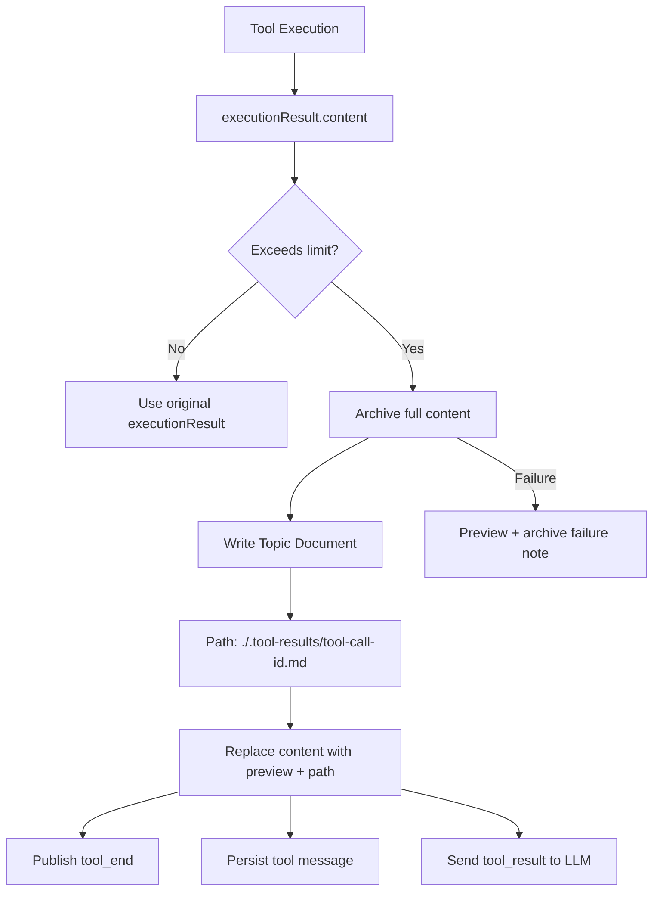

# Tool Result Archive Design

## Summary

Tool results that exceed the model-facing result limit should no longer become permanently
invisible to the agent. The runtime should preserve the current bounded context behavior while
archiving the complete tool result into the topic document virtual file tree.

When a tool result is too large, the agent receives a truncated preview plus a stable document path:

```text
./.tool-results/<tool-call-id>.md
```

The agent can then inspect the complete result through existing document or VFS reading tools.

## Goals

- Preserve full tool output when `executionResult.content` exceeds `toolResultMaxLength`.
- Return a bounded preview to the LLM to prevent context overflow.
- Add a path to the model-facing result so the agent can continue reading omitted content.
- Store archived results under the current topic so topic-scoped document behavior remains coherent.
- Keep `packages/local-file-shell/src/file/read.ts` unchanged; `readLocalFile` already supports `loc`
  for follow-up range reads.

## Non-Goals

- Do not add DB access or topic-document awareness to `packages/local-file-shell`.
- Do not change the `readLocalFile` parameter contract in this iteration.
- Do not make `truncateToolResult` itself responsible for database writes.
- Do not block tool execution when archival fails.

## Current Context

`truncateToolResult` is a pure synchronous string helper. It truncates content and appends a notice,
but it has no access to `agentId`, `topicId`, `serverDB`, or the agent document services required to
persist full content.

The repository already has two relevant persistence surfaces:

- `AgentDocumentsService.createForTopic(...)`, which creates a document and writes the
  `topic_documents` association.
- `AgentDocumentVfsService.write/read/list(...)`, which provides a filesystem-shaped view over
  agent documents and mounted namespaces.

The ordinary VFS `write(...)` path accepts `topicId` in context but does not itself create the
`topic_documents` association for new ordinary documents. Therefore the archive writer must either
use a topic-aware service path or explicitly ensure topic association after creating the document.

## Recommended Approach

Archive at the AgentRuntime tool-result boundary, after tool execution has produced
`executionResult` and before the runtime:

1. publishes the `tool_end` stream event,
2. persists the tool message,
3. pushes the tool result into the next LLM step state.

This placement makes the archived/truncated result the single authoritative payload for the stream,
database, and next model call.



## Data Contract

The archive helper should accept:

| Field                 | Source                                                  | Requirement                              |
| --------------------- | ------------------------------------------------------- | ---------------------------------------- |
| `content`             | `executionResult.content`                               | Required; original complete output       |
| `toolCallId`          | `chatToolPayload.id`                                    | Required for archive path                |
| `agentId`             | runtime metadata                                        | Required for document ownership          |
| `topicId`             | runtime context or metadata                             | Required for topic association           |
| `limit`               | `agentConfig.chatConfig.toolResultMaxLength` or default | Required for preview                     |
| `serverDB` / `userId` | runtime context                                         | Required for server-side document writes |

The helper should return either the original content or a replacement string. It should not mutate
the original `executionResult` implicitly; the caller should replace `executionResult.content`
explicitly.

Recommended result shape:

```ts
interface ToolResultArchiveOutcome {
  archived: boolean;
  archivePath?: string;
  content: string;
  error?: string;
}
```

## Archive Path

The archive path is fixed:

```text
./.tool-results/<tool-call-id>.md
```

The implementation should ensure `./.tool-results` exists before writing the file.

If the same `tool-call-id` is processed again, the archive should be overwritten or updated in place.
This keeps retries and resumptions deterministic: one tool call ID maps to one latest full-result
document.

## Model-Facing Content

For an archived result, the LLM-facing content should contain:

1. the same truncated preview policy used today,
2. the original length and omitted-character count,
3. the archive path,
4. brief instruction that the agent can read that path for omitted content.

Example:

```text
<first N characters>

[Content truncated: 123,456 characters omitted to prevent context overflow. Original length:
148,456 characters]
Full content archived at: ./.tool-results/call_abc123.md
Use the document/file reading tool to inspect specific sections if needed.
```

## Error Handling

Archival failure must not fail the tool call.

If content exceeds the limit but the archive cannot be written, return the truncated preview with a
short archive failure note:

```text
[Archive failed: <reason>. Full content was not persisted.]
```

Expected non-fatal archive skip cases:

- missing `toolCallId`,
- missing `agentId`,
- missing `topicId`,
- missing server database context,
- failed directory creation,
- failed document write.

Skip cases should still produce a bounded result.

## Integration Points

Primary integration points:

- `src/server/modules/AgentRuntime/RuntimeExecutors.ts`
  - normal server-side tool execution branch,
  - batch tool execution branch,
  - client-dispatched tool result branch after `dispatchClientTool(...)`.
- `src/server/services/toolExecution/index.ts`
  - keep existing truncation as a low-level protection until the final boundary archive is in place.
- `src/server/services/agentDocumentVfs/index.ts` or `src/server/services/agentDocuments/index.ts`
  - reuse existing document write primitives, but ensure topic association.

Frontend local-only tool execution should not be expanded in this design unless it re-enters the
server AgentRuntime path. The first implementation should focus on server AgentRuntime results.

## Testing

Behavior-oriented tests should cover:

- oversized server tool result is archived and model-facing content includes the archive path,
- under-limit result is not archived and content is unchanged,
- missing `topicId` falls back to ordinary truncation without throwing,
- archive write failure returns truncated content with an archive failure note,
- retry with the same `toolCallId` updates the same archive path,
- batch tool execution applies the same archive behavior per tool call,
- client-dispatched tool result, when handled by server AgentRuntime, is archived before stream and
  persistence.

Avoid tests that snapshot internal constant tables. Assert observable outcomes: returned content,
archive path, document content, and topic association.

## Resolved Decisions

All implementation-relevant decisions are fixed for the first iteration:

- Archive path is `./.tool-results/<tool-call-id>.md`.
- `readLocalFile` is not changed.
- Archival is best-effort and non-blocking for tool success.
- Final result mutation occurs before stream, persistence, and next LLM state.
